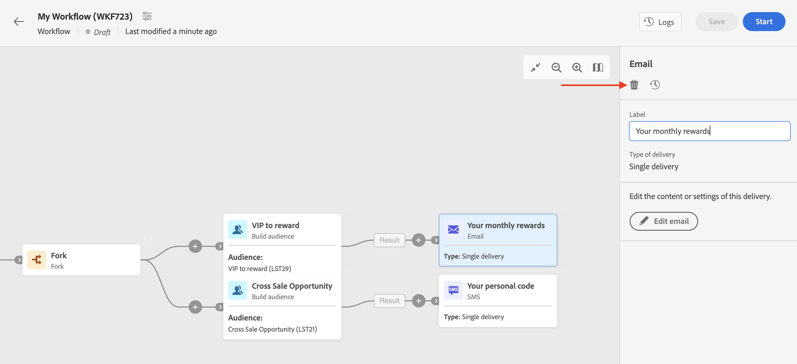

# Arbeta med leveranser {#work-with-deliveries}

>[!CONTEXTUALHELP]
>id="acw_deliveries_list"
>title="Leveranser"
>abstract="En leverans är en kommunikation som skickas till en publik via en viss kanal: e-post, SMS eller push. På den här skärmen kan du redigera, duplicera och ta bort befintliga leveranser. Du kan även visa rapporter för slutförda leveranser. Klicka på knappen **Skapa leverans** för att lägga till en ny leverans."

## Skapa en leverans {#create-delivery}

Du kan skapa fristående leveranser från den vänstra menyn **[!UICONTROL Deliveries]** eller skapa leveranser i ett arbetsflöde, som ingår i en kampanj eller inte.

Bläddra bland flikarna nedan för att lära dig hur du skapar en leverans:

>[!BEGINTABS]

>[!TAB Skapa en fristående leverans]

Så här skapar du en fristående leverans:

1. Bläddra till menyn **[!UICONTROL Deliveries]** till vänster och klicka på knappen **[!UICONTROL Create delivery]**.

   {zoomable="yes"}

1. Välj en kanal för leveransen.
1. Definiera målgruppen för leveransen, för huvudmålet och kontrollgruppen. [Läs mer om målgrupper](../audience/about-recipients.md).

   {zoomable="yes"}{width="70%" align="left"}

1. Definiera meddelandeinnehållet. Läs mer om leveranskanaler och hur du definierar ett leveransinnehåll i dessa avsnitt:

   * [E-postkanal](../email/create-email.md)
   * [Push-meddelandekanal](../push/gs-push.md)
   * [SMS-kanal](../sms/create-sms.md)

1. (valfritt) Definiera leveransschemat . Om inget schema har definierats skickas meddelanden direkt när du har klickat på knappen **[!UICONTROL Send]**.
1. Klicka på knappen **[!UICONTROL Review and send]** om du vill kontrollera dina inställningar.
1. Använd knappen **[!UICONTROL Simulate content]** för att testa dina inställningar för leverans och anpassning. Läs mer om meddelandesimulering i [det här avsnittet](../preview-test/preview-test.md).
1. Klicka på knappen **[!UICONTROL Prepare]** för att beräkna målpopulationen och generera meddelandena. Förberedelsesteget kan ta några minuter. När färdigställandet är klart kan meddelanden skickas. Om ett fel inträffar bläddrar du till **loggarna** för att kontrollera varningar och varningar.
1. Kontrollera resultaten och klicka på knappen **[!UICONTROL Send]** för att börja skicka meddelanden.
1. När du har skickat meddelanden bläddrar du till avsnittet **Rapporter** för att få åtkomst till nyckelvärden. Läs mer om leveransrapporter i [det här avsnittet](../reporting/delivery-reports.md).

>[!TAB Skapa en leverans i ett arbetsflöde]

Så här skapar du en leverans i ett arbetsflöde:

1. Skapa ett arbetsflöde eller öppna ett befintligt. [Läs mer om arbetsflöden](../workflows/gs-workflow-creation.md#gs-workflow-steps)
1. Lägg till och konfigurera en [**[!UICONTROL Build audience]**](../workflows/activities/build-audience.md)-aktivitet.
1. Klicka på ikonen `+` och välj en leveransaktivitet: **[!UICONTROL Email]**, **[!UICONTROL SMS]**, **[!UICONTROL Push notification (Android)]** eller **[!UICONTROL Push notification (iOS)]**. Läs mer om aktiviteter i leveranskanaler i ett arbetsflöde och hur du definierar ett leveransinnehåll i [det här avsnittet](../workflows/activities/channels.md).

   {zoomable="yes"}

1. Starta arbetsflödet och kontrollera loggarna.

Du kan också lägga till leveranser i en kampanj utan att skapa ett arbetsflöde. För att uppnå detta går du till fliken **[!UICONTROL Deliveries]** i kampanjen och klickar på knappen **[!UICONTROL Create delivery]**.

{zoomable="yes"}

Konfigurationsstegen är desamma som för fristående leveranser.

Mer information om hur du konfigurerar en kampanj och hanterar leveranser som tillhör en kampanj finns i [det här avsnittet](../campaigns/gs-campaigns.md).

>[!ENDTABS]

## Lägg till personalisering {#personalization}

Meddelanden från Adobe Campaign kan personaliseras på olika sätt. [Läs mer om personaliseringsfunktioner](../personalization/gs-personalization.md).

Använd Campaign för att skapa dynamiskt innehåll och skicka personaliserade meddelanden. Personalization funktioner kan kombineras för att förbättra era budskap och skapa en anpassad användarupplevelse.

Du kan anpassa meddelandeinnehållet genom att:

* Infogar dynamiska **anpassningsfält**

  Anpassningsfält används för personalisering på första nivån av dina meddelanden. Du kan välja vilket fält som helst tillgängligt i databasen från personaliseringsredigeraren. För en leverans kan du välja vilket fält som helst som är relaterat till mottagaren, meddelandet eller leveransen. Dessa attribut kan infogas på ämnesraden eller i meddelandetexten. [Läs mer](../personalization/personalize.md)

* Infogar fördefinierade **uttrycksfragment**

  Campaign innehåller en uppsättning uttrycksfragment som innehåller en specifik återgivning som du kan infoga i dina leveranser. Du kan till exempel lägga till en logotyp, ett hälsningsmeddelande eller en länk till meddelandets spegelsida. uttrycksfragment är tillgängliga från en dedikerad post som körs i personaliseringsredigeraren. Dessutom kan du skapa egna uttrycksfragment som passar dina behov. [Lär dig använda uttrycksfragment](../content/use-expression-fragments.md)

* Skapa **villkorligt innehåll**

  Konfigurera villkorsstyrt innehåll för att lägga till dynamisk personalisering baserat på mottagarens profil till exempel. Textblock och/eller bilder infogas när ett visst villkor är true. [Läs mer](../personalization/conditions.md)

* Lägg till **anpassade erbjudanden**

  Lägg in skräddarsydda erbjudanden i ert meddelandeinnehåll, beroende på mottagarens plats, det aktuella vädret eller den senaste inköpsordern. [Läs mer](../msg/offers.md)

## Förgranska och testa leveranserna

När meddelandeinnehållet har definierats kan du förhandsgranska det för att kontrollera återgivningen av dina meddelanden och kontrollera personaliseringsinställningarna med testprofiler. [Läs mer](../preview-test/preview-test.md)

## Schemalägg leverans som skickas {#gs-schedule}

>[!CONTEXTUALHELP]
>id="acw_deliveries_email_schedule"
>title="Ange kontaktdatum och -tid"
>abstract="Ange datum och exakt tid för att skicka leveransen. Genom att välja den lämpligaste tidpunkten för ert marknadsföringsmeddelande kan ni maximera öppningsfrekvensen."

Du kan ange datum och exakt tid för att skicka meddelanden. Genom att välja den lämpligaste tidpunkten för ert marknadsföringsmeddelande kan ni maximera öppningsfrekvensen.

Om du vill schemalägga sändning av en leverans öppnar du leveransen och bläddrar till avsnittet **[!UICONTROL Schedule]**. Använd växlingsknappen **[!UICONTROL Enable scheduling]** för att aktivera den och ange önskat datum och tid för sändning. När du har skickat leveransen börjar den faktiska avsändaren på det kontaktdatum som du har angett.

{zoomable="yes"}

Som standard är alternativet **[!UICONTROL Enable confirmation before sending]** aktiverat. Det här alternativet kräver att du bekräftar att leveransen ska skickas innan det schemalagda datumet och den schemalagda tidpunkten. Om du behöver skicka leveransen automatiskt på det schemalagda datumet och den schemalagda tidpunkten kan du inaktivera det här alternativet.

Lär dig hur du skickar en schemalagd leverans i [det här avsnittet](../monitor/prepare-send.md#schedule-the-send).

## Övervaka och spåra loggar {#gs-tracking-logs}

Att övervaka era leveranser efter att de har skickats är ett viktigt steg för att se till att era marknadsföringskampanjer är effektiva och når ut till era kunder.

Du kan övervaka efter att du har skickat en leverans samt förstå hur leveransfel och karantäner hanteras.

Läs mer om övervakning och spårning i [det här avsnittet](../reporting/gs-reports.md).

## Duplicera en leverans {#delivery-duplicate}

Du kan skapa en kopia av en befintlig leverans, antingen från leveranslistan eller från kontrollpanelen för leverans.

Så här duplicerar du en leverans från listan med leveranser:

1. Klicka på knappen med tre punkter till höger bredvid namnet på den leverans som ska dupliceras.
1. Välj **[!UICONTROL Duplicate]**.
1. Bekräfta duplicering: den nya kontrollpanelen för leverans öppnas på den centrala skärmen.

Så här duplicerar du en leverans från kontrollpanelen:

1. Öppna leveransen och klicka på knappen **[!UICONTROL ...More]** överst på skärmen.
1. Välj **[!UICONTROL Duplicate]**.
1. Bekräfta duplicering: Den nya leveransen ersätter den aktuella leveransen på den centrala skärmen.

## Ta bort en leverans {#delivery-delete}

Leveranser tas bort från leveranslistan, antingen från huvudposten i det vänstra fältet eller från leveranslistan för en kampanj.

Så här tar du bort en leverans från listan över leveranser:

1. Klicka på knappen med tre punkter till höger bredvid namnet på den leverans som ska dupliceras.
1. Välj **[!UICONTROL Delete]**.
1. Bekräfta borttagning.

Alla leveranser är tillgängliga i de här listorna, men leveranser som har skapats i ett arbetsflöde kan inte tas bort därifrån. Om du vill ta bort en leverans som har skapats i ett arbetsflöde måste du ta bort leveransaktiviteten från arbetsflödet.

Så här tar du bort en leverans från ett arbetsflöde:

1. Välj leveransaktivitet.
1. Klicka på ikonen **[!UICONTROL Delete]** på den högra panelen.
1. Bekräfta borttagning. Om leveransen har underordnade noder kan du välja att ta bort dem också eller att behålla dem.

