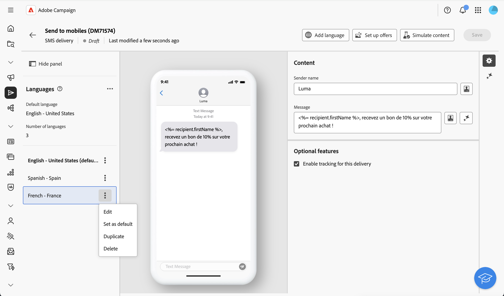

# Konfigurera flerspråkig leverans {#multilingual-delivery}

>[!CONTEXTUALHELP]
>id="acw_homepage_welcome_rn1"
>title="Flerspråkiga leveranser"
>abstract="Nu kan du skicka meddelanden på flera språk i webbgränssnittet för Campaign. Fyll i alla språkvarianter genom att överföra en CSV-fil för push-meddelanden."
>additional-url="https://experienceleague.adobe.com/docs/campaign-web/v8/release-notes/release-notes.html?lang=sv-SE" text="Se versionsinformation"

>[!CONTEXTUALHELP]
>id="acw_deliveries_email_multilingual"
>title="Lägg till språk"
>abstract="På den här fliken hittar du en lista över de språk som leveransen ska skickas till. Du kan lägga till fler språk genom att klicka på knappen Lägg till språk eller genom att duplicera ett annat språk på den här fliken."

>[!CONTEXTUALHELP]
>id="acw_multilingual_file_upload"
>title="Importera språkvarianter"
>abstract="Använd den här dialogrutan om du vill lägga till en språkvariant genom att importera en CSV-fil. Filen fyller automatiskt i alla tillgängliga fält för det valda språket. Du kan dra och släppa filen eller välja den på datorn innan du bekräftar."

I gränssnittet för Campaign-webben kan du konfigurera leveranser som flerspråkiga, vilket gör att du kan skicka meddelanden baserat på vilket språk som används i en profil. Om ingen inställning har angetts skickas meddelandet på standardspråket.

I en flerspråkig leverans baseras språkhanteringen på varianter. Varje variant representerar ett språk. När leveransen skapas kan du lägga till flera språkvarianter som matchar antalet obligatoriska språk i meddelandet. Du kan också ändra standardspråket när som helst efter att du har lagt till dessa varianter.

Den flerspråkiga funktionen är för närvarande tillgänglig för e-post, push-meddelanden, transaktionsmeddelanden och SMS.

Så här ställer du in flerspråkiga leveranser:

1. Lägg till en språkvariant, [läs mer](#add-variant)
1. Definiera innehållet för varje variant, [läs mer](#define-content)
1. Hantera språkvarianter, [läs mer](#manage-variant)

## Lägg till en språkvariant{#add-variant}

Så här skapar du språkvarianter:

1. Klicka på pennikonen på kontrollpanelen för leverans för att öppna skärmen för utgåva av leveransinnehåll och klicka sedan på **[!UICONTROL Add language]**.

   >[!IMPORTANT]
   >
   >Knappen **[!UICONTROL Add language]** är bara tillgänglig om måldimensionen innehåller schemat **Language**. Mer information om scheman och måldimensioner finns i den [detaljerade dokumentationen](../audience/targeting-dimensions.md).

   {zoomable="yes"}

1. I listrutan **Lägg till språk** väljer du det språk som ska läggas till och bekräftar sedan. För push-meddelanden kan du även [överföra en CSV-fil](#csv-upload) om du vill importera alla språkvarianter samtidigt.

   Det första språket som du lägger till anges automatiskt som standard och det befintliga innehållet blir standardversionen. När ytterligare språk läggs till kopieras deras innehåll från standardspråket.

   {zoomable="yes"}

   >[!NOTE]
   >
   >Vilka språk som är tillgängliga i den här listan beror på de värden som har definierats av attributet **Language** (värden som system, användare, dbenum osv.). Läs mer om uppräkningshantering i det här [avsnittet](../administration/enumerations.md).

1. Upprepa den här åtgärden om du vill lägga till andra språk. Panelen **[!UICONTROL Languages]** till vänster visar en lista över de språk du har valt, antalet språk och standardspråket.

   Om du t.ex. har valt engelska, franska och svenska kan du se följande tre språk:

   {zoomable="yes"}

   Mer information om hur du hanterar språkvarianter finns i [avsnittet](#manage-variant).

## Definiera innehållet för varje variant{#define-content}

När språken har angetts definierar du innehållet för leveransen för varje språk.

1. Välj ett språk på panelen **[!UICONTROL Languages]** till vänster på skärmen för leveransutgåva av innehåll.

   {zoomable="yes"}

1. Definiera innehållet i meddelandet för det här språket. Läs mer i det här [avsnittet](../msg/create-deliveries.md).

1. Upprepa den här åtgärden för varje språk.

<!--
>[!BEGINTABS]

>[!TAB Email delivery]

1. From the delivery content edition screen, choose a language and click the **[!UICONTROL Edit email body]** button. You can also hover over the email preview and select **[!UICONTROL Open email designer]**.

    {zoomable="yes"}

1. Define the content of your email for this language. [Read more](../email/get-started-email-designer.md#start-authoring)

1. Repeat this operation for each language.

>[!TAB SMS delivery]

1. From the delivery content edition screen, choose a language.

1. Edit the content of the SMS message for this language. [Read more](../sms/create-sms.md)

    {zoomable="yes"}

1. Repeat this operation for each language.

>[!ENDTABS]

-->

Om du vill förhandsgranska leveransen klickar du på knappen **[!UICONTROL Simulate content]** och väljer profiler. Se till att rätt innehåll visas för varje profil.

{zoomable="yes"}

## Hantera språkvarianter{#manage-variant}

På den vänstra panelen visas all information om språkvarianter. Om du vill ta bort alla språk klickar du på utökningsknappen och sedan på **[!UICONTROL Delete all variants]**.

{zoomable="yes"}

I listan med språkvarianter kan du utföra följande åtgärder:

* **Redigera**: Ändra språket samtidigt som det associerade innehållet behålls.
* **Ange som standard**: ange språket som standardspråk. När ingen språkdefinition finns för en profil skickas meddelandet på standardspråket.
* **Duplicera**: Duplicera innehållet som definierats för det här språket och välj en annan variant.
* **Ta bort**: ta bort varianten och dess associerade innehåll.

{zoomable="yes"}

## Importera språkvarianter från CSV (push-meddelanden) {#csv-upload}

För push-meddelanden kan du snabbt fylla i alla språkvarianter genom att överföra en CSV-fil som innehåller ditt flerspråkiga innehåll. Den här funktionen effektiviserar framtagningen av flerspråkiga kampanjer genom att göra det möjligt att förbereda innehåll offline och importera det i grupp.

* **Effektivitet**: lägg till flera språk och deras innehåll i en enda åtgärd
* **Konsekvens**: säkerställ enhetliga meddelanden för alla språkvarianter
* **Collaboration**: aktivera innehållsteam så att de kan förbereda översättningar i välbekanta kalkylbladsverktyg
* **Masshantering**: hantera och uppdatera enkelt många språkvarianter

### Förhandskrav {#csv-best-practices}

Följ dessa standarder för att se till att CSV-importen lyckas:

* **Använd den exakta kolumnstrukturen**: Alla 14 kolumner måste finnas i CSV-filen, även om du lämnar lite tomt. Kolumner som saknas orsakar importfel. Du kan använda en annan ordning, men alla kolumner måste finnas.
* **Matcha kolumnnamn exakt**: Kolumnnamn är skiftlägeskänsliga. Använd `title` inte `Title`, `badge` inte `Bbadge`, `locale` inte `Locale`.
* **Använd gemena språkkoder**: Formatera språkkoder som `en_us`, `fr_fr`, `de_de` (gemener med understreck), inte `en_US` eller `en-us`.
* **Fyll i obligatoriska kolumner**: Kolumnerna `locale` och `language` måste innehålla värden för varje rad. Tomma värden orsakar importfel.
* **Behåll unika språk**: Varje språkkod får bara finnas en gång i CSV-filen. Dubblerade språkinställningar kommer att avvisas.
* **Spara som UTF-8**: Spara alltid CSV-filen med UTF-8-kodning för att stöda internationella tecken korrekt.
* **Innehåll som innehåller citattecken**: Om rubriken eller meddelandetexten innehåller kommatecken omsluter du hela fältet med citattecken: `"Hello, welcome!"`.
* **Använd numeriska värden korrekt**: För flaggkolumner (isContentAvailable, isMutableContent, silentPush), använd `1` för true, `0` för false eller lämna tomt som standard.
* **Validera JSON-format**: Om du använder kolumnen customFields kontrollerar du att JSON är korrekt formaterad: `{"key":"value"}` med korrekta citattecken och parenteser.
* **Testa med minimala data först**: Börja med en enkel CSV på 2-3 språk för att verifiera formatet innan du skapar stora filer.

>[!NOTE]
>
>Kolumnstrukturen beskrivs i det här [avsnittet](#csv-columns).

### Importera CSV-filen {#csv-steps}

Så här importerar du språkvarianter från en CSV-fil:

1. Klicka på **[!UICONTROL Add language]** i leveransredigeraren.

   {zoomable="yes"}

1. Välj din CSV-fil genom att dra och släppa den i överföringsområdet, eller klicka för att bläddra i datorn.

   Systemet validerar filformatet och innehållet. Om valideringen misslyckas visar felmeddelanden vilka kolumner eller data som är felaktiga. Åtgärda problemen i CSV-filen och överför igen. Se [avsnittet](#csv-troubleshooting).

   {zoomable="yes"}

1. Granska det importerade innehållet på språkvarianternas panel för att bekräfta att alla översättningar har lästs in korrekt.

   {zoomable="yes"}

### Kolumnstruktur {#csv-columns}

Här är rätt kolumnstruktur som ska användas:

>[!NOTE]
>
>Du kan använda en annan ordning, men alla kolumner måste finnas. Mer information finns i det här [avsnittet](#csv-best-practices).

1. **titel**: Meddelanderubrik (obligatoriskt)
1. **messageBody**: Meddelandetext (krävs)
1. **ljud**: Ljudfilens namn (t.ex. `default`, `custom_sound.mp3`) - lämna tomt som standard
1. **badge**: Badge-nummer som ska visas på appikonen (iOS) - använd endast siffror
1. **deeplinkURI**: URL för djup länk som ska öppnas när meddelanden trycks ned - lämna tomt om det inte används
1. **kategori**: ID för meddelandekategori för anpassade åtgärder (iOS) - lämna tomt om det inte används
1. **iosMediaAttachmentURL**: URL för mediebilaga för iOS-meddelanden - lämna tomt om det inte används
1. **androidMediaAttachmentURL**: URL för mediebilaga för Android-meddelanden - lämna tomt om det inte används
1. **isContentAvailable**: Flagga för tillgängligt innehåll (iOS) - använd `1` för true, `0` för false, lämna tomt för standard (0)
1. **isMutableContent**: Flagga för mutable content (iOS) - använd `1` för true, `0` för false, lämna tomt för standard (0)
1. **customFields**: Anpassade data i JSON-format (t.ex. `{"key1":"value1","key2":"value2"}`) - lämna tomt om det inte används
1. **locale**: Språkkod (obligatoriskt) - t.ex. `en_us`, `fr_fr`, `de_de` - **obligatoriskt, måste vara unik per rad**
1. **språk**: Språknamn (obligatoriskt) - t.ex. `English-United States`, `French-France` - **obligatoriskt**
1. **silentPush**: Tyst push-flagga - använd `1` för tyst push, `0` för normal, lämna tomt för standard (0)

### Exempel på CSV-fil {#csv-examples}

Här följer ett grundläggande exempel med de obligatoriska fälten:

```csv
title,messageBody,sound,badge,deeplinkURI,category,iosMediaAttachmentURL,androidMediaAttachmentURL,isContentAvailable,isMutableContent,customFields,locale,language,silentPush
Welcome!,Thank you for joining us,,,,,,,,,, en_us,English-United States,0
Bienvenue !,Merci de nous avoir rejoint,,,,,,,,,,fr_fr,French-France,0
Willkommen!,Vielen Dank für Ihre Anmeldung,,,,,,,,,, de_de,German-Germany,0
¡Bienvenido!,Gracias por unirte a nosotros,,,,,,,,,, es_es,Spanish-Spain,0
```

Här följer ett exempel med valfria fält:

```csv
title,messageBody,sound,badge,deeplinkURI,category,iosMediaAttachmentURL,androidMediaAttachmentURL,isContentAvailable,isMutableContent,customFields,locale,language,silentPush
Welcome!,Thank you for joining us,default,1,,,https://example.com/welcome-en.jpg,https://example.com/welcome-en.jpg,,,, en_us,English-United States,0
Bienvenue !,Merci de nous avoir rejoint,default,1,,,https://example.com/welcome-fr.jpg,https://example.com/welcome-fr.jpg,,,, fr_fr,French-France,0
Willkommen!,Vielen Dank für Ihre Anmeldung,default,1,,,https://example.com/welcome-de.jpg,https://example.com/welcome-de.jpg,,,, de_de,German-Germany,0
¡Bienvenido!,Gracias por unirte a nosotros,default,1,,,https://example.com/welcome-es.jpg,https://example.com/welcome-es.jpg,,,, es_es,Spanish-Spain,0
```

Här är ett exempel med anpassade fält

```csv
title,messageBody,sound,badge,deeplinkURI,category,iosMediaAttachmentURL,androidMediaAttachmentURL,isContentAvailable,isMutableContent,customFields,locale,language,silentPush
New Collection,Discover our latest products,default,1,,,,,,,"{"campaign":"summer2025","segment":"premium"}",en_us,English-United States,0
Nouvelle Collection,Découvrez nos derniers produits,default,1,,,,,,,"{"campaign":"summer2025","segment":"premium"}",fr_fr,French-France,0
```

>[!NOTE]
>
>För omfattande push-meddelanden med karuseller eller åtgärdsknappar använder Campaign en annan konfigurationsmetod än CSV-import. Konfigurera push-innehåll direkt i leveransredigeraren efter import av grundläggande flerspråkigt innehåll.

### Personalization i CSV-filer {#csv-personalization}

Om du vill använda anpassningsfält i ditt CSV-innehåll måste du använda `<span>`-taggar:

```csv
title,messageBody,sound,badge,deeplinkURI,category,iosMediaAttachmentURL,androidMediaAttachmentURL,isContentAvailable,isMutableContent,customFields,locale,language,silentPush
"Hello <span class=""nl-dce-field nl-dce-done"" data-nl-expr=""recipient.firstName"">recipient.firstName</span>","Your order has shipped!",,,,,,,,,,en_us,English-United States,0
"Bonjour <span class=""nl-dce-field nl-dce-done"" data-nl-expr=""recipient.firstName"">recipient.firstName</span>","Votre commande a été expédiée !",,,,,,,,,,fr_fr,French-France,0
```

Under leveransen ersätter Campaign dessa platshållare med faktiska mottagardata.

### Felsökning {#csv-troubleshooting}

| Fel | Orsak | Lösning |
|-------|-------|----------|
| Nödvändiga kolumner saknas | CSV-filen innehåller inte alla 14 kolumner | Kontrollera att CSV-filen innehåller alla 14 kolumner i exakt den ordning som visas ovan. Använd tomma värden för oanvända kolumner. |
| Ogiltiga språk-/språkvärden | nationella inställningar eller språkkolumner är tomma | Både nationella och språkliga kolumner måste ha värden för varje rad |
| Duplicera nationella inställningar | Samma språkkod visas flera gånger | Varje språkvärde måste vara unikt - ta bort dubblettrader |
| Problem med filkodning | CSV-filen använder inkompatibel kodning | Spara din CSV-fil med UTF-8-kodning |
| Kolumnmatchningsfel | Rader har ett annat antal kolumner än rubriker | Kontrollera att alla rader har exakt 14 kolumner som matchar rubriken |
| Ogiltiga numeriska värden | badge, isContentAvailable, isMutableContent eller silentPush innehåller icke-numeriska värden | Använd endast siffror: 0 eller 1 för flaggor, eller lämna tomt som standard |
| Felaktig JSON | kolumnen customFields innehåller ogiltig JSON | Kontrollera att JSON-syntaxen är korrekt: `{"key":"value"}` eller lämna tomt |
| Skiftläge för kolumnnamn matchar inte | Kolumnnamnen matchar inte exakt | Kolumnnamn är skiftlägeskänsliga - använd exakta namn som visas ovan (t.ex. `badge`, inte `Badge` eller `BADGE`) |

>Bästa tillvägagångssätt visas i det här [avsnittet](#csv-best-practices). Kolumnstrukturen beskrivs i det här [avsnittet](#csv-columns).

