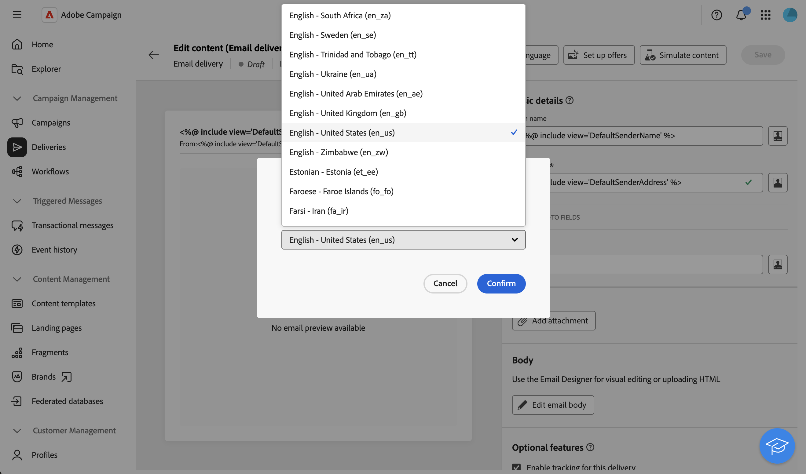

# Konfigurera flerspråkig leverans {#multilingual-delivery}

>[!CONTEXTUALHELP]
>id="acw_deliveries_email_multilingual"
>title="Lägg till språk"
>abstract="På den här fliken hittar du en lista över de språk som leveransen ska skickas till. Du kan lägga till fler språk genom att klicka på knappen Lägg till språk eller genom att duplicera ett annat språk på den här fliken."

I gränssnittet för Campaign-webben kan du konfigurera leveranser som flerspråkiga, vilket gör att du kan skicka meddelanden baserat på vilket språk som används i en profil. Om ingen inställning har angetts skickas meddelandet på standardspråket.

I en flerspråkig leverans baseras språkhanteringen på varianter. Varje variant representerar ett språk. När leveransen skapas kan du lägga till flera språkvarianter som matchar antalet obligatoriska språk i meddelandet. Du kan också ändra standardspråket när som helst efter att du har lagt till dessa varianter.

Den flerspråkiga funktionen är för närvarande tillgänglig för e-post, push-meddelanden, transaktionsmeddelanden och SMS.

>[!AVAILABILITY]
>
>Flerspråkiga push-meddelanden, transaktionsmeddelanden och SMS är bara tillgängliga för en uppsättning organisationer (begränsad tillgänglighet) och kommer att lanseras globalt i en framtida version. Servern måste uppgraderas till 8.8.2 eller senare.

Så här ställer du in flerspråkiga leveranser:

1. Lägg till en språkvariant, [läs mer](#add-variant)
1. Definiera innehållet för varje variant, [läs mer](#define-content)
1. Hantera språkvarianter, [läs mer](#manage-variant)

## Lägg till en språkvariant{#add-variant}

Så här skapar du språkvarianter:

1. Klicka på pennikonen på kontrollpanelen för leverans för att öppna skärmen för utgåva av leveransinnehåll och klicka sedan på **[!UICONTROL Add language]**.

   >[!IMPORTANT]
   >
   >Knappen **[!UICONTROL Add language]** är bara tillgänglig om måldimensionen innehåller schemat **Language**. Mer information om scheman och måldimensioner finns i den [detaljerade dokumentationen](../audience/targeting-dimensions.md).

   {zoomable="yes"}

1. I listrutan **Lägg till språk** väljer du det språk som ska läggas till och bekräftar sedan.

   Det första språket som du lägger till anges automatiskt som standard och det befintliga innehållet blir standardversionen. När ytterligare språk läggs till kopieras deras innehåll från standardspråket.

   {zoomable="yes"}

   >[!NOTE]
   >
   >Vilka språk som är tillgängliga i den här listan beror på de värden som har definierats av attributet **Language** (värden som system, användare, dbenum osv.). Läs mer om uppräkningshantering i det här [avsnittet](../administration/enumerations.md).

1. Upprepa den här åtgärden om du vill lägga till andra språk. Panelen **[!UICONTROL Languages]** till vänster visar en lista över de språk du har valt, antalet språk och standardspråket.

   Om du t.ex. har valt engelska, franska och svenska kan du se följande tre språk:

   {zoomable="yes"}

   Mer information om hur du hanterar språkvarianter finns i [avsnittet](#manage-variant).

## Definiera innehållet för varje variant{#define-content}

När språken har angetts definierar du innehållet för leveransen för varje språk.

1. Välj ett språk på panelen **[!UICONTROL Languages]** till vänster på skärmen för leveransutgåva av innehåll.

   {zoomable="yes"}

1. Definiera innehållet i meddelandet för det här språket. Läs mer i det här [avsnittet](../msg/create-deliveries.md).

1. Upprepa den här åtgärden för varje språk.

<!--
>[!BEGINTABS]

>[!TAB Email delivery]

1. From the delivery content edition screen, choose a language and click the **[!UICONTROL Edit email body]** button. You can also hover over the email preview and select **[!UICONTROL Open email designer]**.

    {zoomable="yes"}

1. Define the content of your email for this language. [Read more](../email/get-started-email-designer.md#start-authoring)

1. Repeat this operation for each language.

>[!TAB SMS delivery]

1. From the delivery content edition screen, choose a language.

1. Edit the content of the SMS message for this language. [Read more](../sms/create-sms.md)

    {zoomable="yes"}

1. Repeat this operation for each language.

>[!ENDTABS]

-->

Om du vill förhandsgranska leveransen klickar du på knappen **[!UICONTROL Simulate content]** och väljer profiler. Se till att rätt innehåll visas för varje profil.

{zoomable="yes"}

## Hantera språkvarianter{#manage-variant}

På den vänstra panelen visas all information om språkvarianter. Om du vill ta bort alla språk klickar du på utökningsknappen och sedan på **[!UICONTROL Delete all variants]**.

{zoomable="yes"}

I listan med språkvarianter kan du utföra följande åtgärder:

* **Redigera**: Ändra språket samtidigt som det associerade innehållet behålls.
* **Ange som standard**: ange språket som standardspråk. När ingen språkdefinition finns för en profil skickas meddelandet på standardspråket.
* **Duplicera**: Duplicera innehållet som definierats för det här språket och välj en annan variant.
* **Ta bort**: ta bort varianten och dess associerade innehåll.

{zoomable="yes"}

