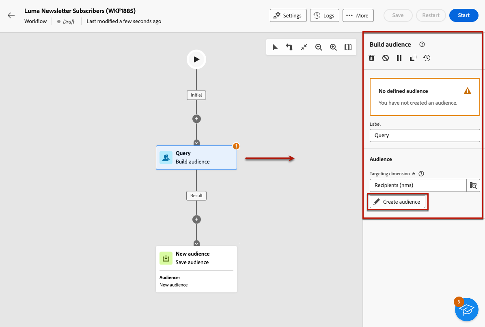
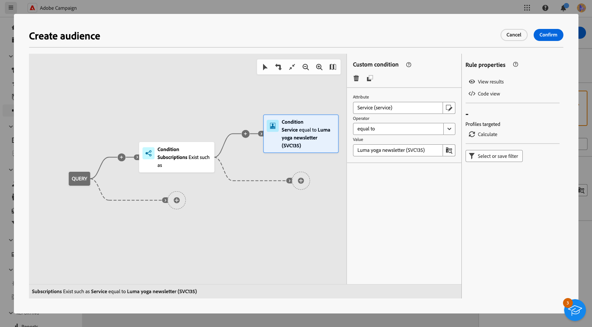

# Skicka meddelanden till prenumeranterna på en tjänst {#send-to-subscribers}

Du kan skapa prenumerationstjänster i Adobe Campaign och skicka meddelanden till dina prenumeranter. Lär dig hur du skapar prenumerationstjänster på [den här sidan](../audience//manage-services.md#create-service).

Om du vill skicka meddelanden till dina prenumeranter skapar du en specifik publik som identifierar prenumeranterna och skapar sedan leveransen enligt nedan.

1. Skapa en målgrupp. Ett nytt arbetsflöde skapas automatiskt. [Läs mer om målgrupper](../audience/create-audience.md)

1. För bättre läsbarhet kan du ändra arbetsflödets namn i arbetsflödesinställningens **Etikett** fält. [Lär dig hur du konfigurerar arbetsflödesinställningar](../workflows/workflow-settings.md)

1. Öppna **[!UICONTROL Build audience]** aktivitet och välj **[!UICONTROL Create audience]**. [Lär dig konfigurera en målgruppsaktivitet](../workflows/activities/build-audience.md)

   

1. Välj följande anpassade villkor när du skapar målgrupper: **[!UICONTROL Susbscriptions]** finns som **[!UICONTROL Service]** är lika med den tjänst du har definierat. I det här exemplet väljer du **Luma yoga newsletter**.

   

1. Välj **[!UICONTROL Confirm]** och klicka **[!UICONTROL Start]** för att köra arbetsflödet.

1. Skapa en leverans. Steg för att skapa en leverans beskrivs i [den här sidan](../msg/gs-messages.md#create-delivery).
1. Bläddra till leveransinställningarna och ändra standardmålmappningen till **Prenumerationer (nms:subscriptions)**.

   

1. I huvudmåldelen av leveransen väljer du den målgrupp du skapade ovan.

   

1. Skapa meddelandeinnehåll, testa och skicka leveransen, enligt informationen i [det här avsnittet](../preview-test/preview-test.md).

   

Leveransen skickas endast till prenumeranterna av tjänsten.
