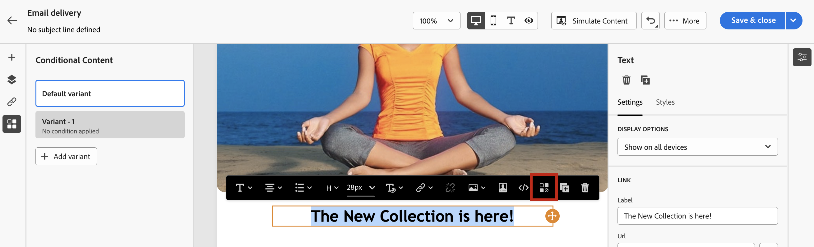

# Skapa villkorsstyrt innehåll{#add-conditions}

>[!CONTEXTUALHELP]
>id="acw_homepage_card3"
>title="Skapa villkorsstyrt innehåll"
>abstract="Skapa villkorsstyrt innehåll för att definiera dynamisk personalisering baserat på mottagarens profil och ersätt automatiskt textblock och bilder när vissa villkor uppfylls. Den här funktionen kan lyfta era kampanjer till nya höjder och leverera målinriktade, personaliserade upplevelser till er målgrupp."

Villkorligt innehåll är en kraftfull funktion som gör att du kan skapa dynamisk personalisering baserat på mottagarens profil och automatiskt ersätta textblock och bilder när vissa villkor uppfylls. Den här funktionen kan lyfta era kampanjer till nya höjder och leverera målinriktade, personaliserade upplevelser till er målgrupp.

Genom att konfigurera fält för villkorligt innehåll kan du skapa avancerad dynamisk personalisering som till exempel baseras på mottagarens profil. Textblock, länkar, ämnesrader och/eller bilder ersätts i meddelandeinnehållet när ett visst villkor är uppfyllt. Du kan t.ex. visa&quot;Herr&quot; eller&quot;fru&quot; enligt värdet i fältet Kön i Adobe Campaign-databasen, eller inkludera en annan länk baserat på vilket mottagarspråk som föredras.

## Så här skapar du villkorsstyrt innehåll

Om du vill skapa villkorsstyrt innehåll måste du skapa villkor i uttrycksredigeraren med en viss hjälpfunktion. Den här metoden är tillgänglig för alla leveranskanaler, i alla fält där du kan komma åt uttrycksredigeraren, t.ex. ämnesraden, e-postlänkar och text-/knappinnehållskomponenter. [Lär dig var du lägger till dynamiskt innehåll](gs-personalization.md/#access)

Förutom uttrycksredigeraren kan du använda en dedikerad villkorsstyrd innehållsbyggare när du utformar ett e-postmeddelande som gör att du kan skapa villkor med hjälp av profilattribut.

## Skapa villkor i uttrycksredigeraren {#condition-perso-editor}

Om du vill definiera ett villkorligt innehåll för en leverans följer du stegen nedan. I det här exemplet vill vi skapa villkorligt innehåll baserat på mottagarens språk (franska eller engelska).

1. Öppna en leverans och redigera innehållet.

1. Leta reda på fältet där du vill lägga till villkorligt innehåll och klicka på **[!UICONTROL Open personalization dialog]** för att öppna uttrycksredigeraren. I det här exemplet vill vi lägga till villkorligt innehåll i ett SMS-meddelande:

   

1. I personaliseringsredigeraren går du till **[!UICONTROL Helper functions]** vänster meny.

1. Klicka på plustecknet (+) bredvid ikonen **If** för att starta ditt villkor. Följande rad ska läggas till på den centrala skärmen:
   `<% if (<FIELD>==<VALUE>) { %>Insert content here<% } %>`

   * Ersätt `<FIELD>` av ett personaliseringsfält. Mottagarens språk: `recipient.language`.
   * Ersätt `<VALUE>` efter värdet som ska uppfyllas. Exempel, `'French'`.
   * Ersätt `Ìnsert content here` efter innehållet som du vill visa för profilerna som uppfyller villkoret som anges ovan.

     

1. Ange det innehåll som ska visas om mottagarna inte uppfyller villkoret. Så här gör du:

   1. Lägg till en **else** hjälpfunktion: Placera markören före uttryckets avslutande tagg `%>` och klicka på `+` bredvid **Annars** funktion.

      >[!NOTE]
      >
      >Varje gång en hjälpfunktion läggs till öppnas (`<%`) och avslutande (`%>`) läggs taggar automatiskt till före och efter funktionen. Exempel efter att du har lagt till en Else-hjälpfunktion i ett uttryck:
      >
      >`<% if (<FIELD>==<VALUE>) { %>Insert content here<% } <% else { %> Insert content here<% } %>%>`
      >
      >Se till att du tar bort de här taggarna för att undvika syntaxfel. I det här exemplet har det korrigerade uttrycket tagits bort **Annars** funktionstaggar är:
      >
      >`<% if (<FIELD>==<VALUE>) { %>Insert content here<% } else { %> Insert content here<% } %>`

   1. Ersätt `Ìnsert content here` efter innehållet som du vill visa för de profiler som inte uppfyller villkoret.

      

   Du kan också använda **else if** hjälpfunktion för att skapa villkor med flera innehållsvarianter. Uttrycket nedan visar till exempel tre varianter av ett meddelande beroende på mottagarens språk:

   

1. När villkoret är klart kan du spara innehållet och kontrollera återgivningen genom att simulera innehållet.

## Skapa villkorsstyrt innehåll i e-postmeddelanden  {#condition-condition-builder}

Villkorligt innehåll i e-postmeddelanden kan skapas på två sätt:
* I uttrycksredigeraren genom att skapa ett villkor med hjälp av hjälpfunktioner,
* I en dedikerad villkorsstyrd innehållsbyggare som är tillgänglig när du utformar ett e-postmeddelande.

Det finns detaljerad information om hur du skapar villkor med hjälp av uttrycksredigeraren [här](#condition-perso-editor).

I avsnittet nedan får du hjälp med att skapa villkor med hjälp av e-postdesignerns verktyg för villkorligt innehåll. I det här exemplet skapar vi ett e-postmeddelande med flera varianter beroende på mottagarens språk. Följ dessa steg för att göra detta:

1. Skapa eller öppna en e-postleverans, redigera innehållet och klicka på **[!UICONTROL Edit email body]** för att öppna arbetsytan för e-postdesign.

1. Markera en innehållskomponent och klicka på **[!UICONTROL Enable conditional content]**.

   

1. The **[!UICONTROL Conditional Content]** öppnas till vänster på skärmen. I den här rutan kan du skapa flera varianter av den markerade innehållskomponenten med villkor.

1. Konfigurera din första variant. För att göra detta, hovra över **[!UICONTROL Variant - 1]** i **[!UICONTROL Conditional Content]** och klicka på **[!UICONTROL Add condition]** ikon.

1. En regelbyggare visas. Använd profilattributen för att skapa villkoret för den första varianten av meddelandet och klicka på **[!UICONTROL Confirm]**. I det här exemplet skapar vi en regel som riktar sig till mottagare vars språk är &quot;franska&quot;.

   

1. Regeln är nu associerad med varianten. För bättre läsbarhet rekommenderar vi att du byter namn på varianten genom att klicka på ellipsmenyn.

   Konfigurera nu hur komponenten ska visas om regeln uppfylls när meddelandet skickas. I det här exemplet vill vi visa texten på franska om det är mottagarens favoritspråk.

   

1. Lägg till så många varianter som behövs för innehållskomponenten. Du kan när som helst växla mellan de olika varianterna för att kontrollera hur innehållskomponenten visas beroende på villkorsreglerna.

   >[!NOTE]
   >Om inga regler som definieras i varianterna uppfylls när meddelandet skickas, kommer innehållskomponenten att visa innehållet som definierats i **[!UICONTROL Default variant]** från **[!UICONTROL Conditional Content]** fönster.
