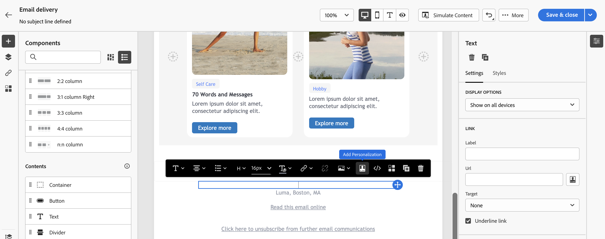

# Lägg till inbyggda innehållsblock {#ootb-content-blocks}

Adobe Campaign erbjuder en lista med förkonfigurerade innehållsblock. Dessa innehållsblock är dynamiska, personaliserade och har en specifik rendering som du kan infoga i leveranserna. Du kan till exempel lägga till en logotyp, ett gratulationsmeddelande eller en länk till en spegelsida.

Så här lägger du till ett innehållsblock i en leverans:

1. Öppna en leverans och redigera innehållet.

1. Leta reda på fältet där du vill lägga till ett innehållsblock och klicka på **[!UICONTROL Open personalization dialog]** -ikonen för att öppna uttrycksredigeraren.

   {zoomable=&quot;yes&quot;}{width="800" align="center"}

1. I uttrycksredigeraren går du till **[!UICONTROL Content blocks]** vänster meny.

1. Om du vill lägga till ett innehållsblock placerar du markören på önskad plats i innehållet och infogar det genom att klicka på plusknappen (+).

   {zoomable=&quot;yes&quot;}{width="800" align="center"}

Inbyggda innehållsblock är:

* **[!UICONTROL Default opt-out banner]**
* **[!UICONTROL Enabled by Adobe Campaign]**: infogar logotypen&quot;Enabled by Adobe Campaign&quot;.
* **[!UICONTROL Formatting function for proper nouns]**: genererar **[!UICONTROL toSmartCase]** JavaScript-funktion som ändrar den första bokstaven i varje ord till versaler.
* **[!UICONTROL Greetings]**: infogar hälsningar med mottagarens fullständiga namn följt av ett kommatecken. Exempel:&quot;Hello John Doe,&quot;.
* **[!UICONTROL Insert Logo]**: infogar en logotyp som är definierad i instansinställningarna.
* **[!UICONTROL Link to mirror page]**: infogar en länk till [spegelsida](../email/mirror-page.md). Standardformatet är:&quot;Om du inte kan visa det här meddelandet korrekt klickar du här&quot;.
* **[!UICONTROL Mirror page URL]**: infogar spegelsidans URL, vilket gör att leveransdesigners kan kontrollera länken.
* **[!UICONTROL Notification style]**
* **[!UICONTROL Offer acceptance URL in unitary mode]**: infogar en URL som gör att ett erbjudande kan anges till **[!UICONTROL Accepted]**. (Det här blocket är tillgängligt om interaktionsmodulen är aktiverad)
* **[!UICONTROL Registration confirmation]**: infogar en länk som bekräftar prenumerationen.
* **[!UICONTROL Registration link]**: infogar en prenumerationslänk. Den här länken definieras i instansinställningarna. Standardinnehållet är:&quot;Klicka här om du vill registrera dig.&quot;
* **[!UICONTROL Registration link (with referrer)]**: infogar en prenumerationslänk som gör att besökaren och leveransen kan identifieras. Den här länken definieras i instansinställningarna.
* **[!UICONTROL Registration page URL]**: infogar en prenumerations-URL
* Delningslänkar för sociala nätverk
* **[!UICONTROL Style of content emails]** och **[!UICONTROL Notification style]**: generera kod som formaterar ett e-postmeddelande med fördefinierade HTML-format.
* **[!UICONTROL Unsubscription link]**: infogar en länk som gör det möjligt att avbryta prenumerationen på alla leveranser (blockeringslista). Standardinnehållet är:&quot;Du får det här meddelandet eftersom du har varit i kontakt med ***ditt organisationsnamn*** eller ett närstående bolag. Ta inte längre emot meddelanden från ***ditt organisationsnamn*** klicka här.&quot;

>[!NOTE]
>
>Du kan definiera nya block från Adobe Campaign v8-konsolen som gör att du kan optimera din leveranspersonalisering. Läs mer i [Kampanjdokumentation v8 (klientkonsol)](https://experienceleague.adobe.com/docs/campaign/campaign-v8/campaigns/send/personalize/personalization-blocks.html#create-custom-personalization-blocks){target="_blank"}.
