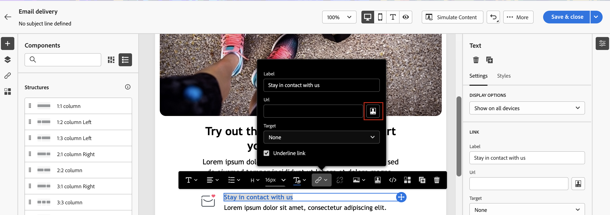

# Kom igång med dynamiskt innehåll {#gs-dynamic-content}

>[!CONTEXTUALHELP]
>id="acw_targetdata_personalization_dashboard"
>title="Personalisering"
>abstract="Med uttrycksredigeraren kan du välja, ordna, anpassa och validera alla data för att skapa en anpassad upplevelse av ditt innehåll. Ni kan personalisera era meddelanden till varje mottagare genom att utnyttja profildata och skapa villkorsstyrt innehåll för att anpassa meddelandet till varje mottagare och endast visa det innehåll som är relevant. Dessutom finns det personaliseringsblock som du kan använda för att lägga till fördefinierat personaliserat innehåll i leveranserna."

Som marknadsförare är det viktigt att inrikta sig på kunder som verkligen är intresserade av era erbjudanden och att engagera dem genom att tillhandahålla effektivt och relevant innehåll. Med tanke på det stora urval av mottagare som ni stöter på kan det vara tidskrävande och onödigt att skapa flera olika typer av marknadsföringsmaterial som kan tilltala olika personer. Det är här som dynamiskt innehåll kommer in på spel.

Med Adobe Campaign funktioner för dynamiskt webbinnehåll kan du anpassa ditt innehåll baserat på den information du har samlat in om dina mottagare. Genom att använda dynamiskt innehåll ser du till att era marknadsföringssatsningar är mer relevanta och undviker att marknadsföra oönskade eller onödiga produkter eller tjänster. På så sätt blir innehållet mer tilltalande och sannolikheten för att det läses ökar. Dessutom kan ni anpassa innehållet så att mottagarna känner att de får information från en person snarare än en dator.

## Hur gör jag ert innehåll dynamiskt? {#make-content-dyn}

Du kan göra meddelandeinnehållet dynamiskt genom att infoga JavaScript-konstruktioner i webbuttrycksredigeraren för Campaign. Vid sändning av meddelanden tolkas dessa uttryck av Adobe Campaign för att leverera rätt innehåll till var och en av mottagarna:

* **Anpassa era meddelanden** till varje enskild mottagare genom att utnyttja profildata som förnamn, intressen, var de bor, vad de köpt och mycket annat. Du kan välja vilket fält som helst tillgängligt i databasen från den anpassade redigeraren som är relaterad till mottagaren, meddelandet eller leveransen. Dessa attribut kan infogas på ämnesraden eller i meddelandetexten. Följande syntax infogar mottagarens ort i ditt innehåll: &lt;%= mottagare.location.city %>.

  {width="800" align="center"}

* **Skapa villkorsstyrt innehåll** för att anpassa era leveranser till varje mottagare och endast visa det innehåll som är relevant för en viss kund baserat på den information ni har om dem. På så sätt kan du visa specifika textblock och/eller bilder baserat på villkor. Anpassa t.ex. en e-postbanderoll som baseras på mottagarnas prenumeration till en viss tjänst.

  {width="800" align="center"}

* **Använd personaliseringsblock** för att spara tid och enkelt kunna återanvända personaliserat innehåll i era meddelanden. Campaign innehåller en uppsättning personaliseringsblock som innehåller en specifik återgivning som du kan infoga i dina leveranser. Du kan till exempel lägga till en logotyp, ett gratulationsmeddelande eller en länk till spegelsidan för ett e-postmeddelande. Innehållsblock är tillgängliga från ett dedikerat tävlingsbidrag i personaliseringsredigeraren.

  {width="800" align="center"}

## Öppna uttrycksredigeraren {#access}

Adobe Campaign V8 Web är en uttrycksredigerare där du kan välja, ordna, anpassa och validera alla data för att skapa en anpassad upplevelse av ditt innehåll. Uttrycksredigeraren är tillgänglig för alla kanaler, i alla fält med **[!UICONTROL Open personalization dialog]** ikon, t.ex. ämnesradfältet, eller e-postlänkar och text-/knappinnehållskomponenter.

Här är några exempel på hur du får åtkomst till uttrycksredigeraren beroende på vilket innehåll du vill göra dynamiskt:

* *Åtkomst till uttrycksredigeraren från fältet Avsändarens namn*

  {width="800" align="center"}

* *Åtkomst till uttrycksredigeraren från en e-posttextkomponent*

  {width="800" align="center"}

* *Åtkomst till uttrycksredigeraren från en länk i ett e-postmeddelande*

  {width="800" align="center"}

>[!NOTE]
>
>Förutom uttrycksredigeraren kan du även använda en dedikerad villkorsstyrd innehållsbyggare när du utformar ett e-postmeddelande. [Lär dig hur du skapar villkorsstyrt innehåll i e-postmeddelanden](conditions.md)

## Låt oss dyka djupare {#dive-deeper}

Nu när du har en förståelse för hur du gör ditt innehåll dynamiskt är det dags att gå djupare in i dessa dokumentationsavsnitt för att börja arbeta med funktionen.

<table style="table-layout:fixed"><tr style="border: 0;">
<td>

<a href="personalize.md"><strong>Lägg till personalisering</strong></a>

</td>
<td>

<a href="conditions.md"><strong>Lägga till villkorligt innehåll</strong>

</td>
<td>

<a href="content-blocks.md"><strong>Lägg till inbyggda innehållsblock</strong></a>

</td>
</tr></table>
