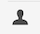
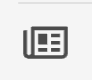
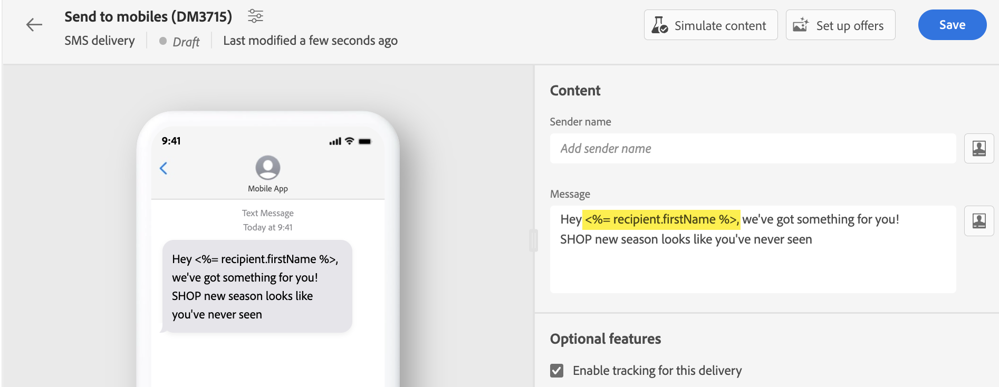

# Anpassa innehållet {#add-personalization}

Du kan anpassa alla leveranser med hjälp av uttrycksredigeraren, som är tillgänglig i fält med **[!UICONTROL Open personalization dialog]** ikon, t.ex. ämnesraden, e-postlänkar och innehållskomponenter för text/knapp. [Lär dig hur du kommer åt uttrycksredigeraren](gs-personalization.md/#access)

## Anpassningssyntax {#syntax}

Personaliseringstaggar följer en specifik syntax: `<%= table.field %>`. Om du till exempel vill infoga mottagarens efternamn från mottagartabellen använder du `<%= recipient.lastName %>` syntax.

Under leveransförberedelseprocessen tolkar Adobe Campaign automatiskt dessa taggar och ersätter dem med motsvarande fältvärden för varje mottagare. Du kan visa den faktiska ersättningen genom att simulera innehållet.

När du överför kontakter från en extern fil för en fristående e-postleverans är alla fält i indatafilen tillgängliga för personalisering. Syntaxen är följande: `<%= dataSource.field %>`.

## Lägg till personaliseringstaggar {#add}

Så här lägger du till personaliseringstaggar i en leverans:

1. Öppna uttrycksredigeraren med **[!UICONTROL Open personalization dialog]** -ikoner som är tillgängliga från redigeringsfält av texttyp, t.ex. ämnesraden eller SMS-brödtexten. [Lär dig hur du kommer åt uttrycksredigeraren](gs-personalization.md/#access)

   {width="800" align="center"}

1. Uttrycksredigeraren öppnas. Anpassningsfält som finns i Adobe Campaign-databasen är ordnade i flera menyer till vänster på skärmen:

   {width="800" align="center"}

   | Meny | Beskrivning |
   |-----|------------|
   |  | The **[!UICONTROL Subscribers application]** I listas fält som är relaterade till prenumeranterna av ett program, t.ex. den använda terminalen eller operativsystemet. *Den här menyn är endast tillgänglig för push-meddelanden* |
   |  | The **[!UICONTROL Recipient]** I listas fält som definierats i mottagartabellen, t.ex. mottagarnas namn, sidor eller adresser. När [överföra kontakter från en extern fil](../audience/file-audience.md) för en fristående e-postleverans visas alla fält som är tillgängliga i indatafilen på den här menyn. |
   |  | The **[!UICONTROL Message]** I listas fält som är relaterade till leveransloggarna, inklusive alla meddelanden som skickas till mottagare eller enheter i alla kanaler, t.ex. datumet för den senaste händelsen med en viss mottagare |
   |  | The **[!UICONTROL Delivery]** I listas fält som är relaterade till de parametrar som krävs för att utföra leveranser, t.ex. leveranskanalen eller etiketten. |

   >[!NOTE]
   >
   >Som standard visar varje meny alla fält i den markerade tabellen (Mottagare, Meddelande / Leverans). Om du vill ta med fält från tabeller som är länkade till den markerade tabellen aktiverar du **[!UICONTROL Display advanced attributes]** alternativ som finns under listan.

1. Om du vill lägga till ett anpassningsfält placerar du markören på önskad plats i innehållet och klickar på knappen `+` för att infoga den.

1. När innehållet är klart kan du spara det och testa återgivningen av personaliseringen genom att simulera innehållet. I exemplet nedan visas personaliseringen av ett SMS-meddelande med mottagarnas förnamn.

   {width="800" align="center"}

   {width="800" align="center"}
