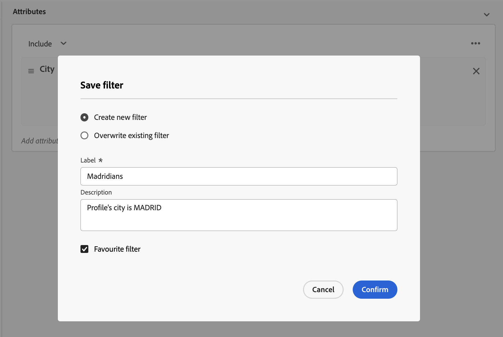

# Arbeta med fördefinierade filter {#predefined-filters}

>[!CONTEXTUALHELP]
>id="acw_homepage_card3"
>title="Fördefinierad filterhantering"
>abstract="Campaign Web har nu ett användarvänligt gränssnitt där ni enkelt kan hantera och anpassa fördefinierade filter efter just era behov. Skapa en gång och spara för framtida bruk."

>[!CONTEXTUALHELP]
>id="acw_predefined-filters-dashboard"
>title="Fördefinierade filter"
>abstract="Campaign Web har nu ett användarvänligt gränssnitt där ni enkelt kan hantera och anpassa fördefinierade filter efter just era behov. Skapa en gång och spara för framtida bruk."

Fördefinierade filter är anpassade filter som är tillgängliga för framtida bruk. De kan användas som genvägar vid filtreringsåtgärder med regelbyggaren.

## Skapa ett fördefinierat filter {#create-predefined-filter}

>[!CONTEXTUALHELP]
>id="acw_predefined-filters-creation"
>title="Skapa ett fördefinierat filter"
>abstract="Ange en etikett för det fördefinierade filtret och markera den tabell det gäller. Öppna de andra alternativen för att lägga till en beskrivning och ange det här filtret som en favorit. Använd sedan knappen Skapa regel för att definiera filtervillkoren."

När du skapar ett filter med regelverktyget kan du spara det för framtida bruk. När det sparas som ett anpassat filter är det tillgängligt för framtida bruk. Du kan också skapa och redigera fördefinierade filter från den dedikerade menyn i den vänstra navigeringen.

Följ stegen nedan om du vill spara ett anpassat filter i regelverktyget:

1. Öppna regelbyggaren och definiera filtervillkoren. I exemplet nedan filtrerar du mottagare som bor i Madrid.
1. Klicka på **Markera eller spara filter** och markera **Spara som ett filter**.

   

1. Välj **Skapa ett nytt filter** och ange ett namn och en beskrivning för filtret.

   

1. (valfritt) Aktivera **Spara som favorit** om du vill se det här fördefinierade filtret i dina favoriter.

   

1. Klicka **Bekräfta** för att spara ändringarna.

Ditt anpassade filter finns nu i **Fördefinierade filter** och är tillgängliga för alla Campaign-användare.

## Använda ett fördefinierat filter {#use-predefined-filter}

## Hantera dina fördefinierade filter {#manage-predefined-filter}

