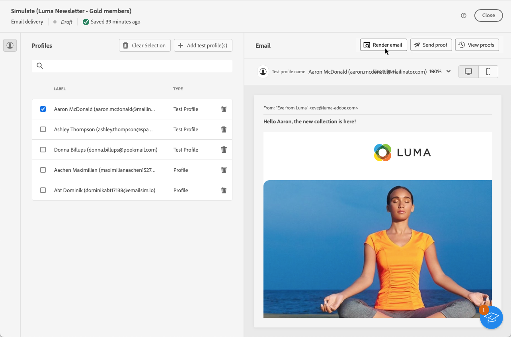

# Testa e-poståtergivningen {#email-rendering}

Innan du skickar e-postmeddelandet måste du se till att det visas för mottagarna på ett optimalt sätt på en mängd olika webbklienter och enheter.

För att göra detta kan du använda ditt **Litmus**-konto i [!DNL Adobe Campaign] för att omedelbart förhandsgranska din e-poståtergivning i olika sammanhang och kontrollera kompatibiliteten i de flesta datorer och program (webmail, message service, mobile, osv.).

>[!CAUTION]
>
>Om du använder e-poståtergivning i Campaign skickas ett korrektur till ett tredjepartssystem. Genom att ansluta ditt Litmus-konto till [!DNL Campaign] bekräftar du att Adobe inte ansvarar för de data som du kan skicka till den tredje parten. E-postprincipen för lagring av litterala data gäller för dessa e-postmeddelanden, inklusive personaliseringsdata som kan inkluderas i dessa korrektur. Om du vill få tillgång till eller ta bort sådana data måste du kontakta Litmus direkt.

Om du vill få åtkomst till funktionerna för e-poståtergivning måste du:

* Har ett Litmus-konto
* Välj profiler och/eller testprofiler - Lär dig hur i [det här avsnittet](preview-content.md)

Följ sedan stegen nedan.

1. Klicka på knappen **[!UICONTROL Simulate content]** på skärmen [Redigera innehåll](../email/edit-content.md) eller i Designer [Email](../email/get-started-email-designer.md).

1. Markera knappen **[!UICONTROL Render email]**.

   {zoomable="yes"}

1. Klicka på **Anslut ditt Litmus-konto** i det övre högra avsnittet.

   {zoomable="yes"}

1. Ange dina inloggningsuppgifter och logga in.

   {zoomable="yes"}

1. Klicka på knappen **Kör test** om du vill generera förhandsgranskningar via e-post.

1. Kontrollera e-postinnehållet i vanliga dator-, mobil- och webbaserade klienter.

   {zoomable="yes"}

<!--
TO CHECK IF user is directed to Litmus or if the email rendering is shown directly in the Campaign UI.

CONTENT ABOVE COPIED FROM AJO

If not redirecting to Litmus:

To test the email rendering, follow these steps:

1. Access the email content creation screen, then click **[!UICONTROL Simulate content]**.

1. Click the **[!UICONTROL Render email]** button.

    The left pane provides various desktop, mobile and web-based email clients. Select the desired email client to display a preview of your email in the right pane. 

    {zoomable="yes"}

    >[!NOTE]
    >
    >The email clients list provides a sample of the major mail clients. Additional email clients are available from the filter button next to the top search bar.

 -->
