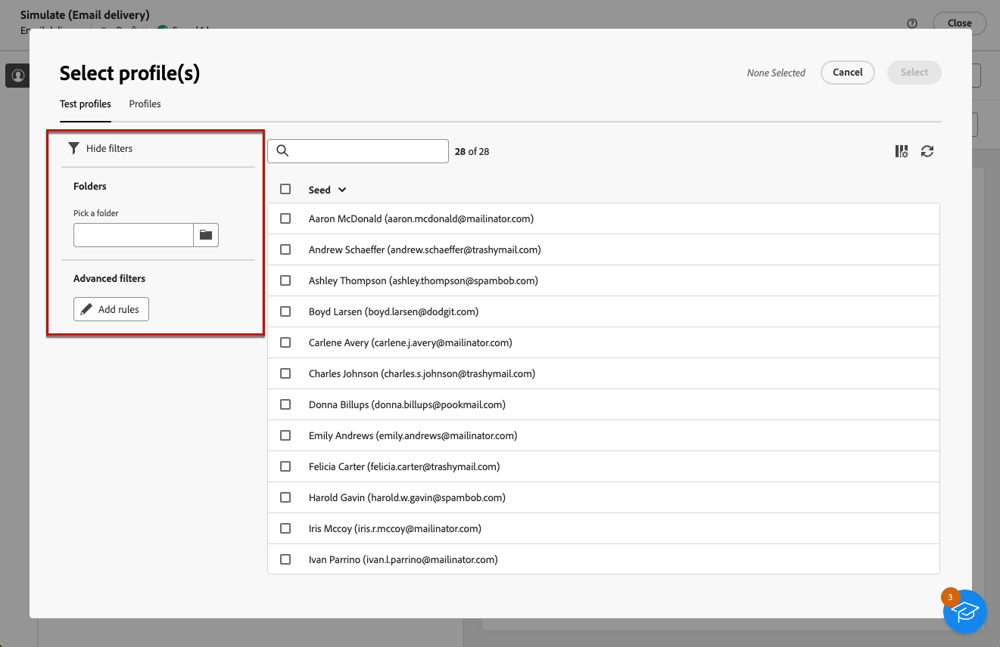

# Förhandsgranska meddelandeinnehållet {#preview-content}

Använd [!DNL Campaign] innehållssimulering för att förhandsgranska innehållet i meddelandet innan det skickas. På så sätt kan du styra personaliseringen och kontrollera hur den visas för mottagarna.

Följ stegen nedan om du vill förhandsgranska innehållet i leveransen.

1. Bläddra till skärmen Redigera innehåll för leveransen eller till [E-postdesigner](../email/get-started-email-designer.md).

1. Klicka på knappen **[!UICONTROL Simulate content]**.

   {zoomable=&quot;yes&quot;}

1. Om du vill välja de profiler som ska användas för att förhandsgranska ditt personaliserade innehåll använder du:

   * **[!UICONTROL Add test profile(s)]** för förhandsgranskning av e-post- och SMS-leveranser

   * **[!UICONTROL Add subscriber(s)]** för förhandsgranskning av push-meddelanden

1. Du kan kombinera profiler och testprofiler för att förhandsgranska ditt e-postmeddelande eller SMS.

   * The **[!UICONTROL Test profiles]** På -fliken visas alla testprofiler, som är ytterligare och fiktiva mottagare i databasen. [Lär dig hur du arbetar med testprofiler](../audience/test-profiles.md)

   * The **[!UICONTROL Profiles]** På -fliken visas alla profiler som lagras i databasen. [Lär dig arbeta med profiler](../audience/about-recipients.md)

   {zoomable=&quot;yes&quot;}

1. När du bläddrar i testprofilen eller profillistorna kan du använda filter för att förfina sökningen.

   {zoomable=&quot;yes&quot;}

   Du kan till exempel definiera en regel som söker efter alla testprofiler med **[!UICONTROL Prospect]** status. [Lär dig hur du lägger till regler med frågemodelleraren](../query/query-modeler-overview.md).

1. Klicka **[!UICONTROL Select]** för att bekräfta ditt val.

   En förhandsgranskning av leveransinnehållet visas i den högra rutan i dialogrutan **[!UICONTROL Simulate]** skärm. Personaliserade element ersätts med data från den profil som valts i den vänstra rutan.

   {zoomable=&quot;yes&quot;}

1. Om du har lagt till flera profiler kan du växla mellan dem i listan för att förhandsgranska motsvarande leveransinnehåll. Du kan också lägga till fler testprofiler och ta bort markeringen med motsvarande knappar i den vänstra rutan.

1. För e-postleveranser kan du justera **[!UICONTROL Zoom level]** och förhandsgranska innehållet på datorn eller en mobil enhet med den dedikerade ikonen i det övre högra hörnet.

1. Från **[!UICONTROL Simulate]** kan du också:
   * Skicka testleveranser till specifika mottagare för validering - [Läs mer](test-deliveries.md)
   * Få åtkomst till loggarna för skickade testleveranser - [Läs mer](test-deliveries.md#access-test-deliveries)
   * Kontrollera innehållsåtergivningen i vanliga e-postklienter endast för e-post - [Läs mer](email-rendering.md)

