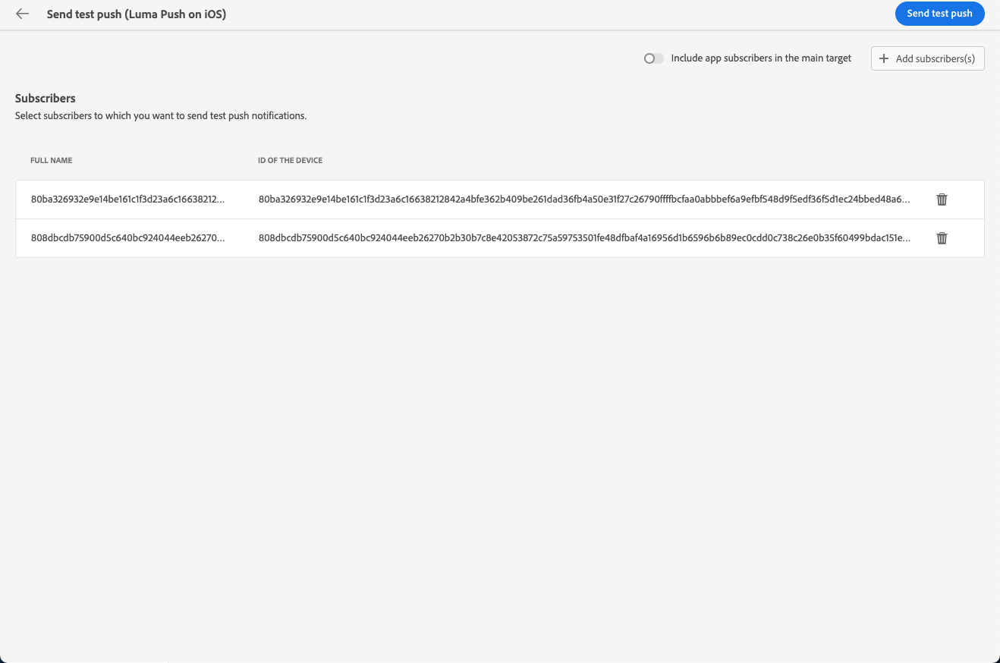

# Skicka testleveranser {#send-test-deliveries}

>[!CONTEXTUALHELP]
>id="acw_email_preview_mode"
>title="Förhandsgranskningsläge"
>abstract="Förhandsgranska och testa meddelandet genom att inkludera testpopulationen i huvudmålet."

**[!UICONTROL Adobe Campaign]** gör att du kan testa ett meddelande innan det skickas till huvudmålgruppen.

Att skicka testleveranser (som tidigare kallats korrektur) är ett viktigt steg när det gäller att validera kampanjen och identifiera potentiella problem.

Mottagarna av ett test kan kontrollera olika element som länkar, avanmälningslänkar, bilder eller spegelsidor samt upptäcka eventuella fel i återgivning, innehåll, personaliseringsinställningar och leveranskonfiguration.

## Välj testmottagare {#test-recipients}

>[!CONTEXTUALHELP]
>id="acw_email_preview_option_test_target"
>title="Testpopulation"
>abstract="Välj ett testpopulationsläge."

Beroende på vilken kanal du använder kan testmeddelanden skickas till tre typer av mottagare:

* [Testprofiler](#test-profiles) - Skicka **testa e-post och SMS** till dirigerade adresser, som är ytterligare mottagare i databasen.

  De kan skapas i [!DNL Campaign] konsolen i **[!UICONTROL Resources]** > **[!UICONTROL Campaign Management]** > **[!UICONTROL Seed addresses]** mapp. Läs mer i [Kampanjdokumentation v8 (konsol)](https://experienceleague.adobe.com/docs/campaign/campaign-v8/audience/add-profiles/test-profiles.html){target="_blank"}

* [Ersätt från huvudmål](#substitution-profiles) - Skicka **testa e-post och SMS** till en viss e-postadress eller ett visst telefonnummer när du personifierar en befintlig profil.

  På så sätt kan du uppleva meddelandet som mottagarna, vilket ger dig en korrekt representation av innehållet som profilen kommer att ta emot.

* [Prenumeranter](#subscribers) - Skicka **testa push-meddelanden** till fiktiva prenumeranter som läggs till i databasen.

  Precis som testprofiler kan de skapas i [!DNL Campaign] konsolen i **[!UICONTROL Resources]** > **[!UICONTROL Campaign Management]** > **[!UICONTROL Seed addresses]** mapp. Läs mer i [Kampanjdokumentation v8 (konsol)](https://experienceleague.adobe.com/docs/campaign/campaign-v8/audience/add-profiles/test-profiles.html){target="_blank"}

Om du vill välja mottagare för en testleverans följer du stegen nedan beroende på vilken typ av profiler du vill använda.

### Testprofiler {#test-profiles}

1. Bläddra till skärmen Redigera innehåll för din e-post eller SMS-leverans och klicka sedan på **[!UICONTROL Simulate content]** -knappen.

1. Klicka på knappen **[!UICONTROL Test]**.

   >[!NOTE]
   >
   >Om du redan har valt profiler till [förhandsgranska leveransen](preview-content.md), visas de i den vänstra rutan.

   

1. Från **[!UICONTROL Mode]** nedrullningsbar lista, välja **[!UICONTROL Test profiles]** för att rikta sig till fiktiva mottagare som får testmeddelandet eller SMS-leveransen.

   

1. Om du redan har valt profiler till [förhandsgranska meddelandet](preview-content.md) på skärmen för innehållssimulering är dessa profiler förmarkerade som testmottagare. Du kan rensa markeringen och/eller lägga till fler mottagare med **[!UICONTROL Add test profile(s)]** -knappen.

   >[!NOTE]
   >
   >Som standard är **[!UICONTROL Use test profiles]** läge är valt.

1. Om du även vill skicka det slutliga meddelandet till mottagarna av testleveransen väljer du **[!UICONTROL Include test population in the main target]** alternativ.

1. När du har valt testprofilerna kan du [skicka testleveransen](#send-test).

### Ersättningsprofiler {#substitution-profiles}

Skicka ett testmeddelande eller SMS till en viss e-postadress eller ett visst telefonnummer samtidigt som data från en befintlig profil i [!DNL Campaign] använder du ersättningsprofiler.

1. Innan du skickar ett test måste du definiera en målgrupp för leveransen. [Läs mer](../audience/about-audiences.md)

1. Bläddra till skärmen Redigera innehåll för din e-post eller SMS-leverans och klicka sedan på **[!UICONTROL Simulate content]** -knappen.

1. Klicka på knappen **[!UICONTROL Test]**.

   

1. Från **[!UICONTROL Mode]** nedrullningsbar lista, välja **[!UICONTROL Substitute from main target]** för att skicka ett test till en viss e-postadress eller ett visst telefonnummer samtidigt som data från en befintlig profil visas.

   >[!CAUTION]
   >
   >Om du inte har valt en [publik](../audience/about-audiences.md) för leverans, **[!UICONTROL Substitute from main target]** är nedtonat och du kan inte välja ersättningsprofiler.

1. Klicka på **[!UICONTROL Add address]** och ange den e-postadress eller det telefonnummer som ska ta emot testleveransen.

   

   >[!NOTE]
   >
   >Du kan ange valfri e-postadress eller valfritt telefonnummer. Detta gör att du kan skicka testleveranser till alla mottagare, även om de inte är användare av [!DNL Adobe Campaign].

1. Välj profilen från det mål som du har definierat för leveransen som ska användas som ersättning. Du kan också låta [!DNL Adobe Campaign] välj en slumpmässig profil från målet. Profildata från den valda profilen visas vid testleveransen.

1. Bekräfta mottagaren och upprepa åtgärden för att lägga till så många e-postadresser eller telefonnummer som behövs.

   

1. Om du även vill skicka det slutliga meddelandet till mottagarna av testleveransen väljer du **[!UICONTROL Include test population in the main target]** alternativ.

1. När ersättningsprofilerna är valda kan du [skicka testleveransen](#send-test).

### Prenumeranter {#subscribers}

När du arbetar med push-meddelanden kan testleveranser bara skickas till prenumeranter. Följ stegen nedan för att välja dem.

1. Bläddra till skärmen Redigera innehåll för leveransen och klicka sedan på **[!UICONTROL Simulate content]** -knappen.

1. Klicka på knappen **[!UICONTROL Test]**.

   

1. Om du redan har valt abonnenter på [förhandsgranska leveransen](preview-content.md) på skärmen för innehållssimulering är dessa profiler förvalda som testprenumeranter.

   Du kan rensa urvalet och/eller lägga till ytterligare prenumeranter med den dedikerade knappen.

   

1. Om du även vill skicka det sista push-meddelandet till testprenumeranterna väljer du **[!UICONTROL Include test population in the main target]** alternativ.

1. När prenumeranterna har valts kan du [skicka testleveransen](#send-test).

## Skicka testleveransen {#send-test}

Följ stegen nedan för att skicka testleveransen till de valda mottagarna.

1. Klicka på knappen **[!UICONTROL Send test]**.

1. Bekräfta sändningen.

   

1. Skicka så många tester som behövs tills du har slutfört innehållet i leveransen.

När du är klar kan du förbereda och skicka leveransen till huvudmålet. Läs mer i avsnitten nedan:

* [Skicka e-post](../monitor/prepare-send.md)
* [Skicka push-meddelanden](../push/send-push.md#send-push)
* [Skicka SMS-leverans](../sms/send-sms.md#send-sms)

## Åtkomst till skickade testleveranser {#access-proofs}

När testleveranserna har skickats kan du få åtkomst till dedikerade loggar från **[!UICONTROL View test log]** -knappen.

Med dessa loggar kan du få tillgång till alla tester som skickats för den valda leveransen och visualisera specifik statistik som relaterar till deras sändning. [Lär dig övervaka leveransloggar](../monitor/delivery-logs.md)

Du kan även komma åt skickade tester via [leveranslista](../msg/gs-messages.md), som alla leveranser.

