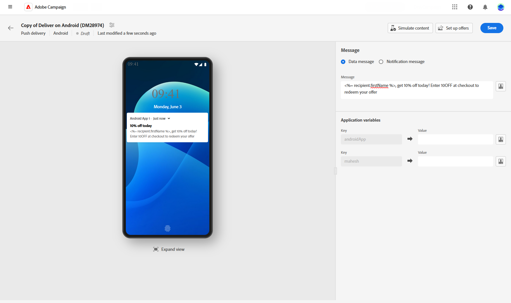

# Designa en push-meddelandeleverans {#content-push}

>[!CONTEXTUALHELP]
>id="acw_deliveries_push_android_content"
>title="Push-innehåll för Android"
>abstract="Definiera innehållet i ditt push-meddelande för Android-enheter. Klicka på knappen **Redigera innehåll** -knappen."

>[!CONTEXTUALHELP]
>id="acw_deliveries_push_ios_content"
>title="Push iOS content"
>abstract="Definiera innehållet i ditt push-meddelande för iOS-enheter. Klicka på knappen **Redigera innehåll** -knappen."

## Definiera innehållet i meddelandet {#push-message}

>[!CONTEXTUALHELP]
>id="acw_deliveries_push_ios_msg"
>title="Skicka iOS-meddelande"
>abstract="Definiera innehållet i ditt push-meddelande för iOS-enheter. Klicka på knappen **Titel** och **Meddelande** fält. Använd uttrycksredigeraren för att anpassa data och lägga till dynamiskt innehåll. Om du vill ha mer anpassad konfiguration går du till **Avancerade inställningar** -avsnitt."

>[!CONTEXTUALHELP]
>id="acw_deliveries_push_android_msg"
>title="Skicka iOS-meddelande"
>abstract="Definiera innehållet i ditt push-meddelande för Android-enheter. Klicka på knappen **Titel** och **Meddelande** fält. Använd uttrycksredigeraren för att anpassa data och lägga till dynamiskt innehåll. Om du vill anpassa ditt push-meddelande ytterligare kan du välja en bild som du vill lägga till i ditt push-meddelande, meddelandeikonen som visas på dina profilers enheter och dess färg. Om du vill ha mer anpassad konfiguration går du till **Avancerade inställningar** -avsnitt."

>[!CONTEXTUALHELP]
>id="acw_deliveries_push_ios_silent"
>title="Tyst meddelande för iOS"
>abstract="I läget för tyst överföring kan ett tyst meddelande skickas till ett mobilprogram. Användaren har inte informerats om meddelandets ankomst. Den överförs direkt till programmet."

När du har skapat din push-leverans kan du definiera innehållet. Parametrar och inställningar beror på det mobila operativsystemet: Android eller iOS. Bläddra bland flikarna nedan för att lära dig hur du skapar meddelanden för varje operativsystem.

>[!BEGINTABS]

>[!TAB Android]

Med Firebase Cloud Messaging kan du välja mellan två typer av meddelanden:

* The **[!UICONTROL Data message]** hanteras av klientprogrammet. Dessa meddelanden skickas direkt till mobilprogrammet, som genererar och visar ett Android-meddelande på enheten. Datameddelanden innehåller bara dina anpassade programvariabler.

  Om du vill definiera innehåll, anpassa data och lägga till dynamiskt innehåll klickar du på **[!UICONTROL Message]** och använder uttrycksredigeraren. Du kan använda den här redigeraren för att anpassa dina meddelanden.
I **[!UICONTROL Application variables]** -menyn läggs programvariablerna automatiskt till. Med dessa variabler kan du definiera meddelandebeteende. Du kan till exempel konfigurera en specifik programskärm som ska visas när användaren aktiverar meddelandet.

  

* The **[!UICONTROL Notification message]**, hanteras automatiskt av FCM SDK. FCM visar automatiskt meddelandet på användarnas enheter för klientprogrammets räkning. Meddelanden innehåller en fördefinierad uppsättning parametrar och alternativ, men de kan fortfarande anpassas ytterligare med anpassade programvariabler.

  Klicka på knappen **[!UICONTROL Title]** och **[!UICONTROL Message]** fält. Använd uttrycksredigeraren för att definiera innehåll, anpassa data och lägga till dynamiskt innehåll.

  Om du vill anpassa ditt push-meddelande ytterligare kan du välja en bild som du vill lägga till i ditt push-meddelande, meddelandeikonen som visas på dina profilers enheter och dess färg.

  

>[!TAB iOS]

Klicka på knappen **[!UICONTROL Title]** och **[!UICONTROL Message]** fält. Använd uttrycksredigeraren för att definiera innehåll, anpassa data och lägga till dynamiskt innehåll.

Du kan lägga till en **[!UICONTROL Subtitle]**, värdet för undertitelparametern för iOS-meddelandenyttolasten. Se det här avsnittet.

I läget för tyst överföring kan ett tyst meddelande skickas till ett mobilprogram. Användaren har inte informerats om meddelandets ankomst. Den överförs direkt till programmet.

>[!ENDTABS]

## Avancerade inställningar för push-meddelanden {#push-advanced}

>[!CONTEXTUALHELP]
>id="acw_deliveries_push_advanced_settings"
>title="Avancerade inställningar för push-meddelanden"
>abstract="Definiera avancerade inställningar för ditt push-meddelande, till exempel dess prioritet, antalet associerade meddelanden, programvariabler och mycket annat."

>[!CONTEXTUALHELP]
>id="acw_deliveries_push_advanced_settings_critical"
>title="Kritiskt varningsläge"
>abstract="Aktivera det här alternativet om du vill lägga till ljud i meddelandet, även när användarens telefon är inställd på fokusläge eller om enheten är avstängd. Detta säkerställer att användarna alltid informeras om viktiga varningar."

>[!CONTEXTUALHELP]
>id="acw_deliveries_push_advanced_settings_count"
>title="Antal meddelanden"
>abstract="Använd det här alternativet om du vill ange antalet olästa meddelanden som ska visas direkt på programikonen. På så sätt kan användaren snabbt se antalet väntande meddelanden."

>[!CONTEXTUALHELP]
>id="acw_deliveries_push_advanced_settings_mutable"
>title="Muterbart innehåll"
>abstract="Använd det här alternativet om du vill tillåta att mobilprogrammet hämtar mediainnehåll som är kopplat till meddelandet."

>[!CONTEXTUALHELP]
>id="acw_deliveries_push_advanced_settings_score"
>title="Relevanspoäng"
>abstract="Ange ett relevansvärde mellan 0 och 100 för att prioritera ordningen för meddelanden i meddelandesammanfattningen. Högre poäng innebär viktigare meddelanden."

>[!CONTEXTUALHELP]
>id="acw_deliveries_push_advanced_settings_app_variables"
>title="Programvariabler"
>abstract="Använd programvariabler för att definiera meddelandebeteende. Dessa variabler är helt anpassningsbara och ingår som en del av den meddelandenyttolast som skickas till den mobila enheten."

>[!CONTEXTUALHELP]
>id="acw_deliveries_push_advanced_settings_category"
>title="Kategori-ID"
>abstract="Ange namnet på det kategori-ID som är associerat med meddelandet. Detta gör att åtgärdsknappar visas, vilket gör att användaren kan utföra olika åtgärder direkt från meddelandet utan att öppna programmet."

Avancerade alternativ beror på det mobila operativsystemet: Android eller iOS. Bläddra bland flikarna nedan för att lära dig hur du definierar alternativ för meddelanden för varje operativsystem.

>[!BEGINTABS]

>[!TAB Android]

| Parameter | Beskrivning |
|---------|---------|
| **[!UICONTROL Sound]** | Ställ in ljudet som ska spelas upp när enheten får ditt meddelande. |
| **[!UICONTROL Notification Count]** | Ange hur många nya olästa uppgifter som ska visas direkt på programikonen. På så sätt kan användaren snabbt se antalet väntande meddelanden. |
| **[!UICONTROL Channel ID]** | Ange meddelandets kanal-ID. Appen måste skapa en kanal med det här channel-id:t innan något meddelande med det här channel-id:t tas emot. |
| **[!UICONTROL Click action]** | Definiera åtgärden som är kopplad till en användare som klickar på meddelandet. Detta avgör beteendet när användaren interagerar med meddelandet, till exempel öppnar en viss skärm eller utför en viss åtgärd i programmet. |
| **[!UICONTROL Tag]** | Ange en identifierare som ska användas för att ersätta befintliga meddelanden i meddelanderutan. Detta förhindrar att flera meddelanden ackumuleras och säkerställer att endast den senaste relevanta aviseringen visas. |
| **[!UICONTROL Priority]** | Ange prioritetsnivån för meddelandet, som kan vara standard, minimum, low eller high. Prioritetsnivån avgör hur viktigt och brådskande meddelandet är, vilket påverkar hur det visas och om det kan kringgå vissa systeminställningar. Mer information finns i [FCM-dokumentation](https://firebase.google.com/docs/reference/fcm/rest/v1/projects.messages#notificationpriority). |
| **[!UICONTROL Visibility]** | Ange synlighetsnivån för ditt meddelande, som kan vara offentlig, privat eller hemlig. Synlighetsnivån avgör hur mycket av meddelandets innehåll som visas på låsskärmen och andra känsliga områden. Mer information finns i [FCM-dokumentation](https://firebase.google.com/docs/reference/fcm/rest/v1/projects.messages#visibility). |
| **[!UICONTROL Sticky]** | När det är aktiverat visas meddelandet även när användaren klickar på det.  Om det är inaktiverat stängs meddelandet automatiskt när användaren interagerar med det. Tack vare det klibbiga beteendet kan viktiga meddelanden finnas kvar på skärmen under längre perioder. |
| **[!UICONTROL Application variables]** | Gör att du kan definiera meddelandebeteende. Dessa variabler är helt anpassningsbara och ingår som en del av den meddelandenyttolast som skickas till den mobila enheten. |

>[!TAB iOS]

| Parameter | Beskrivning |
|---------|---------|
| **[!UICONTROL Critical alert mode]** | Aktivera det här alternativet om du vill lägga till ljud i meddelandet, även när användarens telefon är inställd på fokusläge eller om enheten är avstängd. Detta säkerställer att viktiga varningar uppmärksammas av användaren. När du väljer det här alternativet kan du justera meddelandevolymen med hjälp av volymnivåfältet. Ett tal mellan 0 och 100 ovanför fältet återspeglar dina inställningar. |
| **[!UICONTROL Clean Badge]** | Aktivera det här alternativet om du vill uppdatera badge-värdet som visas på programikonen. Det ser till att märket korrekt återspeglar antalet nya olästa uppgifter. |
| **[!UICONTROL Notification count]** | Ange ett tal som ska visas direkt på programikonen, vilket anger antalet nya olästa uppgifter. Detta ger användaren en snabb visuell referens. |
| **[!UICONTROL Volume]** | Volymen av ljudet från 0 till 100. |
| **[!UICONTROL Mutable content]** | Aktivera det här alternativet om du vill tillåta att mobilprogrammet hämtar mediainnehåll som är kopplat till meddelandet. Mer information om detta hittar du i [Apples dokumentation för utvecklare](https://developer.apple.com/library/content/documentation/NetworkingInternet/Conceptual/RemoteNotificationsPG/ModifyingNotifications.html). |
| **[!UICONTROL Relevance score]** | Ange ett relevansvärde mellan 0 och 100 för att prioritera ordningen för meddelanden i meddelandesammanfattningen. Högre poäng innebär viktigare meddelanden. |
| **[!UICONTROL Interruption level]** | <ul> <li>**[!UICONTROL Active]**: Anges som standard visas meddelandet omedelbart, skärmen visas och ett ljud kan spelas upp. Meddelanden går inte igenom fokusläget.</li><li>**[!UICONTROL Passive]**: Systemet lägger till meddelandet i meddelandelistan utan att skärmen ljusas eller ett ljud spelas upp. Meddelanden går inte igenom fokusläget.</li><li>**[!UICONTROL Time sensitive]**: Systemet visar meddelandet omedelbart, lyser upp skärmen, kan spela upp ett ljud och gå igenom fokus-lägen. Den här nivån kräver inget särskilt tillstånd från Apple.</li> <li>**[!UICONTROL Critical]**: Systemet visar meddelandet omedelbart, lyser upp skärmen och kringgår avstängningsväxeln eller fokusläget. Observera att den här nivån kräver ett särskilt tillstånd från Apple.</ul> |
| **[!UICONTROL Thread-id]** | Identifierare som används för att gruppera relaterade meddelanden tillsammans. Meddelanden med samma tråd-ID organiseras som en enda konversation eller tråd i meddelandelistan. |
| **[!UICONTROL Category]** | Ange namnet på det kategori-ID som är associerat med meddelandet. Detta gör att åtgärdsknappar visas, vilket gör att användaren kan utföra olika åtgärder direkt från meddelandet utan att öppna programmet. |
| **[!UICONTROL Target content ID]** | Identifierare som används för att ange vilket programfönster som ska flyttas fram när meddelandet öppnas. |
| **[!UICONTROL Launch image]** | Ange namnet på startbildfilen som ska visas när användaren väljer att starta programmet från meddelandet. Den valda bilden visas i stället för programmets vanliga startskärm. |
| **[!UICONTROL Application variables]** | Gör att du kan definiera meddelandebeteende. Dessa variabler är helt anpassningsbara och ingår som en del av den meddelandenyttolast som skickas till den mobila enheten. |

>[!ENDTABS]

<!--Sounds must be included in the application and defined when the service is created. Refer to this section.-->
