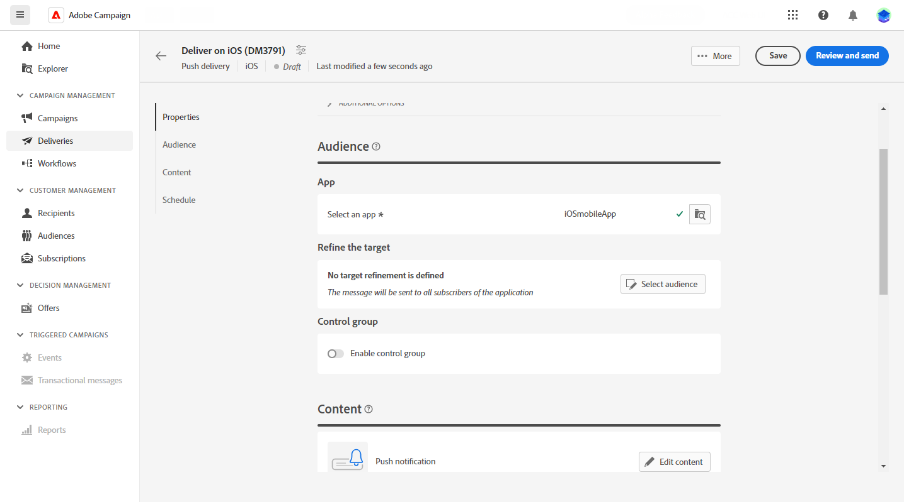

# Skapa en leverans av push-meddelanden {#create-push}

>[!CONTEXTUALHELP]
>id="acw_deliveries_push_audience"
>title="Definiera penselmålgruppen"
>abstract="Välj den bästa målgruppen för ditt push-meddelande."

>[!CONTEXTUALHELP]
>id="acw_push_notification_template"
>title="Push-meddelandemall"
>abstract="Välj en mall för push-meddelanden för att starta din push-leverans."

>[!CONTEXTUALHELP]
>id="acw_deliveries_push_properties"
>title="Push-leveransegenskaper"
>abstract="Hantera egenskaperna för push-leverans."

Du kan skapa en fristående leverans av push-meddelanden eller skapa ett push-meddelande i samband med ett kampanjarbetsflöde. Stegen nedan beskriver proceduren för en fristående push-leverans (en bild). Om du arbetar i ett kampanjarbetsflöde visas stegen för att skapa i [det här avsnittet](../workflows/activities/channels.md#create-a-delivery-in-a-campaign-workflow).

Så här skapar du en ny fristående push-leverans:

1. Gå till **[!UICONTROL Deliveries]** till vänster och klicka på  **[!UICONTROL Create delivery]** -knappen.

1. Under **[!UICONTROL Channel]** avsnitt, välja **Push-meddelande** som kanal och välj en mall, beroende på vilket operativsystem enheten har: Android eller iOS. [Läs mer om mallar](../msg/delivery-template.md)

1. Bekräfta genom att klicka på knappen **[!UICONTROL Create delivery]**.

   

1. Ange en **[!UICONTROL Label]** för leverans och åtkomst till **[!UICONTROL Additional options]** nedrullningsbar meny.

   +++Konfigurera följande inställningar baserat på dina behov.
   * **[!UICONTROL Internal name]**: Tilldela en unik identifierare till leveransen.
   * **[!UICONTROL Folder]**: Lagra leveransen i en viss mapp.
   * **[!UICONTROL Delivery code]**: Ordna leveranserna med din egen namnkonvention.
   * **[!UICONTROL Description]**: Ange en beskrivning för leveransen.
   * **[!UICONTROL Nature]**: Ange e-postens natur för klassificeringsändamål.
+++

1. Från **[!UICONTROL Audience]** väljer du det program som du vill använda för leveransen.

1. Klicka på **[!UICONTROL Select audience]** för att rikta sig till en befintlig målgrupp eller skapa en egen. [Läs mer](../audience/about-recipients.md)

   Observera att ditt push-meddelande som standard skickas till alla prenumeranter på programmet.

   

1. Aktivera **[!UICONTROL Enable control]** gruppalternativ för att ställa in en kontrollgrupp för att mäta effekten av leveransen, så att du kan jämföra beteendet hos den population som tog emot meddelandet med beteendet hos kontakter som inte gjorde det. [Läs mer](../audience/control-group.md)

1. Klicka **[!UICONTROL Edit content]** för att börja designa innehållet i ditt push-meddelande. [Läs mer](content-push.md)

   

   Från den här skärmen kan du även [simulera ditt innehåll](../preview-test/preview-test.md) och [konfigurera erbjudanden](../content/offers.md).

1. Aktivera **[!UICONTROL Enable scheduling]** alternativ. När du har initierat leveransen skickas meddelandet automatiskt på exakt det datum och klockslag som du har angett för mottagaren. Läs mer om leveransplanering i [det här avsnittet](../msg/gs-messages.md#gs-schedule)

   

1. Klicka **[!UICONTROL Configure delivery settings]** för att få tillgång till avancerade alternativ för leveransmallen. [Läs mer](../advanced-settings/delivery-settings.md)

   
