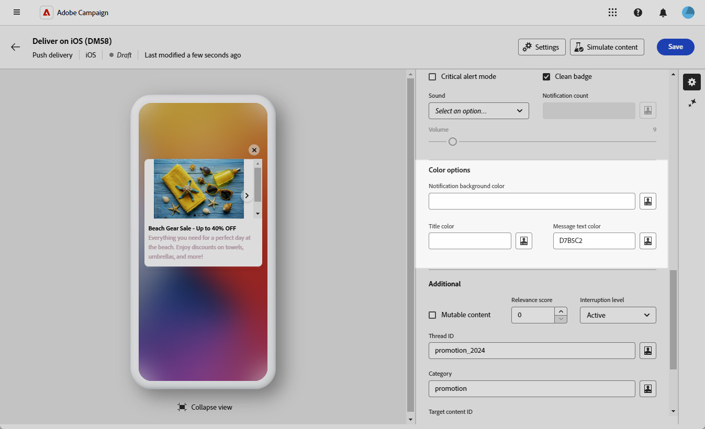

# Designa en omfattande iOS-leverans {#rich-push}

>[!IMPORTANT]
>
>Innan du utformar ett push-meddelande måste du konfigurera V2-anslutningen. Mer information finns på [den här sidan](https://experienceleague.adobe.com/en/docs/campaign-classic/using/sending-messages/sending-push-notifications/configure-the-mobile-app/configuring-the-mobile-application).

## Definiera innehållet i meddelandet {#push-message}

När push-leveransen är klar definierar du innehållet med någon av följande mallar:

* Med **Standard** kan du skicka meddelanden med en enkel ikon och en medföljande bild.
* **Grundläggande** kan innehålla text, bilder och knappar i dina meddelanden.
* Med **Carousel** kan du skicka meddelanden med text och flera bilder som användare kan svepa igenom.
* **Timer** innehåller en nedräkningstimer i dina meddelanden.

Gå igenom flikarna nedan för att lära dig mer om hur du anpassar mallarna.

>[!BEGINTABS]

>[!TAB Standard]

1. Välj **[!UICONTROL Default]** i listrutan **[!UICONTROL Template]**.

   

1. I fältet **[!UICONTROL Title]** anger du etiketten för titeln som du vill ska visas i listan med meddelanden som är tillgängliga från meddelandecentret.

   Det här fältet definierar värdet på parametern **title** i iOS-meddelandenyttolasten.

1. Du kan också lägga till en **[!UICONTROL Subtitle]** som motsvarar parametern **subtitle** i iOS-meddelandenyttolasten.

1. Ange innehållet i meddelandet i fältet **[!UICONTROL Message]**.

1. Använd uttrycksredigeraren för att definiera innehåll, anpassa data och lägga till dynamiskt innehåll. [Läs mer](../personalization/personalize.md)

   

1. Om du vill anpassa ditt push-meddelande ytterligare väljer du en **[!UICONTROL Launch image]**-URL att lägga till i ditt push-meddelande.

1. I listrutan **[!UICONTROL Advanced settings]** går du till fliken **[!UICONTROL Sound and Badge]** och anpassar ytterligare inställningar, till exempel ljud- och badge-alternativ för dina meddelanden. [Läs mer](#sound-badge)

   

1. Utforska de **[!UICONTROL Additional]** alternativ som är tillgängliga för dina push-meddelanden om du vill göra ytterligare anpassningar. [Läs mer](#push-advanced)

   

1. **[!UICONTROL Application variables]** läggs automatiskt till på menyn **[!UICONTROL Application variables]**. De gör att du kan definiera meddelandebeteende, t.ex. konfigurera en specifik programskärm som ska visas när användaren aktiverar meddelandet.

När du har definierat meddelandeinnehållet kan du använda testprenumeranter för att förhandsgranska och testa meddelandet.

>[!TAB Grundläggande]

1. Välj **[!UICONTROL Basic]** i listrutan **[!UICONTROL Template]**.

   

1. Skriv texten i fälten **[!UICONTROL Title]**, **[!UICONTROL Expanded title]**, **[!UICONTROL Message]** och **[!UICONTROL Expanded message]** för att skapa meddelandet.

   Texten **[!UICONTROL Message]** visas i den komprimerade vyn, medan **[!UICONTROL Expanded message]** visas när meddelandet expanderas.

   

1. Använd uttrycksredigeraren för att definiera innehåll, anpassa data och lägga till dynamiskt innehåll. [Läs mer](../personalization/personalize.md)

1. Du kan också lägga till en **[!UICONTROL Subtitle]** som motsvarar parametern **subtitle** i iOS-meddelandenyttolasten.

1. Lägg till den URL som definierar den **[!UICONTROL Click action]** som är associerad med en användare som klickar på meddelandet. Detta avgör beteendet när användaren interagerar med meddelandet, till exempel öppnar en viss skärm eller utför en viss åtgärd i programmet.

1. Om du vill anpassa ditt push-meddelande ytterligare väljer du en **[!UICONTROL Launch image]**-URL att lägga till i ditt push-meddelande.

1. I listrutan **[!UICONTROL Advanced settings]** går du till fliken **[!UICONTROL Sound and Badge]** och anpassar ytterligare inställningar, till exempel ljud- och badge-alternativ för dina meddelanden. [Läs mer](#sound-badge)

   

1. Ange hexadecimala färgkoder för **[!UICONTROL Notification background color]**, **[!UICONTROL Notification background color]** och **[!UICONTROL Message text color]** på menyn **[!UICONTROL Color options]**.

   

1. Utforska de **[!UICONTROL Additional]** alternativ som är tillgängliga för dina push-meddelanden om du vill göra ytterligare anpassningar. [Läs mer](#push-advanced)

1. **[!UICONTROL Application variables]** läggs automatiskt till på menyn **[!UICONTROL Application variables]**. De gör att du kan definiera meddelandebeteende, t.ex. konfigurera en specifik programskärm som ska visas när användaren aktiverar meddelandet.

När du har definierat meddelandeinnehållet kan du använda testprenumeranter för att förhandsgranska och testa meddelandet.

>[!TAB Carousel]

1. Välj **[!UICONTROL Carousel]** i listrutan **[!UICONTROL Template]**.

   

1. Skriv texten i fälten **[!UICONTROL Title]**, **[!UICONTROL Expanded title]**, **[!UICONTROL Message]** och **[!UICONTROL Expanded message]** för att skapa meddelandet.

   Texten **[!UICONTROL Message]** visas i den komprimerade vyn, medan **[!UICONTROL Expanded message]** visas när meddelandet expanderas.

   

1. Använd uttrycksredigeraren för att definiera innehåll, anpassa data och lägga till dynamiskt innehåll. [Läs mer](../personalization/personalize.md)

1. Du kan också lägga till en **[!UICONTROL Subtitle]** som motsvarar parametern **subtitle** i iOS-meddelandenyttolasten.

1. Lägg till den URL som definierar den **[!UICONTROL Click action]** som är associerad med en användare som klickar på meddelandet. Detta avgör beteendet när användaren interagerar med meddelandet, till exempel öppnar en viss skärm eller utför en viss åtgärd i programmet.

1. Välj hur **[!UICONTROL Carousel]** ska användas:

   * **[!UICONTROL Auto]**: bläddrar automatiskt igenom bilder som bildrutor och övergår i fördefinierade intervall.
   * **[!UICONTROL Manual]**: gör att användare kan svepa mellan bildrutor manuellt för att navigera bland bilderna.

1. Klicka på **[!UICONTROL Add image]** och ange din **[!UICONTROL Image]** URL, **[!UICONTROL Text]** och **[!UICONTROL Action URI]**.

   Se till att du inkluderar minst tre bilder och högst fem bilder.

   

1. Hantera bildens ordning med nedpil och uppåtpil.

1. I listrutan **[!UICONTROL Advanced settings]** går du till fliken **[!UICONTROL Sound and Badge]** och anpassar ytterligare inställningar, till exempel ljud- och badge-alternativ för dina meddelanden. [Läs mer](#sound-badge)

1. Ange hexadecimala färgkoder för **[!UICONTROL Notification background color]**, **[!UICONTROL Notification background color]** och **[!UICONTROL Message text color]** på menyn **[!UICONTROL Color options]**.

   

1. Utforska de **[!UICONTROL Additional]** alternativ som är tillgängliga för dina push-meddelanden om du vill göra ytterligare anpassningar. [Läs mer](#push-advanced)

1. **[!UICONTROL Application variables]** läggs automatiskt till på menyn **[!UICONTROL Application variables]**. De gör att du kan definiera meddelandebeteende, t.ex. konfigurera en specifik programskärm som ska visas när användaren aktiverar meddelandet.

När du har definierat meddelandeinnehållet kan du använda testprenumeranter för att förhandsgranska och testa meddelandet.

>[!TAB Timer]

1. Välj **[!UICONTROL Timer]** i listrutan **[!UICONTROL Notification type]**.

   

1. Skriv texten i fälten **[!UICONTROL Title]**, **[!UICONTROL Expanded title]**, **[!UICONTROL Message]** och **[!UICONTROL Expanded message]** för att skapa meddelandet.

   Texten **[!UICONTROL Message]** visas i den komprimerade vyn, medan **[!UICONTROL Expanded message]** visas när meddelandet expanderas.

   

1. Använd uttrycksredigeraren för att definiera innehåll, anpassa data och lägga till dynamiskt innehåll. [Läs mer](../personalization/personalize.md)

1. Du kan också lägga till en **[!UICONTROL Subtitle]** som motsvarar parametern **subtitle** i iOS-meddelandenyttolasten.

1. Lägg till den URL som definierar den **[!UICONTROL Click action]** som är associerad med en användare som klickar på meddelandet. Detta avgör beteendet när användaren interagerar med meddelandet, till exempel öppnar en viss skärm eller utför en viss åtgärd i programmet.

1. Om du vill anpassa ditt push-meddelande ytterligare väljer du en **[!UICONTROL Launch image]**-URL att lägga till i ditt push-meddelande.

1. Ange **[!UICONTROL Timer duration]** i sekunder eller **[!UICONTROL Timer end timestamp]** till en specifik epok-tidsstämpel.

   

1. Ange den text och bild som ska visas när timern har gått ut i fälten **[!UICONTROL Alternate title]**, **[!UICONTROL Alternate message]** och **[!UICONTROL Alternate launch image]**.

   

1. I listrutan **[!UICONTROL Advanced settings]** går du till fliken **[!UICONTROL Sound and Badge]** och anpassar ytterligare inställningar, till exempel ljud- och badge-alternativ för dina meddelanden. [Läs mer](#sound-badge)

1. Ange hexadecimala färgkoder för **[!UICONTROL Notification background color]**, **[!UICONTROL Notification background color]** och **[!UICONTROL Message text color]** på menyn **[!UICONTROL Color options]**.

1. Utforska de **[!UICONTROL Additional]** alternativ som är tillgängliga för dina push-meddelanden om du vill göra ytterligare anpassningar. [Läs mer](#push-advanced)

1. **[!UICONTROL Application variables]** läggs automatiskt till på menyn **[!UICONTROL Application variables]**. De gör att du kan definiera meddelandebeteende, t.ex. konfigurera en specifik programskärm som ska visas när användaren aktiverar meddelandet.

När du har definierat meddelandeinnehållet kan du använda testprenumeranter för att förhandsgranska och testa meddelandet.

>[!ENDTABS]

## Avancerade inställningar för push-meddelanden {#push-advanced}

### Ljud- och märkesalternativ {#sound-badge}

| Parameter | Beskrivning |
|-----------|-------------|
| **[!UICONTROL Critical alert mode]** | Aktivera det här alternativet om du vill lägga till ljud i meddelandet, även om användarens telefon är inställd på fokusläge eller avstängd. |
| **[!UICONTROL Clean Badge]** | Aktivera det här alternativet om du vill uppdatera badge-värdet. |
| **[!UICONTROL Sound]** | Ställ in ljudet som ska spelas upp när enheten får ditt meddelande. |
| **[!UICONTROL Notification count]** | Ange ett nummer som ska visas direkt på programikonen, vilket anger antalet nya olästa meddelanden. |
| **[!UICONTROL Volume]** | Ange ljudvolymen från 0 till 100. Ljud måste inkluderas i programmet och definieras när tjänsten skapas. |

### Färgalternativ {#color}

| Parameter | Beskrivning |
|-----------|-------------|
| **[!UICONTROL Notification background color]** | Ange färgen på meddelandebakgrunden med hjälp av hexadecimala färgkoder. |
| **[!UICONTROL Title color]** | Ange färgen för titeln med hexadecimala färgkoder. |
| **[!UICONTROL Message text color]** | Ange färgen på texten med hexadecimala färgkoder. |

### Avancerade alternativ {#notification-options}

| Parameter | Beskrivning |
|-----------|-------------|
| **[!UICONTROL Mutable content]** | Aktivera det här alternativet om du vill tillåta mobilprogrammet att hämta medieinnehåll. |
| **[!UICONTROL Relevance score]** | Ange ett relevansvärde mellan 0 och 100. Systemet använder detta för att sortera meddelanden i meddelandesammanfattningen. |
| **[!UICONTROL Interruption level]** | <ul><li>**Aktiv**: Om du anger det som standard visas meddelandet omedelbart, skärmen startas och ett ljud kan spelas upp. Meddelanden går inte igenom fokuslägena.</li><li>**Passiv**: Systemet lägger till meddelandet i meddelandelistan utan att skärmen eller ljudet visas. Meddelanden går inte igenom fokuslägena.</li><li>**Tidskänslig**: Systemet visar meddelandet omedelbart, lyser skärmen, kan spela upp ett ljud och går igenom fokuslägen. Den här nivån kräver inte särskilt tillstånd från Apple.</li><li>**Kritisk**: Systemet visar meddelandet omedelbart, lyser upp skärmen och kringgår avstängningsväxeln eller fokusläget. Observera att den här nivån kräver särskilt tillstånd från Apple.</li></ul> |
| **[!UICONTROL Thread-id]** | Ange den identifierare som används för att gruppera relaterade meddelanden. |
| **[!UICONTROL Category]** | Ange namnet på ditt kategori-ID, som kommer att visa åtgärdsknappar. Dessa meddelanden ger användaren ett snabbare sätt att utföra olika åtgärder som svar på ett meddelande utan att öppna eller navigera i programmet. |
| **[!UICONTROL Target content ID]** | Ange en identifierare som används för att ange vilket programfönster som ska visas när meddelandet öppnas. |