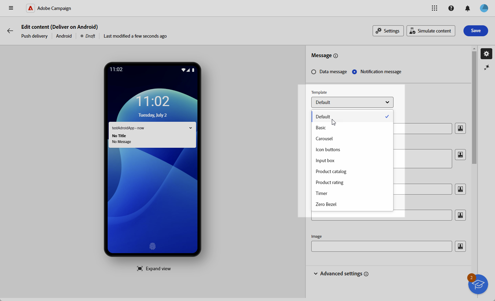
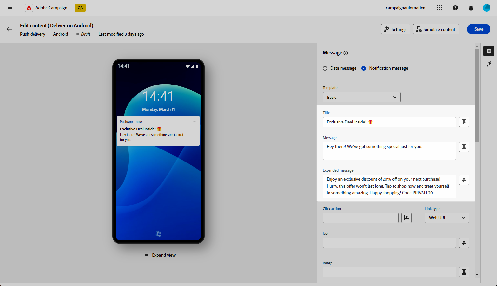
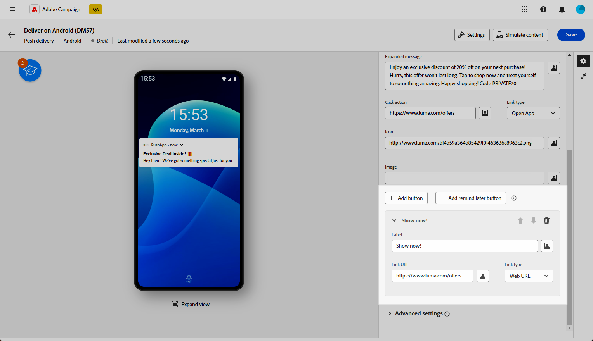

# Designa en omfattande push-leverans för Android {#rich-push}

>[!CONTEXTUALHELP]
>id="acw_deliveries_push_remind_later"
>title="Knappen Påminn senare"
>abstract="The **Påminn senare** finns ett alternativ för att schemalägga en påminnelse. Tidsstämpelfältet kräver ett värde som representerar epok i sekunder."

>[!AVAILABILITY]
>
>Den här funktionen finns i **Begränsad tillgänglighet** (LA).

Med Firebase Cloud Messaging kan du välja mellan två typer av meddelanden:

* The **[!UICONTROL Data message]** hanteras av klientprogrammet. Dessa meddelanden skickas direkt till mobilprogrammet, som genererar och visar ett Android-meddelande på enheten. Datameddelanden innehåller bara dina anpassade programvariabler.

* The **[!UICONTROL Notification message]**, hanteras automatiskt av FCM SDK. FCM visar automatiskt meddelandet på användarnas enheter för klientprogrammets räkning. Meddelanden innehåller en fördefinierad uppsättning parametrar och alternativ, men de kan fortfarande anpassas ytterligare med anpassade programvariabler.

{zoomable="yes"}

## Definiera innehållet i meddelandet {#push-message}

När du har skapat din push-leverans kan du definiera innehållet. Tre mallar är tillgängliga:

* **Standardmall** Med kan du skicka meddelanden med en enkel ikon och en medföljande bild.

* **Grundläggande mall** kan innehålla text, bilder och knappar i dina meddelanden.

* **Carousel-mall** Med kan du skicka meddelanden med text och flera bilder som användare kan svepa igenom.

Gå igenom flikarna nedan för att lära dig mer om hur du anpassar mallarna.

>[!BEGINTABS]

>[!TAB Standardmall]

1. Från **[!UICONTROL Template]** nedrullningsbar meny, välja **[!UICONTROL Default]**.

   

1. Skriv texten i **[!UICONTROL Title]** och **[!UICONTROL Message]** fält.

   

1. Använd uttrycksredigeraren för att definiera innehåll, anpassa data och lägga till dynamiskt innehåll. [Läs mer](../personalization/personalize.md)

1. Definiera **[!UICONTROL Click action]** som är kopplad till en användare klickar på meddelandet. Detta avgör beteendet när användaren interagerar med meddelandet, till exempel öppnar en viss skärm eller utför en viss åtgärd i programmet.

1. Om du vill anpassa ditt push-meddelande ytterligare kan du välja en **[!UICONTROL Image]** URL som ska läggas till i ditt push-meddelande och meddelandets **[!UICONTROL Icon]** som ska visas på dina profilers enheter.

   

1. Konfigurera **[!UICONTROL Advanced settings]** om ditt push-meddelande. [Läs mer](#push-advanced)

När du har definierat meddelandeinnehållet kan du använda testprenumeranter för att förhandsgranska och testa meddelandet.

>[!TAB Grundläggande mall]

1. Från **[!UICONTROL Template]** nedrullningsbar meny, välja **[!UICONTROL Basic]**.

   

1. Skriv texten i **[!UICONTROL Title]**, **[!UICONTROL Message]** och **[!UICONTROL Expanded message]** fält.

   The **[!UICONTROL Message]** texten visas i den komprimerade vyn när **[!UICONTROL Expanded message]** visas när meddelandet expanderas.

   

1. Använd uttrycksredigeraren för att definiera innehåll, anpassa data och lägga till dynamiskt innehåll. [Läs mer](../personalization/personalize.md)

1. Lägg till den URL som definierar **[!UICONTROL Click action]** som är kopplad till en användare klickar på meddelandet. Detta avgör beteendet när användaren interagerar med meddelandet, till exempel öppnar en viss skärm eller utför en viss åtgärd i programmet.

1. Välj **[!UICONTROL Link type]** för den URL du lade till i **[!UICONTROL Click action]** fält:

   * **[!UICONTROL Web URL]**: Webb-URL:er dirigerar användare till onlineinnehåll. När de klickar uppmanas de enhetens standardwebbläsare att öppna och navigera till den angivna URL:en.

   * **[!UICONTROL Deeplink]**: Djuplänkar är URL-adresser som vägleder användare till specifika avsnitt i ett program även om programmet stängs. När du klickar på det här alternativet kan en dialogruta visas så att användarna kan välja mellan olika appar som kan hantera länken.

   * **[!UICONTROL Open App]**: Med öppna app-URL:er kan du ansluta direkt till innehåll i ett program. Det gör att ditt program kan etablera sig som standardhanterare för en viss typ av länk, utan att dialogrutan för olika betydelser visas.

   Mer information om hur du hanterar Android-applänkar finns i [Dokumentation för Android-utvecklare](https://developer.android.com/training/app-links).

   

1. Om du vill anpassa ditt push-meddelande ytterligare kan du välja en **[!UICONTROL Image]** URL som ska läggas till i ditt push-meddelande och meddelandets **[!UICONTROL Icon]** som ska visas på dina profilers enheter.

1. Klicka **[!UICONTROL Add button]** och fylla i följande fält:

   * **[!UICONTROL Label]**: Texten visas på knappen.
   * **[!UICONTROL Link URI]**: Ange den URI som ska köras när du klickar på knappen.
   * **[!UICONTROL Link type]**: Typ av länk antingen **[!UICONTROL Web URL]**, **[!UICONTROL Deeplink]**, eller **[!UICONTROL Open App]**.

   Du kan inkludera upp till tre knappar i ditt push-meddelande. Om du väljer **[!UICONTROL Remind later button]** kan du bara använda högst två knappar.

   

1. Klicka **[!UICONTROL Add remind later]** om du vill lägga till ett alternativ för Påminn mig senare i ditt push-meddelande. Ange en **[!UICONTROL Label]** och **[!UICONTROL Timestamp]**.

   Ett värde som representerar epok i sekunder förväntas för fältet Tidsstämpel.

   

1. Konfigurera **[!UICONTROL Advanced settings]** om ditt push-meddelande. [Läs mer](#push-advanced)

När du har definierat meddelandeinnehållet kan du använda testprenumeranter för att förhandsgranska och testa meddelandet.

>[!TAB Carousel-mall]

1. Från **[!UICONTROL Template]** nedrullningsbar meny, välja **[!UICONTROL Carousel]**.

   

1. Skriv texten i **[!UICONTROL Title]**, **[!UICONTROL Message]** och **[!UICONTROL Expanded message]** fält.

   The **[!UICONTROL Message]** texten visas i den komprimerade vyn när **[!UICONTROL Expanded message]** visas när meddelandet expanderas.

   

1. Använd uttrycksredigeraren för att definiera innehåll, anpassa data och lägga till dynamiskt innehåll. [Läs mer](../personalization/personalize.md)

1. Lägg till den URL som definierar **[!UICONTROL Click action]** som är kopplad till en användare klickar på meddelandet. Detta avgör beteendet när användaren interagerar med meddelandet, till exempel öppnar en viss skärm eller utför en viss åtgärd i programmet.

1. Välj **[!UICONTROL Link type]** för den URL du lade till i **[!UICONTROL Click action]** fält:

   * **[!UICONTROL Web UR]**L: Webb-URL:er dirigerar användare till onlineinnehåll. När de klickar uppmanas de enhetens standardwebbläsare att öppna och navigera till den angivna URL:en.

   * **[!UICONTROL Deeplink]**: Djuplänkar är URL-adresser som vägleder användare till specifika avsnitt i ett program även om programmet stängs. När du klickar på det här alternativet kan en dialogruta visas så att användarna kan välja mellan olika appar som kan hantera länken.

   * **[!UICONTROL Open App]**: Med öppna app-URL:er kan du ansluta direkt till innehåll i ett program. Det gör att ditt program kan etablera sig som standardhanterare för en viss typ av länk, utan att dialogrutan för olika betydelser visas.

   Mer information om hur du hanterar Android-applänkar finns i [Dokumentation för Android-utvecklare](https://developer.android.com/training/app-links).

   

1. Om du vill anpassa ditt push-meddelande ytterligare kan du välja meddelandets **[!UICONTROL Icon]** som ska visas på dina profilers enheter.

1. Välj hur **[!UICONTROL carousel]** används:

   * **[!UICONTROL Auto]**: bläddrar automatiskt igenom bilderna som bildrutor och övergår i fördefinierade intervall.
   * **[!UICONTROL Manual]**: gör att användare kan svepa mellan bildrutor manuellt för att navigera bland bilderna.

     Aktivera **[!UICONTROL Filmstrip]** om du vill inkludera förhandsvisningar av föregående och nästa bild bredvid huvudbilden.

1. Klicka **[!UICONTROL Add image]** och ange bildens URL och text.

   Se till att du inkluderar minst tre bilder och högst fem bilder.

   

1. Hantera bildens ordning med nedpil och uppåtpil.

1. Konfigurera **[!UICONTROL Advanced settings]** om ditt push-meddelande. [Läs mer](#push-advanced)

När du har definierat meddelandeinnehållet kan du använda testprenumeranter för att förhandsgranska och testa meddelandet.

>[!ENDTABS]

## Avancerade inställningar för push-meddelanden {#push-advanced}

{zoomable="yes"}

| Parameter | Beskrivning |
|---------|---------|
| **[!UICONTROL Icon color]** | Ställ in färgen på ikonen med de hexadecimala färgkoderna. |
| **[!UICONTROL Title color]** | Ange färgen på titeln med de hexadecimala färgkoderna. |
| **[!UICONTROL Message text color]** | Ange färgen på meddelandetexten med de hexadecimala färgkoderna. |
| **[!UICONTROL Notification background color]** | Ange färgen på meddelandebakgrunden med de hexadecimala färgkoderna. |
| **[!UICONTROL Sound]** | Ställ in ljudet som ska spelas upp när enheten får ditt meddelande. |
| **[!UICONTROL Notification Count]** | Ange hur många nya olästa uppgifter som ska visas direkt på programikonen. På så sätt kan användaren snabbt se antalet väntande meddelanden. |
| **[!UICONTROL Channel ID]** | Ange meddelandets kanal-ID. Appen måste skapa en kanal med det här channel-id:t innan något meddelande med det här channel-id:t tas emot. |
| **[!UICONTROL Tag]** | Ange en identifierare som ska användas för att ersätta befintliga meddelanden i meddelanderutan. Detta förhindrar att flera meddelanden ackumuleras och säkerställer att endast den senaste relevanta aviseringen visas. |
| **[!UICONTROL Priority]** | Ange prioritetsnivån för meddelandet, som kan vara standard, minimum, low eller high. Prioritetsnivån avgör hur viktigt och brådskande meddelandet är, vilket påverkar hur det visas och om det kan kringgå vissa systeminställningar. Mer information finns i [FCM-dokumentation](https://firebase.google.com/docs/reference/fcm/rest/v1/projects.messages#notificationpriority). |
| **[!UICONTROL Visibility]** | Ange synlighetsnivån för ditt meddelande, som kan vara offentlig, privat eller hemlig. Synlighetsnivån avgör hur mycket av meddelandets innehåll som visas på låsskärmen och andra känsliga områden. Mer information finns i [FCM-dokumentation](https://firebase.google.com/docs/reference/fcm/rest/v1/projects.messages#visibility). |
| **[!UICONTROL Sticky notification]** | När det är aktiverat visas meddelandet även när användaren klickar på det.  Om det är inaktiverat stängs meddelandet automatiskt när användaren interagerar med det. Tack vare det klibbiga beteendet kan viktiga meddelanden finnas kvar på skärmen under längre perioder. |
| **[!UICONTROL Application variables]** | Gör att du kan definiera meddelandebeteende. Dessa variabler är helt anpassningsbara och ingår som en del av den meddelandenyttolast som skickas till den mobila enheten. |
