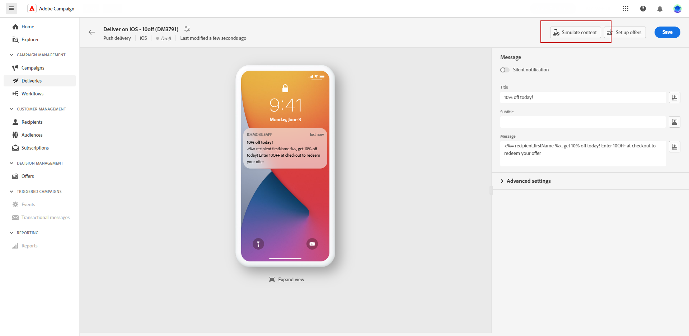

# Förhandsgranska och skicka en leverans av push-meddelanden {#send-push}

## Förhandsgranska leverans av push-meddelanden {#preview-push}

När du har definierat meddelandeinnehållet kan du använda testprofiler för att förhandsgranska och testa meddelandet. Om du har inkluderat anpassat innehåll kan du undersöka hur det här innehållet visas i meddelandet genom att använda testprofildata. På så sätt kan du se till att meddelandet återges korrekt och att de anpassade elementen införlivas på rätt sätt.

1. Från din sida med leveransinnehåll kan du använda **[!UICONTROL Simulate content]** för att förhandsgranska ditt personaliserade innehåll.

   

1. Klicka **[!UICONTROL Add test profile(s)]** om du vill välja en eller flera testprofiler eller profiler.

1. När du har valt testprofiler klickar du på **[!UICONTROL Select]**.

   

1. I den högra rutan hittar du en förhandsgranskning av e-postmeddelandet, där personaliserade element dynamiskt ersätts med data från den valda profilen.

Nu kan ni granska och skicka SMS-meddelanden till er målgrupp.

## Skicka push-meddelanden {#preview-send-push}

1. När du har anpassat ditt push-meddelandeinnehåll klickar du på **[!UICONTROL Review & send]** från **[!UICONTROL Delivery]** sida.

   

1. Klicka **[!UICONTROL Prepare]**och övervaka framstegen och statistiken.

   Om det uppstår några fel hittar du detaljerad information om felet på loggmenyn.

   

1. Skicka meddelanden genom att klicka på **[!UICONTROL Send]** för att fortsätta med den slutliga sändningsprocessen.

1. Bekräfta skicka-åtgärden genom att klicka på knappen **[!UICONTROL Send]** eller **[!UICONTROL Send as scheduled]** -knappen.

   

När leveransen har skickats kan du spåra dina KPI-data (Key Performance Indicator) från leveranssidan och data från loggmenyn.

Nu kan du börja mäta effekten av ditt meddelande med inbyggda rapporter. [Läs mer](../reporting/push-report.md)
