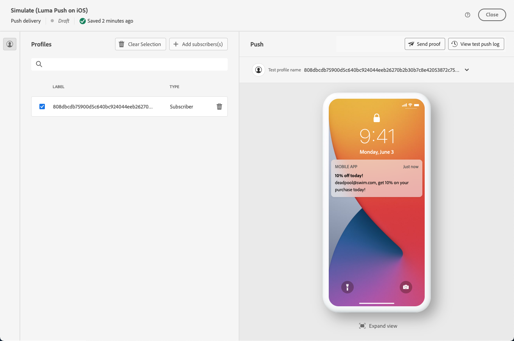

# Förhandsgranska och skicka en push-leverans {#send-push-delivery}

## Förhandsgranska leverans av push-meddelanden {#preview-push}

När du har definierat meddelandeinnehållet kan du använda testprenumeranter för att förhandsgranska och testa meddelandet. Om personaliserat innehåll inkluderas bör du undersöka hur innehållet visas i meddelandet med hjälp av testprofildata. Detta säkerställer att meddelandet återges korrekt och att anpassade element är korrekt inbyggda.

De viktigaste stegen för att förhandsgranska ditt push-meddelande är följande. Mer information om hur du förhandsgranskar leveranser finns i [det här avsnittet](../preview-test/preview-content.md).

1. Använd **[!UICONTROL Simulate content]** från din leveransinnehållssida för att förhandsgranska ditt personliga innehåll.

   {zoomable="yes"}

1. Klicka på **[!UICONTROL Add subscribers(s)]** om du vill välja en eller flera profiler för att förhandsgranska deras data i push-meddelandeinnehållet.

   <!--Once your test subscribers are selected, click **[!UICONTROL Select]**.
    {zoomable="yes"}-->

1. I den högra rutan hittar du en förhandsgranskning av push-meddelandet, där personaliserade element dynamiskt ersätts med data från den valda profilen.

   {zoomable="yes"}

Granska och skicka push-meddelanden till er målgrupp.

## Testa leveransen av push-meddelanden {#test-push}

Skicka korrektur med **Adobe Campaign** innan du levererar dem till huvudmålgruppen. I det här steget valideras leveransen och eventuella problem identifieras.

Testprofiler fungerar som korrekturmottagare. De granskar och validerar komponenter och inställningar som länkar, bilder och personalisering för att säkerställa optimala prestanda och upptäcka fel. Den här processen förfinar och optimerar dina push-meddelanden innan ni når huvudmålgruppen. [Lär dig hur du skickar korrektur](../preview-test/test-deliveries.md#subscribers).

{zoomable="yes"}

## Skicka push-meddelanden {#send-push}

1. När du har anpassat ditt push-meddelandeinnehåll klickar du på **[!UICONTROL Review & send]** på **[!UICONTROL Delivery]**-sidan.

   {zoomable="yes"}

1. Klicka på **[!UICONTROL Prepare]** och övervaka förloppet och statistiken.

   Om fel uppstår hittar du detaljerad information om felet på loggmenyn.

   {zoomable="yes"}

1. Skicka meddelandena genom att klicka på **[!UICONTROL Send]** för att fortsätta med den sista sändningsprocessen.

1. Bekräfta skicka-åtgärden genom att klicka på **[!UICONTROL Send]**.

   Om push-leveransen är schemalagd klickar du på knappen **[!UICONTROL Send as scheduled]**. Läs mer om leveransplanering i [det här avsnittet](../msg/gs-messages.md#schedule-the-delivery-sending).

   {zoomable="yes"}

När leveransen har skickats kan du spåra dina KPI-data (Key Performance Indicator) från din leveranssida och data från **[!UICONTROL Logs]**-menyn.

Börja mäta effekten av ert budskap med inbyggda rapporter. [Läs mer](../reporting/push-report.md).