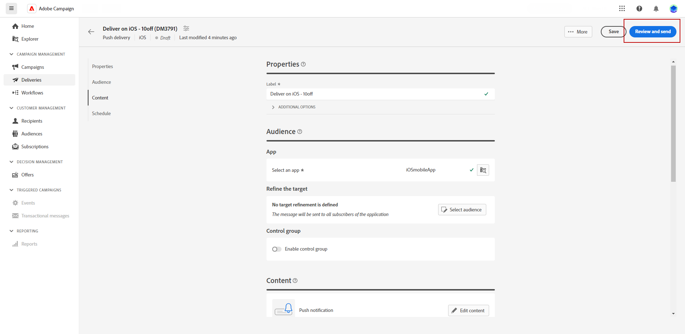
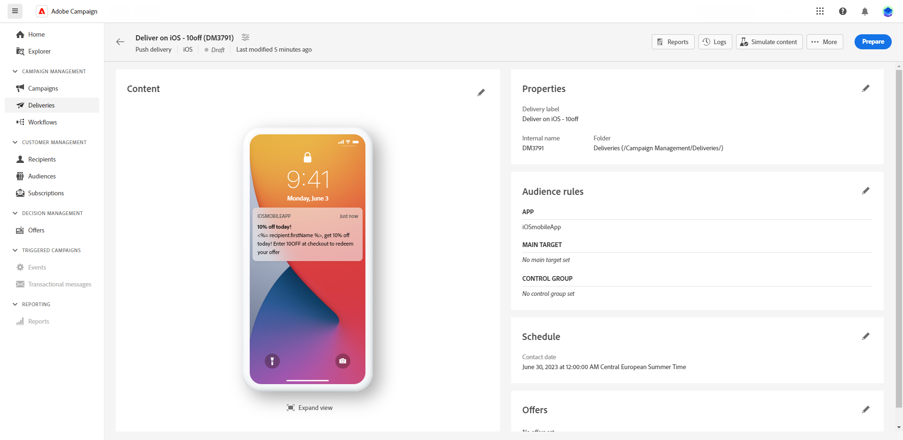

# Förhandsgranska och skicka en push-leverans {#send-push-delivery}

## Förhandsgranska leverans av push-meddelanden {#preview-push}

När du har definierat meddelandeinnehållet kan du använda testprenumeranter för att förhandsgranska och testa meddelandet. Om du har inkluderat anpassat innehåll kan du undersöka hur det här innehållet visas i meddelandet med hjälp av testprofildata. På så sätt kan du se till att meddelandet återges korrekt och att de anpassade elementen införlivas på rätt sätt.

De viktigaste stegen för att förhandsgranska ditt push-meddelande är följande. Mer information om hur du förhandsgranskar leveranser finns i [det här avsnittet](../preview-test/preview-content.md).

1. Använd **[!UICONTROL Simulate content]** för att förhandsgranska ditt personaliserade innehåll.

   {zoomable=&quot;yes&quot;}

1. Klicka **[!UICONTROL Add subscribers(s)]** om du vill välja en eller flera profiler för att förhandsgranska deras data i push-meddelandeinnehållet.

   <!--Once your test subscribers are selected, click **[!UICONTROL Select]**.
    {zoomable="yes"}-->

1. I den högra rutan hittar du en förhandsgranskning av push-meddelandet, där personaliserade element dynamiskt ersätts med data från den valda profilen.

   {zoomable=&quot;yes&quot;}

Nu kan ni granska och skicka push-meddelanden till era målgrupper.

## Testa leveransen av push-meddelanden {#test-push}

Använda **Adobe Campaign** kan du skicka korrektur innan du skickar dem till huvudmålgruppen. Det här steget är viktigt när du ska validera leveransen och identifiera eventuella problem.

Testprofiler är korrekturmottagare. De kan granska och validera komponenter och inställningar som länkar, bilder och personalisering för att säkerställa optimala prestanda och upptäcka eventuella fel. Med den här processen kan ni förfina och optimera era push-meddelanden innan ni når er huvudmålgrupp. [Lär dig hur du skickar korrektur](../preview-test/test-deliveries.md#subscribers)

{zoomable=&quot;yes&quot;}

## Skicka push-meddelanden {#send-push}

1. När du har anpassat ditt push-meddelandeinnehåll klickar du på **[!UICONTROL Review & send]** från **[!UICONTROL Delivery]** sida.

   {zoomable=&quot;yes&quot;}

1. Klicka **[!UICONTROL Prepare]** och övervaka framstegen och statistiken.

   Om det uppstår några fel hittar du detaljerad information om felet på loggmenyn.

   {zoomable=&quot;yes&quot;}

1. Skicka meddelandena genom att klicka på **[!UICONTROL Send]** för att fortsätta med den slutliga sändningsprocessen.

1. Bekräfta skicka-åtgärden genom att klicka på knappen **[!UICONTROL Send]**.

   Om push-leveransen har schemalagts klickar du på **[!UICONTROL Send as scheduled]** -knappen. Läs mer om leveransplanering i [det här avsnittet](../msg/gs-messages.md#schedule-the-delivery-sending).

   {zoomable=&quot;yes&quot;}

När leveransen har skickats kan du spåra dina KPI-data (Key Performance Indicator) från leveranssidan och data från **[!UICONTROL Logs]** -menyn.

Nu kan du börja mäta effekten av ditt meddelande med inbyggda rapporter. [Läs mer](../reporting/push-report.md)
