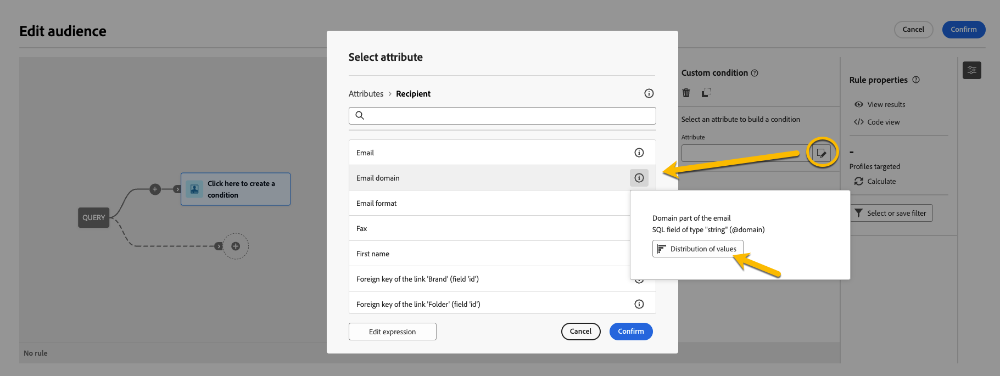
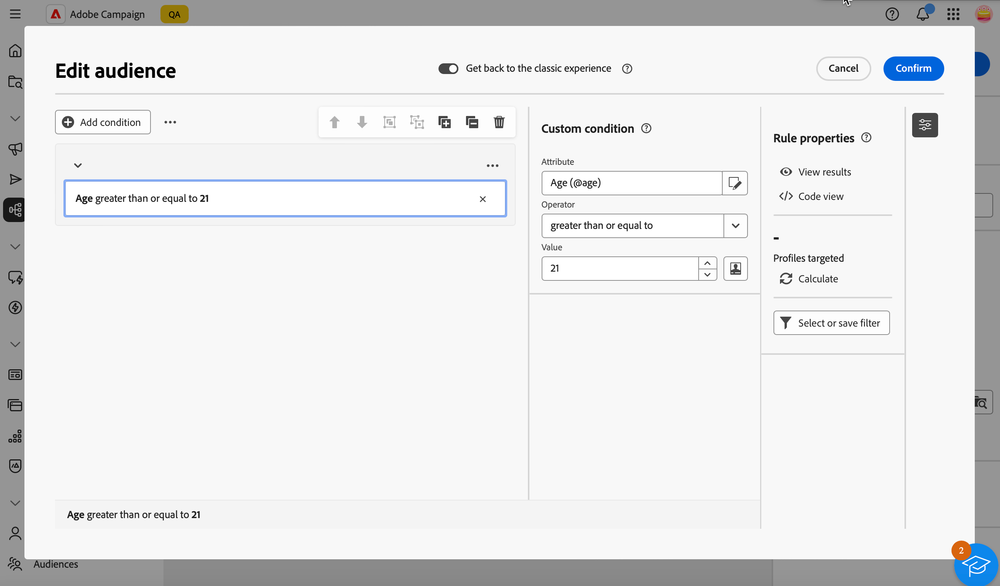
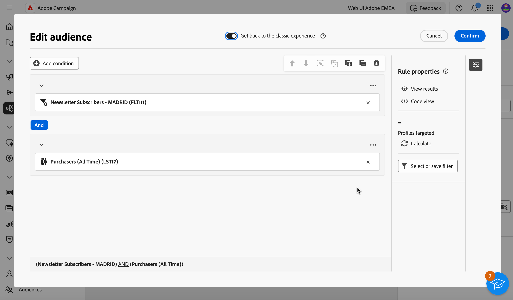

# Bygg din första fråga {#build-query}

Om du vill börja skapa en fråga öppnar du frågemodelleraren från valfri plats, beroende på vilken åtgärd du vill utföra. Frågemodelleraren öppnas med en tom arbetsyta. Klicka på knappen **+** för att konfigurera den första noden i frågan.

>[!IMPORTANT]
>
>Det finns ett helt nytt gränssnitt för frågemodelleraren. Med det nya regelbyggaren kan du enkelt skapa din fråga tack vare det förenklade gränssnittet. Om du vill växla till den här upplevelsen trycker du på växlingsknappen i det övre högra hörnet. Du kan gå tillbaka till den klassiska frågemodelleraren när du vill genom att helt enkelt trycka på tillbaka för att inaktivera det nya gränssnittet. Du kan tillämpa samma principer som frågemodelleraren i det nya gränssnittet.
>{zoomable="yes"}

Du kan lägga till två typer av element:

* **Med filterkomponenter** (Anpassat villkor, Välj målgrupp, Fördefinierat filter) kan du skapa egna regler, välja en målgrupp eller använda ett fördefinierat filter för att förfina frågan. De läggs till i början av frågan och på prickade övergångar. [Lär dig hur du arbetar med att filtrera komponenter](#filtering)

  Exempel: *Mottagare som prenumererar på nyhetsbrevet Sports*, *Mottagare som bor i New York*, *Mottagare som bor i San Francisco*

>[!BEGINTABS]

>[!TAB Klassisk frågemodellerare]

{zoomable="yes"}

>[!TAB Nytt regelverktyg]

{zoomable="yes"}

>[!ENDTABS]

* **Gruppoperatorer** (AND, OR, EXCEPT) gör att du kan gruppera filterkomponenter i diagrammet. De läggs till i befintliga övergångar före en filterkomponent. [Lär dig arbeta med operatorer](#filtering)

  Exempel: *Mottagare som är Super VIP **AND** VIP som belönar **OR** VIP Demo, **EXCEPT** mottagare som är yngre än 21 år och äldre än 45.

>[!BEGINTABS]

>[!TAB Klassisk frågemodellerare]

{zoomable="yes"}

>[!TAB Nytt regelverktyg]

{zoomable="yes"}

>[!ENDTABS]

## Distribution av värden i en fråga {#distribution-values-query}

Värdefördelningen visar procentandelen för varje värde i ett fält i en tabell, baserat på de aktuella frågeparametrarna. Genom att veta hur värdena är fördelade i en fråga kan du förfina segmenteringen.

Du öppnar det här alternativet genom att klicka på attributmarkeringsknappen i frågan enligt nedan. Klicka sedan på ikonen **[!UICONTROL Information]** bredvid det markerade attributet. Du kommer åt knappen **[!UICONTROL Distribution of values]**.

{zoomable="yes"}

>[!NOTE]
>
>* För fält med många värden visas bara de första tjugo värdena. I sådana fall får du en varning från **[!UICONTROL Partial load]**.
>* Alternativet **[!UICONTROL Distribution of values]** är tillgängligt i alla attributväljare. [Lär dig välja attribut](../get-started/attributes.md)
>* Du kan lägga till villkor i resultatet med hjälp av de **[ !Aavancerade filtren]**. [Läs mer här](../get-started/work-with-folders.md#filter-the-values).

## Lägga till filterkomponenter {#filtering}

Med filterkomponenter kan du förfina frågan genom att använda:

* **[Anpassade villkor](#custom-condition)**: Filtrera frågan genom att skapa ett eget villkor med attribut från databasen och avancerade uttryck.
* **[Publiker](#audiences)**: Filtrera frågan med en befintlig publik.
* **[Fördefinierat filter](#predefined-filters)**: Filtrera frågan med befintliga fördefinierade filter.

### Konfigurera ett anpassat villkor {#custom-condition}

>[!CONTEXTUALHELP]
>id="acw_orchestration_querymodeler_customcondition"
>title="Anpassat villkor"
>abstract="Anpassade villkor är att filtrera komponenter som gör att du kan filtrera frågan genom att skapa ett eget villkor med attribut från databasen och avancerade uttryck."

Så här filtrerar du frågan med ett anpassat villkor:

1. Klicka på knappen **+** på den önskade noden och välj **[!UICONTROL Custom condition]**. Rutan för anpassade villkorsegenskaper öppnas till höger.

1. I fältet **Attribut** väljer du attributet från databasen som du vill använda för att skapa villkoret. Attributlistan innehåller alla attribut från kampanjdatabasen, inklusive attribut från länkade tabeller. [Lär dig hur du väljer attribut och lägger till dem i favoriter](../get-started/attributes.md)

   {zoomable="yes"}

   >[!NOTE]
   >
   >Med knappen **Redigera uttryck** kan du använda redigeraren för webbuttryck i Campaign för att manuellt definiera ett uttryck med hjälp av fält från databasen och hjälpfunktionerna. [Lär dig hur du redigerar uttryck](expression-editor.md)

1. Välj den operator som ska användas i listrutan. Olika operatorer är tillgängliga för användning. Observera att operatorer som är tillgängliga i listrutan beror på attributets datatyp.

   +++Lista över tillgängliga operatorer

   | Operatör | Syfte | Exempel |
   |---|---|---|
   | Lika med | Returnerar ett resultat som är identiskt med de data som anges i den andra värdekolumnen. | Efternamnet (@lastName) som är lika med &#39;Jones&#39; returnerar bara mottagare vars efternamn är Jones. |
   | Inte lika med | Returnerar alla värden som inte är identiska med det angivna värdet. | Språket (@language) är inte lika med &quot;English&quot;. |
   | Större än | Returnerar ett värde som är större än det angivna värdet. | Ålder (@age) större än 50 returnerar alla värden större än 50, till exempel 51, 52. |
   | Mindre än | Returnerar ett värde som är mindre än det angivna värdet. | Skapad (@created) före &quot;DaysAgo(100)&quot; returnerar alla mottagare som skapats för mindre än 100 dagar sedan. |
   | Större än eller lika med | Returnerar alla värden som är lika med eller större än det angivna värdet. | Ålder (@age) större än eller lika med 30 returnerar alla mottagare som är 30 år eller äldre. |
   | Mindre än eller lika med | Returnerar alla värden som är lika med eller lägre än det angivna värdet. | Ålder (@age) mindre än eller lika med 60 returnerar alla mottagare som är 60 år eller yngre. |
   | Ingår i | Returnerar resultat som ingår i de angivna värdena. Dessa värden måste avgränsas med kommatecken. | Födelsedatum (@bornDate) ingår i &#39;12/10/1979,12/10/1984&#39; returnerar de mottagare som är födda mellan dessa datum. |
   | Inte i | Fungerar som operatorn Inkluderad i. Här exkluderas mottagare baserat på de angivna värdena. | Födelsedatum (@BirthDate) ingår inte i &#39;12/10/1979,12/10/1984&#39;. Mottagare födda inom dessa datum returneras inte. |
   | Är tom | Returnerar resultat som matchar ett tomt värde i den andra värdekolumnen. | Mobilen (@mobilePhone) är tom returnerar alla mottagare som inte har något mobilnummer. |
   | Är inte tom | Fungerar i motsatt riktning till operatorn Är tom. Du behöver inte ange data i den andra värdekolumnen. | E-postadressen (@email) är inte tom. |
   | Börjar med | Returnerar resultat som börjar med det angivna värdet. | Kontonr (@account) börjar med 32010. |
   | Börjar inte med | Returnerar resultat som inte börjar med det angivna värdet. | Kontonumret (@account) börjar inte med 20. |
   | Innehåller | Returnerar resultat som innehåller minst det angivna värdet. | E-postdomänen (@domain) innehåller mail och returnerar alla domännamn som innehåller mail, till exempel gmail.com. |
   | Innehåller inte | Returnerar resultat som inte innehåller det angivna värdet. | E-postdomänen (@domain) innehåller inte &#39;vo&#39;. Domännamn som innehåller &quot;vo&quot;, t.ex. &quot;voila.fr&quot;, visas inte i resultatet. |
   | Gilla | På samma sätt som operatorn Innehåller kan du infoga ett %-jokertecken i värdet. | Efternamn (@lastName) som &#39;Jon%s&#39;. Jokertecknet fungerar som&quot;joker&quot; och söker efter namn som&quot;Jones&quot;. |
   | Inte som | På samma sätt som operatorn Innehåller kan du infoga ett %-jokertecken i värdet. | Efternamnet (@lastName) är inte som Smi%h. Mottagare vars efternamn är &quot;Smith&quot; returneras inte. |

   +++

1. Definiera det förväntade värdet i fältet **Värde**. Du kan också använda redigeraren för webbuttryck i Campaign för att manuellt definiera ett uttryck med hjälp av fält från databasen och hjälpfunktionerna. Det gör du genom att klicka på knappen **Redigera uttryck** . [Lär dig hur du redigerar uttryck](expression-editor.md)

   *Frågeexempel som returnerar alla profiler som är 21 år eller äldre:*

>[!BEGINTABS]

>[!TAB Klassisk frågemodellerare]

{zoomable="yes"}

>[!TAB Nytt regelverktyg]

{zoomable="yes"}

>[!ENDTABS]

För datumtypsattribut är fördefinierade värden tillgängliga med alternativet **[!UICONTROL Presets]**.

>[!BEGINTABS]

>[!TAB Klassisk frågemodellerare]

{zoomable="yes"}

>[!TAB Nytt regelverktyg]

{zoomable="yes"}

>[!ENDTABS]

#### Anpassade villkor i länkade tabeller (1-1- och 1-N-länkar){#links}

Med anpassade villkor kan du fråga tabeller som är länkade till den tabell som för närvarande används av din regel. Detta inkluderar tabeller med en 1-1 kardinalitetslänk eller samlingstabeller (1-N länk).

Navigera till den länkade tabellen för en **1-1-länk**, markera önskat attribut och definiera det förväntade värdet.

Du kan också markera en tabelllänk direkt i väljaren **Värde** och bekräfta. I så fall måste värden som är tillgängliga för den valda tabellen markeras med en dedikerad väljare, vilket visas i exemplet nedan.

+++Exempel på fråga

Här riktar frågan sig till varumärken vars etikett är&quot;kör&quot;.

1. Navigera inuti tabellen **Varumärke** och markera attributet **Etikett**.

   {zoomable="yes"}{width="85%" align="center"}

1. Definiera det förväntade värdet för attributet.

   {zoomable="yes"}{width="85%" align="center"}

Här följer ett frågeexempel där en tabelllänk har markerats direkt. Tillgängliga värden för den här tabellen måste väljas från en dedikerad väljare.

{zoomable="yes"}{width="85%" align="center"}

+++

För en **1-N-länk** kan du definiera undervillkor för att förfina din fråga, vilket visas i exemplet nedan.

+++Exempel på fråga

Här riktar frågan sig till mottagare som har gjort inköp relaterade till BrewMaster-produkten, med ett totalt belopp på minst 100$.

1. Markera tabellen **Inköp** och bekräfta.

   {zoomable="yes"}{width="50%" align="center"}

1. En utgående övergång läggs till så att du kan skapa delvillkor.

   {zoomable="yes"}{width="85%" align="center"}

1. Välj attributet **Price** och målinköp på minst 1 000$

   {zoomable="yes"}{width="85%" align="center"}

1. Lägg till undervillkor som passar dina behov. Här har vi lagt till ett villkor för målprofiler som har köpt en BrewMaster-produkt.

   {zoomable="yes"}{width="85%" align="center"}

+++

#### Arbeta med aggregerade data {#aggregate}

Med anpassade villkor kan du utföra sammanställningsåtgärder. För att göra detta måste du välja ett attribut direkt från en samlingstabell:

1. Navigera i den önskade samlingstabellen och markera attributet som du vill utföra en sammanställningsåtgärd på.

   {zoomable="yes"}{width="85%" align="center"}

1. I egenskapsrutan växlar du på alternativet **Sammanställd data** och väljer önskad sammanställningsfunktion.

>[!BEGINTABS]

>[!TAB Klassisk frågemodellerare]

{zoomable="yes"}{width="85%" align="center"}

>[!TAB Nytt regelverktyg]

{zoomable="yes"}{width="85%" align="center"}

>[!ENDTABS]

### Välj en målgrupp {#audiences}

>[!CONTEXTUALHELP]
>id="acw_orchestration_querymodeler_selectaudience"
>title="Välj målgrupp"
>abstract="Genom att använda alternativet **Välj målgrupp** kan du välja vilken målgrupp du vill använda för att filtrera din fråga."

Så här filtrerar du frågan med en befintlig målgrupp:

>[!BEGINTABS]

>[!TAB Klassisk frågemodellerare]

1. Klicka på knappen **+** på den önskade noden och välj **[!UICONTROL Select audience]**.

1. Egenskapsrutan **Välj målgrupp** öppnas till höger. Välj den målgrupp som du vill använda för att filtrera frågan.

   *Frågeexempel som returnerar alla profiler som tillhör målgruppen Festival Goers:*

   {zoomable="yes"}

>[!TAB Nytt regelverktyg]

1. Klicka på knappen **Expandera** bredvid knappen **[!UICONTROL Add condition]** och välj **[!UICONTROL Select audience]**.

1. Egenskapsrutan **Välj målgrupp** öppnas till höger. Välj den målgrupp som du vill använda för att filtrera frågan.

   *Frågeexempel som returnerar alla profiler som tillhör målgruppen &quot;Coffee Works&quot;:*

   {zoomable="yes"}

>[!ENDTABS]

### Använda ett fördefinierat filter {#predefined-filters}

>[!CONTEXTUALHELP]
>id="acw_orchestration_querymodeler_predefinedfilter"
>title="Fördefinierat filter"
>abstract="Genom att använda alternativet **Fördefinierat filter** kan du välja ett fördefinierat filter i listan över anpassade filter eller bland favoriter."

Så här filtrerar du frågan med ett fördefinierat filter:

>[!BEGINTABS]

>[!TAB Klassisk frågemodellerare]

1. Klicka på knappen **+** på den önskade noden och välj **[!UICONTROL Predefined filter]**.

1. Panelen **Fördefinierade filter** öppnas till höger. Välj ett fördefinierat filter i listan med anpassade filter eller bland favoriter.

   *Frågeexempel som returnerar alla profiler som motsvarar det fördefinierade filtret Inaktiva kunder:*

   {zoomable="yes"}

>[!TAB Nytt regelverktyg]

1. Klicka på knappen **Expandera** bredvid knappen **[!UICONTROL Add condition]** och välj **[!UICONTROL Predefined filter]**.

1. Panelen **Fördefinierade filter** öppnas till höger. Välj ett fördefinierat filter i listan med anpassade filter eller bland favoriter.

   *Frågeexempel som returnerar alla profiler som motsvarar det fördefinierade filtret Inaktiva kunder:*

   {zoomable="yes"}

>[!ENDTABS]

### Kopiera och klistra in komponenter {#copy}

Med frågemodelleraren kan du kopiera en eller flera filterkomponenter och klistra in dem i slutet av en övergång. Den här åtgärden kan utföras inom den aktuella frågans arbetsyta eller på en arbetsyta i instansen.

>[!NOTE]
>
>Den kopierade markeringen behålls så länge du arbetar i instansen. Om du loggar ut och loggar in igen kommer markeringen inte längre att vara tillgänglig för inklistring.

>[!IMPORTANT]
>
>Det är för närvarande inte möjligt att kopiera och klistra in komponenter i funktionen Skapa ny regel. Om du vill följa de här stegen klickar du på **[!UICONTROL Get back to the classic experience]** längst upp för att använda den klassiska frågemodelleraren.

Så här kopierar och klistrar du in filterkomponenter:

1. Markera den filterkomponent som du vill kopiera genom att klicka på den på arbetsytan. Om du vill markera flera komponenter använder du det markeringsverktyg som finns i verktygsfältet längst upp till höger på arbetsytan.

1. Klicka på knappen **[!UICONTROL Copy]** i komponentens egenskapspanel eller i det blå menyfliksområdet längst ned på skärmen om du har markerat flera komponenter.

   | Kopiera en enstaka komponent | Kopiera flera komponenter |
   |  ---  |  ---  |
   | {zoomable="yes"}{width="200" align="center" zoomable="yes"} | {zoomable="yes"}{width="200" align="center" zoomable="yes"} |

1. Om du vill klistra in komponenterna klickar du på plusknappen i slutet av övergången och väljer **Klistra in i objekt**.

   {zoomable="yes"}

## Kombinera filterkomponenter med operatorer {#operators}

>[!CONTEXTUALHELP]
>id="acw_orchestration_querymodeler_group"
>title="Grupp"
>abstract="I den här rutan kan du ändra operatorn som används för att länka samman filtervillkoren."

Varje gång du lägger till en ny filterkomponent i frågan länkas den automatiskt till den andra komponenten av en **AND** -operator. Det innebär att resultatet från de två filterkomponenterna kombineras.

I det här exemplet har vi lagt till en ny filtreringskomponent av publiktyp i den andra övergången. Komponenten är länkad till det fördefinierade filtervillkoret med en **AND**-operator, vilket innebär att frågeresultaten innehåller mottagare som är målinriktade av det fördefinierade filtret &quot;Newsletter Subscribers - MADRID&quot; OCH som tillhör målgruppen &quot;Purchasers (All time)&quot;.

>[!BEGINTABS]

>[!TAB Klassisk frågemodellerare]

{zoomable="yes"}

Om du vill ändra operatorn som används för att länka samman filtervillkoren klickar du på den och väljer önskad operator i rutan **Grupp** som öppnas till höger.

Tillgängliga operatorer:

* **AND (skärning)**: Kombinerar resultat som matchar alla filtreringskomponenter i utgående övergångar.
* **OR (Union)**: Innehåller resultat som matchar minst en av filterkomponenterna i utgående övergångar.
* **EXCEPT (Uteslutning)**: Utesluter resultat som matchar alla filterkomponenter i den utgående övergången.

{zoomable="yes"}

Dessutom kan du skapa mellanliggande grupper av komponenter genom att gruppera komponenter i en och samma grupp och länka samman dem. På så sätt placeras operatorn AND som standard, och du kan sedan ändra den till önskad operator.

>[!TAB Nytt regelverktyg]

{zoomable="yes"}

Om du vill ändra operatorn som används för att länka samman filtervillkor klickar du på den, den ändras till OR, EXCEPT och sedan tillbaka till OCH och väljer önskad operator.

Tillgängliga operatorer:

* **AND (skärning)**: Kombinerar resultat som matchar alla filtreringskomponenter i utgående övergångar.
* **OR (Union)**: Innehåller resultat som matchar minst en av filterkomponenterna i utgående övergångar.
* **EXCEPT (Uteslutning)**: Utesluter resultat som matchar alla filterkomponenter i den utgående övergången.

{zoomable="yes"}

>[!ENDTABS]

I exemplet nedan har vi skapat en mellanliggande grupp för att inkludera resultat från målgrupperna&quot;VIP att belöna&quot; eller&quot;Super VIP&quot;.

>[!BEGINTABS]

>[!TAB Klassisk frågemodellerare]

{zoomable="yes"}

>[!TAB Nytt regelverktyg]

{zoomable="yes"}

>[!ENDTABS]

## Kontrollera och validera frågan

>[!CONTEXTUALHELP]
>id="acw_orchestration_querymodeler_ruleproperties"
>title="Regelegenskaper"
>abstract="När du har skapat frågan på arbetsytan kan du kontrollera den med rutan **Regelegenskaper** som finns till höger. I den här rutan kan du visa resulterande data, hämta en SQL-kodversion av frågan och kontrollera antalet målposter. Använd knappen **Markera eller spara filter** om du vill spara frågan som ett fördefinierat filter eller ersätta arbetsytans innehåll med ett befintligt filter."

När du har skapat frågan på arbetsytan kan du kontrollera den med rutan **Regelegenskaper** som finns till höger. Den här rutan visas när du skapar en fråga för att skapa en målgrupp. Tillgängliga åtgärder är:

* **Visa resultat:** Visar data från din fråga.
* **Kodvyn**: Visar en kodbaserad version av frågan i SQL.
* **Beräkna**: Uppdaterar och visar antalet poster som din fråga har som mål.
* **Välj eller spara filter**: Välj ett befintligt fördefinierat filter som ska användas på arbetsytan eller spara frågan som ett fördefinierat filter för framtida återanvändning. [Lär dig arbeta med fördefinierade filter](../get-started/predefined-filters.md)

  >[!IMPORTANT]
  >
  >Välj ett fördefinierat filter i rutan Regelegenskaper om du vill ersätta frågan som har byggts in på arbetsytan med det valda filtret.

När frågan är klar klickar du på knappen **[!UICONTROL Confirm]** i det övre högra hörnet för att spara den.

>[!BEGINTABS]

>[!TAB Klassisk frågemodellerare]

Du kan ändra frågan när som helst genom att öppna den. Kom ihåg att när du öppnar en befintlig fråga visas den i en förenklad vy utan att **+**-knappar visas. Om du vill lägga till nya element i frågan markerar du en komponent eller operator på arbetsytan så att knapparna **+** visas.

{zoomable="yes"}

>[!TAB Nytt regelverktyg]

Du kan ändra frågan när som helst genom att öppna den. Det gör du genom att klicka på knappen **[!UICONTROL Add condition]** i det övre vänstra hörnet.

{zoomable="yes"}

>[!ENDTABS]
