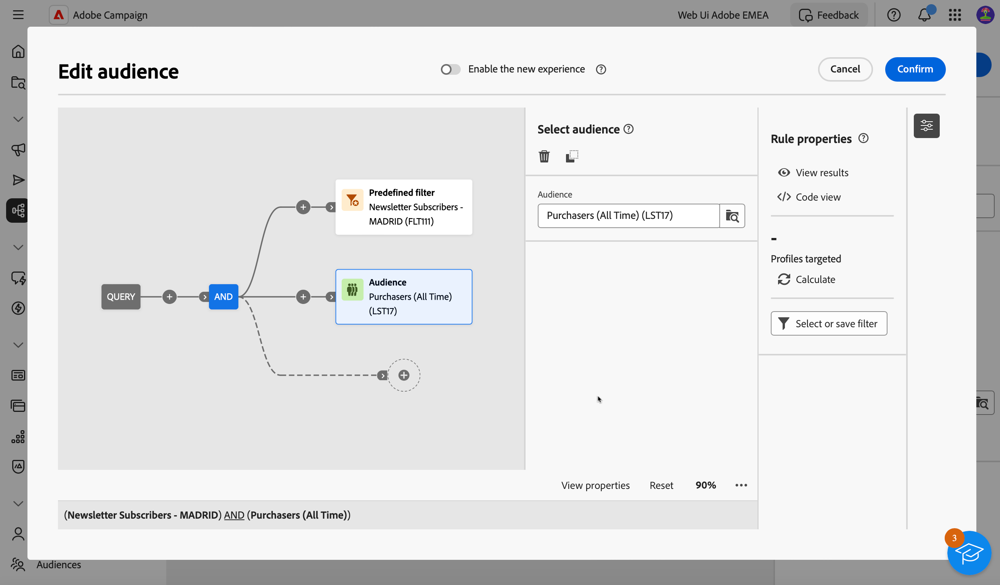

# Bygg din första fråga {#build-query}

Om du vill börja skapa en fråga öppnar du frågemodelleraren från valfri plats, beroende på vilken åtgärd du vill utföra. Frågemodelleraren öppnas med en tom arbetsyta. Klicka på plusknappen (+) för att lägga till den första noden i frågan.

Du kan lägga till två typer av element:

* Med filterkomponenter (Egna villkor, Välj målgrupp, Fördefinierat filter) kan du skapa egna regler, välja en målgrupp eller ett fördefinierat filter för att förfina frågan.

  Exempel *Mottagare som prenumererar på nyhetsbrevet Sports*. *Mottagare som bor i New York*, *Mottagare som bor i San Francisco*

* Med gruppoperatorer (AND, OR, EXCEPT) kan du gruppera filterkomponenter i diagrammet efter behov.

  Exempel: *Mottagare som prenumererar på nyhetsbrevet Sports **OCH**som bor i New York **ELLER**San Francisco*.

Detaljerade steg om hur du lägger till och kombinerar filterkomponenter och gruppoperatorer finns nedan.

## Lägga till filterkomponenter

Med filterkomponenter kan du förfina frågan genom att använda:

* **Anpassade villkor**: Filtrera frågan genom att skapa ett eget villkor med attribut från databasen och avancerade uttryck.
* **Målgrupper**: Filtrera frågan med en befintlig målgrupp.
* **Fördefinierat filter**: Filtrera frågan med befintliga fördefinierade filter.

### Skapa ett anpassat villkor

Så här filtrerar du frågan med ett anpassat villkor:

1. Klicka på plusknappen (+) på önskad nod och välj **[!UICONTROL Custom condition]**.
1. Rutan för anpassade villkorsegenskaper öppnas till höger. I fältet Attribut väljer du attributet från databasen som du vill använda för att skapa villkoret.

   Tillgängliga attribut representerar alla fält från Campaign-databasen, inklusive fält från tabeller som är länkade till mottagartabellen.

   

   >[!NOTE]
   >
   >Med knappen Redigera uttryck kan du använda redigeraren för Campaign-webbuttryck för att manuellt definiera ett uttryck med hjälp av fält från databasen och hjälpfunktionerna.

1. Välj den operator som ska användas i listrutan.

   +++Lista över tillgängliga operatorer

   >[!NOTE]
   >
   >Vilka operatorer som är tillgängliga i listrutan beror på det valda attributets datatyp.

   | Operatör | Syfte | Exempel |
   |  ---  |  ---  |  ---  |
   | Lika med | Returnerar ett resultat som är identiskt med de data som anges i den andra värdekolumnen. | Efternamnet (@lastName) är lika med &#39;Jones&#39;, returnerar bara mottagare vars efternamn är Jones. |
   | Inte lika med | Returnerar alla värden som inte är identiska med det angivna värdet. | Språk (@language) till samma som &quot;English&quot; |
   | Större än | Returnerar ett värde som är större än det angivna värdet. | Ålder (@age) större än 50</strong>, returnerar alla värden som är större än &quot;50&quot;, dvs. &quot;51&quot;, &quot;52&quot; osv. |
   | Mindre än | Returnerar ett värde som är mindre än det angivna värdet. | Skapad (@created) före &#39;DaysAgo(100)&#39;</strong>, returnerar alla mottagare som skapades för mindre än 100 dagar sedan. |
   | Större än eller lika med | Returnerar alla värden som är lika med eller större än det angivna värdet. | Ålder (@age) större än eller lika med 30</strong>, returnerar alla mottagare som är 30 år eller äldre. |
   | Mindre än eller lika med | Returnerar alla värden som är lika med eller lägre än det angivna värdet. | Ålder (@age) mindre än eller lika med 60</strong>, returnerar alla mottagare som är 60 år eller yngre. |
   | Ingår i | Returnerar resultat som ingår i de angivna värdena. Dessa värden måste avgränsas med kommatecken. | Födelsedatum (@BirthDate) ingår i &quot;12/10/1979, 12/10/1984&quot;, returnerar de mottagare som är födda mellan dessa datum. |
   | Inte i | Fungerar som operatorn Inkluderad i. Här vill vi exkludera mottagare baserat på de angivna värdena. | Födelsedatum (@BirthDate) ingår inte i &#39;12/10/1979,12/10/1984&#39;. Till skillnad från i föregående exempel returneras inte mottagare som fötts inom dessa datum. |
   | Är tom | I det här fallet matchar resultatet vi söker efter ett tomt värde i den andra värdekolumnen. | Mobilen (@mobilePhone) är tom returnerar alla mottagare som inte har något mobilnummer. |
   | Är inte tom | Fungerar i motsatt riktning till operatorn Är tom. Du behöver inte ange data i den andra värdekolumnen. | E-postadressen (@email) är inte tom. |
   | Börjar med | Returnerar resultatet med början på det angivna värdet. | Kontonr (@account) börjar med 32010. |
   | Börjar inte med | Returnerar resultat som inte börjar med det angivna värdet | Kontonr (@account) börjar inte med 20 |
   | Innehåller | Returnerar resultatet som innehåller minst det angivna värdet. | E-postdomänen (@domain) innehåller &#39;mail&#39;</strong>, returnerar alla domännamn som innehåller &quot;mail&quot;. Domänen gmail.com returneras alltså också. |
   | Innehåller inte | Returnerar resultat som inte innehåller det angivna värdet. | E-postdomänen (@domain) innehåller inte &#39;vo&#39;</strong>. I det här fallet returneras inte domännamn som innehåller &quot;vo&quot;. Domännamnet voila.fr visas inte i resultatet. |
   | Gilla | Liknar mycket operatorn Contains. Du kan infoga ett % jokertecken i värdet. | Efternamn (@lastName) som &#39;Jon%s&#39;. Här används jokertecknet som&quot;joker&quot; för att hitta namnet&quot;Jones&quot;, om operatorn hade glömt den saknade bokstaven mellan&quot;n&quot; och&quot;s&quot;. |
   | Inte som | Liknar mycket operatorn Contains. Du kan infoga ett % jokertecken i värdet. | Efternamnet (@lastName) är inte som Smi%h. Här returneras inte mottagare vars efternamn är Smi%h. |

+++

1. Välj det förväntade värdet i fältet Värde.

   Du kan också använda redigeringsprogrammet för webbuttryck i Campaign för att manuellt definiera ett uttryck med hjälp av fält från databasen och hjälpfunktionerna. Det gör du genom att klicka på knappen Redigera uttryck.

   *Exempel: Frågan returnerar alla profiler som är 21 år eller äldre*

   

<!--
querying linked tables
collect additional information on the targeted population, e.g. contract numbers, subscriptions to newsletters or origin.
Select the type of data you want to add. This can be data belonging to the filtering dimension or data stored in linked tables. Select the table which contains the information you want to collect and click Next.

aggregates: Define a calculation mode for the field to be added, such as an aggregate for example.-->

### Välj en målgrupp

Så här filtrerar du frågan med en befintlig målgrupp:

1. Klicka på plusknappen (+) på önskad nod och välj **[!UICONTROL Select audience]**.

1. Panelen Välj målgruppsegenskaper öppnas till höger. Välj den målgrupp som du vill använda för att filtrera din fråga.

   *Exempel: Frågan returnerar alla profiler som tillhör målgruppen &quot;Festival Goers&quot;*

   

### Använda ett fördefinierat filter

Så här filtrerar du frågan med ett fördefinierat filter:

1. Klicka på plusknappen (+) på önskad nod och välj **[!UICONTROL Predefined filter]**.

1. Panelen Välj målgruppsegenskaper öppnas till höger. Välj ett fördefinierat filter i listan med anpassade filter eller bland favoriter.

   *Exempel: Frågan returnerar alla profiler som motsvarar det fördefinierade filtret&quot;Inaktiva kunder&quot;.*

   

## Kombinera filterkomponenter med operatorer

När du lägger till en filterkomponent i frågan skapas automatiskt en ny övergång på arbetsytan och den nya filterkomponenten länkas till den första av en AND-operator. Detta innebär att resultat från båda filterkomponenterna kombineras med frågeresultaten.

I det här exemplet läggs en ny filterkomponent av publiktyp till på arbetsytan. Den läggs automatiskt till i en ny övergång och länkas till det fördefinierade filtertypsvillkoret med operatorn AND. I det här fallet innehåller frågeresultaten mottagare som är målinriktade av det fördefinierade filtret&quot;Madridians&quot; OCH som tillhör publiken&quot;Rabattväljare&quot;.

Om du vill ändra operatorn som används för att länka samman filtervillkoren klickar du på den och väljer önskad operator i rutan Du kan ändra operatorn genom att klicka på den och välja önskad operator i grupprutan som öppnas till höger.

Tillgängliga operatorer:

* AND (Skärning): kombinerar resultat från alla filterkomponenter i utgående övergångar.
* OR (Union): innehåller resultat från minst en av filterkomponenterna i utgående övergångar.
* EXCEPT (Uteslutning): Exkluderar resultat från alla filterkomponenter i den utgående övergången.

## Kontrollera och validera frågan

När du har skapat frågan på arbetsytan kan du kontrollera den i rutan Regelegenskaper till höger. Tillgängliga åtgärder är följande:

* **Visa resultat:** visar de data som är resultatet av din fråga.
* **kodvyn**: visar en kodbaserad version av frågan i SQL.
* **Beräkna**: uppdaterar och visar antalet poster som din fråga riktar sig till.
* **Markera eller spara filter**: välj ett befintligt fördefinierat filter som ska användas på arbetsytan eller spara frågan som ett fördefinierat filter för framtida återanvändning. [Lär dig hur du arbetar med fördefinierade filter](../get-started/predefined-filters.md)

  >[!IMPORTANT]
  >
  >Välj ett fördefinierat filter i rutan Regelegenskaper om du vill ersätta frågan som har byggts in på arbetsytan med det valda filtret.
