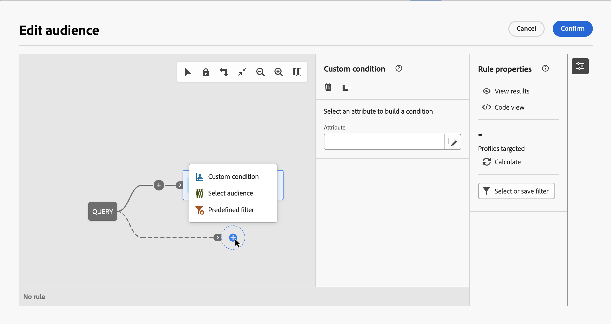

# Bygg din första fråga {#build-query}

Om du vill börja skapa en fråga öppnar du frågemodelleraren från valfri plats, beroende på vilken åtgärd du vill utföra. Frågemodelleraren öppnas med en tom arbetsyta. Klicka på **+** för att konfigurera den första noden i frågan.

Du kan lägga till två typer av element:

* **Filtrera komponenter** (Anpassat villkor, Välj målgrupp, Fördefinierat filter) låter dig skapa egna regler, välja en målgrupp eller ett fördefinierat filter för att förfina din fråga. [Lär dig hur du arbetar med filterkomponenter](#filtering)

  Exempel:

  *Mottagare som prenumererar på nyhetsbrevet Sports*. *Mottagare som bor i New York*, *Mottagare som bor i San Francisco*

* **Gruppoperatorer** (AND, OR, EXCEPT) gör att du kan gruppera filterkomponenter i diagrammet efter behov. [Lär dig arbeta med operatorer](#filtering)

  Exempel:

  *Mottagare som prenumererar på nyhetsbrevet Sports **OCH**som bor i New York **ELLER**San Francisco*.

## Lägga till filterkomponenter {#filtering}

Med filterkomponenter kan du förfina frågan genom att använda:

* **Anpassade villkor**: Filtrera frågan genom att skapa ett eget villkor med attribut från databasen och avancerade uttryck.
* **Målgrupper**: Filtrera frågan med en befintlig målgrupp.
* **Fördefinierat filter**: Filtrera frågan med befintliga fördefinierade filter.

### Konfigurera ett anpassat villkor

>[!CONTEXTUALHELP]
>id="acw_orchestration_querymodeler_customcondition"
>title="Anpassat villkor"
>abstract="Anpassat villkor"

Så här filtrerar du frågan med ett anpassat villkor:

1. Klicka på **+** på önskad nod och välj **[!UICONTROL Custom condition]**. Rutan för anpassade villkorsegenskaper öppnas till höger.

1. I **Attribut** väljer du attributet från databasen som du vill använda för att skapa villkoret. Attributlistan innehåller alla attribut från Campaign-databasen, inklusive attribut från länkade tabeller.

   

   >[!NOTE]
   >
   >Med knappen Redigera uttryck kan du använda redigeraren för Campaign-webbuttryck för att manuellt definiera ett uttryck med hjälp av fält från databasen och hjälpfunktionerna. [Lär dig redigera uttryck](expression-editor.md)

1. Välj den operator som ska användas i listrutan. Olika operatorer är tillgängliga för användning. Observera att operatorer som är tillgängliga i listrutan beror på attributets datatyp.

   +++Lista över tillgängliga operatorer

   | Operatör | Syfte | Exempel |
   |  ---  |  ---  |  ---  |
   | Lika med | Returnerar ett resultat som är identiskt med de data som anges i den andra värdekolumnen. | Efternamnet (@lastName) är lika med &#39;Jones&#39;, returnerar bara mottagare vars efternamn är Jones. |
   | Inte lika med | Returnerar alla värden som inte är identiska med det angivna värdet. | Språk (@language) till samma som &quot;English&quot; |
   | Större än | Returnerar ett värde som är större än det angivna värdet. | Ålder (@age) större än 50</strong>, returnerar alla värden som är större än &quot;50&quot;, dvs. &quot;51&quot;, &quot;52&quot; osv. |
   | Mindre än | Returnerar ett värde som är mindre än det angivna värdet. | Skapad (@created) före &#39;DaysAgo(100)&#39;</strong>, returnerar alla mottagare som skapades för mindre än 100 dagar sedan. |
   | Större än eller lika med | Returnerar alla värden som är lika med eller större än det angivna värdet. | Ålder (@age) större än eller lika med 30</strong>, returnerar alla mottagare som är 30 år eller äldre. |
   | Mindre än eller lika med | Returnerar alla värden som är lika med eller lägre än det angivna värdet. | Ålder (@age) mindre än eller lika med 60</strong>, returnerar alla mottagare som är 60 år eller yngre. |
   | Ingår i | Returnerar resultat som ingår i de angivna värdena. Dessa värden måste avgränsas med kommatecken. | Födelsedatum (@BirthDate) ingår i &quot;12/10/1979, 12/10/1984&quot;, returnerar de mottagare som är födda mellan dessa datum. |
   | Inte i | Fungerar som operatorn Inkluderad i. Här vill vi exkludera mottagare baserat på de angivna värdena. | Födelsedatum (@BirthDate) ingår inte i &#39;12/10/1979,12/10/1984&#39;. Till skillnad från i föregående exempel returneras inte mottagare som fötts inom dessa datum. |
   | Är tom | I det här fallet matchar resultatet vi söker efter ett tomt värde i den andra värdekolumnen. | Mobilen (@mobilePhone) är tom returnerar alla mottagare som inte har något mobilnummer. |
   | Är inte tom | Fungerar i motsatt riktning till operatorn Är tom. Du behöver inte ange data i den andra värdekolumnen. | E-postadressen (@email) är inte tom. |
   | Börjar med | Returnerar resultatet med början på det angivna värdet. | Kontonr (@account) börjar med 32010. |
   | Börjar inte med | Returnerar resultat som inte börjar med det angivna värdet | Kontonr (@account) börjar inte med 20 |
   | Innehåller | Returnerar resultatet som innehåller minst det angivna värdet. | E-postdomänen (@domain) innehåller &#39;mail&#39;</strong>, returnerar alla domännamn som innehåller &quot;mail&quot;. Domänen gmail.com returneras alltså också. |
   | Innehåller inte | Returnerar resultat som inte innehåller det angivna värdet. | E-postdomänen (@domain) innehåller inte &#39;vo&#39;</strong>. I det här fallet returneras inte domännamn som innehåller &quot;vo&quot;. Domännamnet voila.fr visas inte i resultatet. |
   | Gilla | Liknar mycket operatorn Contains. Du kan infoga ett % jokertecken i värdet. | Efternamn (@lastName) som &#39;Jon%s&#39;. Här används jokertecknet som&quot;joker&quot; för att hitta namnet&quot;Jones&quot;, om operatorn hade glömt den saknade bokstaven mellan&quot;n&quot; och&quot;s&quot;. |
   | Inte som | Liknar mycket operatorn Contains. Du kan infoga ett % jokertecken i värdet. | Efternamnet (@lastName) är inte som Smi%h. Här returneras inte mottagare vars efternamn är Smi%h. |

+++

1. I **Värde** definierar du det förväntade värdet. Du kan också använda redigeringsprogrammet för webbuttryck i Campaign för att manuellt definiera ett uttryck med hjälp av fält från databasen och hjälpfunktionerna. Klicka på **Redigera uttryck** -knappen. [Lär dig redigera uttryck](expression-editor.md)

   *Frågeexempel som returnerar alla profiler som är 21 år eller äldre:*

   

#### Anpassade villkor i länkade tabeller (1-1- och 1-N-länkar){#links}

Med anpassade villkor kan du fråga tabeller som är länkade till den tabell som för närvarande används av din regel. Detta inkluderar tabeller med en 1-1 kardinalitetslänk eller samlingstabeller (1-N länk).

För **1-1 länk** markerar du attributet direkt från måltabellen.

+++Exempel på fråga

Här riktar frågan sig till varumärken vars etikett är&quot;kör&quot;.

1. Navigera inuti **Varumärke** tabellen och välj **Etikett** -attribut.

   

1. Definiera det förväntade värdet för attributet.

   

+++

För **1-N-länk** kan du definiera undervillkor för att förfina frågan.

Du kan till exempel välja operatorn Exists på profilinköpen för att ange alla profiler som det finns inköp för som mål. När du är klar lägger du till ett anpassat villkor för den utgående övergången och skapar ett filter som passar dina behov.

+++Exempel på fråga

Här riktar frågan sig till mottagare som har gjort inköp relaterade till BrewMaster-produkten, med ett totalt belopp på minst 100$.

1. Välj **Inköp** tabell och bekräfta.

   

1. En utgående övergång läggs till så att du kan skapa delvillkor.

   

1. Välj **Pris** köp av minst 1 000 dollar för attribut och mål

   

1. Lägg till undervillkor som passar dina behov. Här har vi lagt till ett villkor för målprofiler som har köpt en BrewMaster-produkt.

   

+++

#### Arbeta med aggregerade data {#aggregate}**

Med anpassade villkor kan du utföra sammanställningsåtgärder. För att göra detta måste du välja ett attribut direkt från en samlingstabell:

1. Navigera i den önskade samlingstabellen och markera attributet som du vill utföra en sammanställningsåtgärd på.

   

1. I egenskapsrutan växlar du till **Sammanställningsdata** och väljer önskad sammanställningsfunktion.

   

### Välj en målgrupp

>[!CONTEXTUALHELP]
>id="acw_orchestration_querymodeler_selectaudience"
>title="Välj målgrupp"
>abstract="Välj målgrupp"

Så här filtrerar du frågan med en befintlig målgrupp:

1. Klicka på **+** på önskad nod och välj **[!UICONTROL Select audience]**.

1. The **Välj målgrupp** egenskapspanelen öppnas till höger. Välj den målgrupp som du vill använda för att filtrera frågan.

   *Frågeexempel som returnerar alla profiler som tillhör målgruppen Festival Goers:*

   

### Använda ett fördefinierat filter

>[!CONTEXTUALHELP]
>id="acw_orchestration_querymodeler_predefinedfilter"
>title="Fördefinierat filter"
>abstract="Fördefinierat filter"

Så här filtrerar du frågan med ett fördefinierat filter:

1. Klicka på **+** på önskad nod och välj **[!UICONTROL Predefined filter]**.

1. The **Fördefinierat filter** egenskapspanelen öppnas till höger. Välj ett fördefinierat filter i listan med anpassade filter eller bland favoriter.

   *Frågeexempel som returnerar alla profiler som motsvarar det fördefinierade filtret &quot;Inaktiva kunder&quot;:*

   

### Kopiera och klistra in komponenter {#copy}

Med frågemodelleraren kan du kopiera en eller flera filterkomponenter och klistra in dem i slutet av en övergång. Den här åtgärden kan utföras inom den aktuella frågans arbetsyta eller på en arbetsyta i instansen.

>[!NOTE]
>
>Den kopierade markeringen behålls så länge du arbetar i instansen. Om du loggar ut och loggar in igen kommer markeringen inte längre att vara tillgänglig för inklistring.

Så här kopierar och klistrar du in filterkomponenter:

1. Markera den filterkomponent som du vill kopiera genom att klicka på den på arbetsytan. Om du vill markera flera komponenter använder du det markeringsverktyg som finns i verktygsfältet längst upp till höger på arbetsytan.

1. Klicka på **[!UICONTROL Copy]** i komponentens egenskapspanel eller i det blå menyfliksområdet längst ned på skärmen om du har markerat flera komponenter.

   | Kopiera en enstaka komponent | Kopiera flera komponenter |
   |  ---  |  ---  |
   | {width="200" align="center" zoomable="yes"} | {width="200" align="center" zoomable="yes"} |

1. Om du vill klistra in komponenterna klickar du på plusknappen i slutet av den önskade övergången och väljer **Klistra in objekt**.

## Kombinera filterkomponenter med operatorer {#operators}

>[!CONTEXTUALHELP]
>id="acw_orchestration_querymodeler_group"
>title="Grupp"
>abstract="Grupp"

Varje gång du lägger till en ny filterkomponent i frågan länkas den automatiskt till den andra komponenten av en **OCH** -operator. Det innebär att resultatet från de två filterkomponenterna kombineras.

I det här exemplet har vi lagt till en ny filtreringskomponent av publiktyp i den andra övergången. Komponenten är länkad till det fördefinierade filtertypsvillkoret med en **OCH** -operatorn, vilket innebär att frågeresultaten innehåller mottagare som är målinriktade av det fördefinierade filtret&quot;Madridians&quot; OCH som tillhör publiken&quot;Rabattjägare&quot;.

Om du vill ändra operatorn som används för att länka samman filtervillkoren klickar du på den och väljer önskad operator i dialogrutan **Grupp** som öppnas till höger.

Tillgängliga operatorer:

* **OCH (skärning)**: Kombinerar resultat som matchar alla filterkomponenter i utgående övergångar.
* **OR (Union)**: Innehåller resultat som matchar minst en av filterkomponenterna i utgående övergångar.
* **UTOM (Uteslutning)**: Utesluter resultat som matchar alla filterkomponenter i den utgående övergången.

Du kan dessutom skapa mellanliggande grupper med komponenter genom att klicka på **+** knapp på en övergång. På så sätt kan du lägga till en operator på den här specifika platsen för att gruppera flera komponenter och förfina frågan.

I exemplet nedan har vi skapat en mellanliggande grupp för att inkludera resultat från målgrupperna&quot;VIP att belöna&quot; eller&quot;Super VIP&quot;.

## Kontrollera och validera frågan

>[!CONTEXTUALHELP]
>id="acw_orchestration_querymodeler_ruleproperties"
>title="Regelegenskaper"
>abstract="Regelegenskaper"

När du har skapat frågan på arbetsytan kan du kontrollera den med **Regelegenskaper** rutan till höger. Tillgängliga åtgärder är:

* **Visa resultat:** Visar de data som är resultatet av din fråga.
* **kodvyn**: Visar en kodbaserad version av frågan i SQL.
* **Beräkna**: Uppdaterar och visar antalet poster som frågan riktar sig till.
* **Markera eller spara filter**: Välj ett befintligt fördefinierat filter som ska användas på arbetsytan eller spara frågan som ett fördefinierat filter för framtida återanvändning. [Lär dig hur du arbetar med fördefinierade filter](../get-started/predefined-filters.md)

  >[!IMPORTANT]
  >
  >Välj ett fördefinierat filter i rutan Regelegenskaper om du vill ersätta frågan som har byggts in på arbetsytan med det valda filtret.

Klicka på knappen **[!UICONTROL Confirm]** i det övre högra hörnet för att spara det.

Du kan ändra frågan när som helst genom att öppna den. Kom ihåg att när du öppnar en befintlig fråga visas den i en förenklad vy utan att synligheten för  **+** knappar. Om du vill lägga till nya element i frågan väljer du en komponent eller operator på arbetsytan för att visa **+** knappar.
