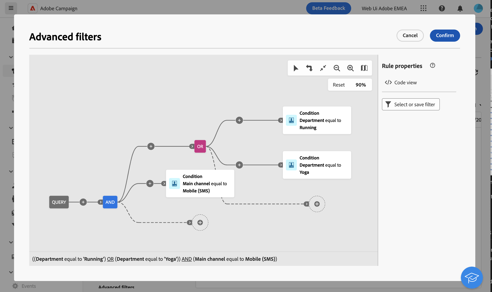

# Filterlistor {#filter-lists}

Adobe Campaign Web innehåller filter i varje objektlista, vilket gör att du kan filtrera information baserat på specifika kontextuella kriterier. Du kan till exempel filtrera leveranser baserat på status, kanal, kontaktdatum eller mapp. Du kan också dölja korrektur.

>[!IMPORTANT]
>
>Det finns ett helt nytt gränssnitt för frågemodelleraren. Med det nya regelbyggaren kan du enkelt skapa din fråga tack vare det förenklade gränssnittet. Om du vill växla till den här upplevelsen trycker du på växlingsknappen i det övre högra hörnet. Du kan gå tillbaka till den klassiska frågemodelleraren när du vill genom att helt enkelt trycka på tillbaka för att inaktivera det nya gränssnittet. Du kan tillämpa samma principer som frågemodelleraren i det nya gränssnittet.
>{zoomable="yes"}

## Använda filter {#apply}

Om du vill använda filter på en lista klickar du på knappen **[!UICONTROL Show filters]** i det övre vänstra hörnet av listan, bredvid sökfältet.

Filterrutan öppnas och tillgängliga filter för den valda listan visas. Du kan till exempel filtrera kampanjer baserat på deras status, start- och slutdatum eller lagringsmapp, medan prenumerationstjänstlistan kan filtreras baserat på kanal- och lagringsmapp.

{zoomable="yes"}{width="70%" align="left" zoomable="yes"}

Om du vill filtrera en lista baserat på dina egna kriterier skapar du ett eget filter. Om du vill göra det bläddrar du längst ned i filterrutan och klickar på knappen **Lägg till regler** . [Lär dig skapa anpassade filter](#custom).

När filtren har tillämpats på en lista visas de under sökfältet. Du kan ta bort ett enskilt filter när som helst eller ta bort alla filter genom att klicka på knappen **Rensa alla** .

## Skapa egna filter {#custom}

Med anpassade filter kan du förfina listor baserat på dina egna specifika villkor. De är utformade med frågemodelleraren i Campaign. Så här skapar du ett eget filter:

1. Öppna filterrutan och klicka på knappen **Lägg till regler** längst ned i rutan.

1. Frågemodelleraren öppnas. Definiera och kombinera filtervillkor efter behov. Detaljerad information om hur du använder frågemodelleraren finns i [det här avsnittet](../query/query-modeler-overview.md).

   I exemplet nedan visas ett anpassat filter som är utformat för att i kampanjlistan visa SMS-kampanjer som körs av operatorer från avdelningarna Running och Yoga.

   {zoomable="yes"}{width="70%" align="left" zoomable="yes"}

1. När det anpassade filtret har konfigurerats klickar du på **[!UICONTROL Confirm]** för att använda det i listan.