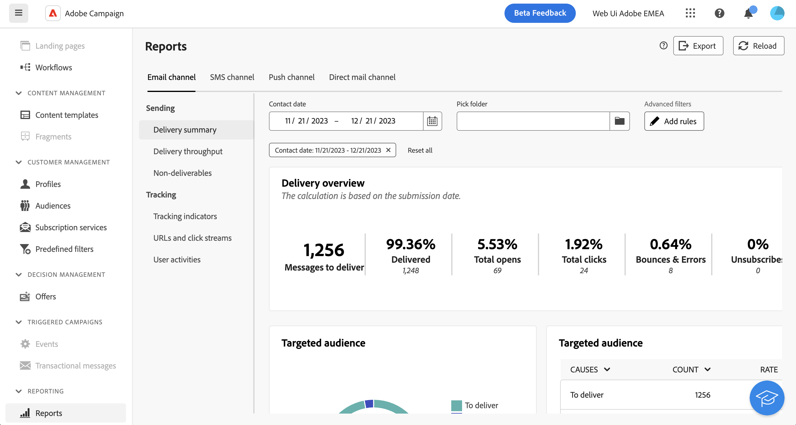
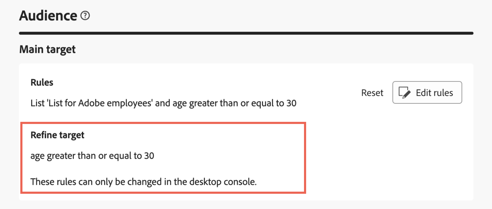

# Arbeta med frågemodelleraren {#segment-builder}

>[!CONTEXTUALHELP]
>id="acw_homepage_learning_card5"
>title="Ny frågemodellerare"
>abstract="Adobe Campaign Web har en frågemodellerare som förenklar filtreringen av databaser för att välja specifika mål baserat på olika kriterier. Detta inkluderar användning av avancerade uttryck och operatorer. Frågemodelleraren är tillgänglig i alla sammanhang där du behöver definiera regler för att filtrera data."

>[!CONTEXTUALHELP]
>id="acw_orchestration_querymodeler_querymessage"
>title="Frågemodelleraren"
>abstract="Definiera filtreringskriterier för mottagare eller andra måldimensioner från databasen. Utnyttja er målgrupp på Adobe Experience Platform för att ytterligare förfina er målgrupp och maximera effekten av er kampanj."

>[!CONTEXTUALHELP]
>id="acw_deliveries_refine_target"
>title="Förfina mål"
>abstract="Dessa regler kan bara ändras i klientkonsolen."

Adobe Campaign webbgränssnitt har en frågemodellerare som förenklar processen att filtrera databasen baserat på olika kriterier. Det garanterar full kompatibilitet med frågor som skapas i klientkonsolen, vilket underlättar en smidig övergång till webbanvändargränssnittet.

Dessutom hanterar frågemodelleraren mycket komplexa och långa frågor effektivt, vilket ger större flexibilitet och precision. Programmet har också stöd för fördefinierade filter under förhållanden, vilket gör det enkelt för användarna att förfina frågor samtidigt som avancerade uttryck och operatorer används för omfattande målgruppsanpassning och segmenteringsstrategier.

## Åtkomst till frågemodelleraren

Frågemodelleraren är tillgänglig i alla sammanhang där du behöver definiera regler för att filtrera data.

| Användning | Exempel |
|  ---  |  ---  |
| **Definiera målgrupper**: Ange den målgrupp du vill ha i dina meddelanden eller arbetsflöden och skapa enkelt nya målgrupper som är anpassade efter dina behov. [Lär dig skapa målgrupper](../audience/one-time-audience.md) | {zoomable="yes"}{width="200" align="center" zoomable="yes"} [Bild som visar hur du kommer åt gränssnittet för målgruppsskapande] |
| **Anpassa arbetsflödesaktiviteter**: Använd regler i arbetsflödesaktiviteter, som **Dela** och **Avstämning**, för att anpassa dem efter dina specifika krav. [Läs mer om arbetsflödesaktiviteter](../workflows/activities/about-activities.md) | {zoomable="yes"}{width="200" align="center" zoomable="yes"} [Bild som visar hur du får åtkomst till alternativ för anpassning av arbetsflöden] |
| **Fördefinierade filter**: Skapa fördefinierade filter som fungerar som genvägar under olika filtreringsåtgärder, oavsett om du arbetar med datalistor eller skapar en målgrupp för en leverans. [Lär dig arbeta med fördefinierade filter](../get-started/predefined-filters.md) | {zoomable="yes"}{width="200" align="center" zoomable="yes"} [Bild som visar hur du får åtkomst till fördefinierade filter] |
| **Filtret rapporterar data**: Lägg till regler för att filtrera de data som visas i rapporter. [Lär dig arbeta med rapporter](../reporting/gs-reports.md) | {zoomable="yes"}{width="200" align="center" zoomable="yes"} [Bild som visar hur du filtrerar data i rapporter ] |
| **Anpassa listor**: Skapa anpassade regler för att filtrera data som visas i listor som mottagare eller leveranslistor. [Lär dig filtrera listor](../get-started/list-filters.md#list-built-in-filters) | {zoomable="yes"}{width="200" align="center" zoomable="yes"} [Bild som visar hur du anpassar listfilter] |
| **Bygg villkorligt innehåll**: Gör e-postinnehåll dynamiskt genom att skapa villkor som definierar vilket innehåll som ska visas för olika mottagare, vilket säkerställer personaliserade och relevanta meddelanden. [Lär dig hur du skapar villkorligt innehåll](../personalization/conditions.md) | {width="200" align="center" zoomable="yes"} [Bild som visar hur du skapar villkorligt innehåll] |

>[!NOTE]
>
>När du får åtkomst till ett objekt som skapats i klientkonsolen där regler har tillämpats, t.ex. en målgrupp eller ett fördefinierat filter, kan **[!UICONTROL Refine target]**-avsnittet visas. Detta innebär att ytterligare parametrar har konfigurerats för att förfina regelmålet. De här parametrarna kan bara ändras i konsolen.
>
>{zoomable="yes"}

## Gränssnitt för frågemodelleraren {#interface}

Frågemodelleraren innehåller en central arbetsyta där du skapar frågan och en höger ruta med information om frågan.

>[!IMPORTANT]
>
>Det finns ett helt nytt gränssnitt för frågemodelleraren. Med det nya regelbyggaren kan du enkelt skapa din fråga tack vare det förenklade gränssnittet. Om du vill växla till den här upplevelsen trycker du på växlingsknappen i det övre högra hörnet. Du kan gå tillbaka till den klassiska frågemodelleraren när du vill genom att helt enkelt trycka på tillbaka för att inaktivera det nya gränssnittet. Du kan tillämpa samma principer som frågemodelleraren i det nya gränssnittet.
>{zoomable="yes"}

>[!CONTEXTUALHELP]
>id="acw_rule_builder_switch_button"
>title="Ny funktion för regelbyggaren"
>abstract="Använd den här växeln för att växla mellan Classic Query-modelleraren och funktionen New rule builder. Med det nya regelbyggaren kan du enklare skapa din fråga tack vare det förenklade och intuitiva gränssnittet."

{zoomable="yes"}

### Den centrala arbetsytan {#canvas}

Frågemodellerarens centrala arbetsyta är den plats där du lägger till och kombinerar de olika komponenterna för att skapa din fråga. [Lär dig skapa en fråga](build-query.md)

>[!BEGINTABS]

>[!TAB Klassisk frågemodellerare]

Verktygsfältet längst ned till höger på arbetsytan innehåller alternativ för att enkelt ändra frågekomponenterna och navigera på arbetsytan:

* **Flera markeringslägen**: Markera flera filtreringskomponenter för att kopiera och klistra in dem där du vill.
* **Rotera**: Växla arbetsytan lodrätt.
* **Anpassa till skärmen**: Anpassa arbetsytans zoomnivå till skärmen.
* **Zooma ut** / **Zooma in**: Zooma ut eller in på arbetsytan.
* **Visningsschema**: Öppna en ögonblicksbild av arbetsytan som visar din aktuella plats.

>[!TAB Ny funktion i regelbyggaren]

Verktygsfältet i det övre högra hörnet av arbetsytan innehåller alternativ för att enkelt ändra frågekomponenterna och navigera på arbetsytan:

* **Flytta upp markering**: Flytta komponenten uppåt en rad.
* **Flytta ned markeringen**: Flytta komponenten nedåt en rad.
* **Gruppmarkering**: Placera två komponenter i en grupp.
* **Dela upp markering**: Separera komponenterna i en enskild grupp.
* **Expandera alla**: Expandera alla grupper.
* **Komprimera alla**: Komprimera alla grupper.
* **Ta bort alla**: Ta bort alla grupper och komponenter.

>[!ENDTABS]

### Rutan Regelegenskaper {#rule-properties}

Till höger visas information om frågan i rutan **[!UICONTROL Rule properties]**. Det gör att du kan utföra olika åtgärder för att kontrollera frågan och se till att den passar dina behov. Den här rutan visas när du skapar en fråga för att skapa en målgrupp. [Lär dig hur du kontrollerar och validerar din fråga](build-query.md#check-and-validate-your-query)
