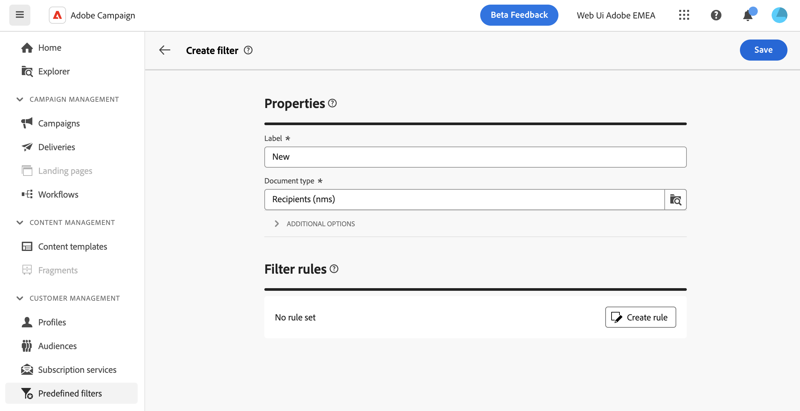

# Arbeta med frågemodelleraren {#segment-builder}

>[!CONTEXTUALHELP]
>id="acw_homepage_learning_card5"
>title="Ny frågemodellerare"
>abstract="Adobe Campaign Web har en frågemodellerare som förenklar filtreringen av databaser för att välja specifika mål baserat på olika kriterier. Detta inkluderar användning av avancerade uttryck och operatorer. Frågemodelleraren är tillgänglig i alla sammanhang där du behöver definiera regler för att filtrera data."

>[!CONTEXTUALHELP]
>id="acw_orchestration_querymodeler_querymessage"
>title="Frågemodelleraren"
>abstract="Definiera filtreringskriterier för mottagare eller andra måldimensioner från databasen. Utnyttja er målgrupp på Adobe Experience Platform för att ytterligare förfina er målgrupp och maximera effekten av er kampanj."

>[!CONTEXTUALHELP]
>id="acw_deliveries_refine_target"
>title="Förfina mål"
>abstract="Dessa regler kan bara ändras i klientkonsolen."

Adobe Campaign webbgränssnitt har en frågemodellerare som förenklar processen att filtrera databasen baserat på olika kriterier. Det garanterar full kompatibilitet med frågor som skapas i klientkonsolen, vilket underlättar en smidig övergång till webbanvändargränssnittet.

Dessutom kan frågemodelleraren hantera mycket komplexa och långa frågor effektivt, vilket ger större flexibilitet och precision. Dessutom har den stöd för fördefinierade filter under förhållanden, vilket gör att du enkelt kan förfina dina frågor samtidigt som du använder avancerade uttryck och operatorer för omfattande målgruppsanpassning och segmenteringsstrategier.

## Åtkomst till frågemodelleraren

Frågemodelleraren är tillgänglig i alla sammanhang där du behöver definiera regler för att filtrera data.

| Användning | Exempel |
|  ---  |  ---  |
| **Definiera målgrupper**: Ange den målgrupp du vill ha i dina meddelanden eller arbetsflöden och skapa enkelt nya målgrupper som är anpassade efter dina behov. [Lär dig skapa målgrupper](../audience/one-time-audience.md) |  |
| **Anpassa arbetsflödesaktiviteter**: Använd regler i arbetsflödesaktiviteter, som **Dela** och **Avstämning**, för att anpassa dem efter dina specifika krav. [Läs mer om arbetsflödesaktiviteter](../workflows/activities/about-activities.md) |  |
| **Fördefinierade filter**: Skapa fördefinierade filter som fungerar som genvägar under olika filtreringsåtgärder, oavsett om du arbetar med datalistor eller skapar en målgrupp för en leverans. [Lär dig arbeta med fördefinierade filter](../get-started/predefined-filters.md) |  |
| **Filtret rapporterar data**: Lägg till regel för att filtrera data som visas i rapporter. [Lär dig arbeta med rapporter](../reporting/gs-reports.md) |  |
| **Anpassa listor**: Skapa anpassade regler för att filtrera data som visas i listor som mottagare, leveranslistor osv. [Lär dig filtrera listor](../get-started/list-filters.md#list-built-in-filters) |  |
| **Bygg villkorligt innehåll**: gör e-postinnehåll dynamiskt genom att skapa villkor som definierar vilket innehåll som ska visas för olika mottagare, vilket säkerställer personaliserade och relevanta meddelanden. [Lär dig hur du skapar villkorligt innehåll](../personalization/conditions.md) |  |

>[!NOTE]
>
>När du får åtkomst till ett objekt som skapats i klientkonsolen där regler har tillämpats, t.ex. en målgrupp eller ett fördefinierat filter, kan avsnittet **[!UICONTROL Refine target]** visas. Detta innebär att ytterligare parametrar har konfigurerats för att förfina regelmålet. De här parametrarna kan bara ändras i konsolen.
>
>

## Gränssnitt för frågemodelleraren {#interface}

>[!CONTEXTUALHELP]
>id="acw_rule_builder_switch_button"
>title="Ny användarupplevelse"
>abstract="Använd den här växeln för att växla mellan den klassiska frågemodelleraren och den nya regelgenereringsupplevelsen."

Frågemodelleraren innehåller en central arbetsyta där du skapar frågan och en höger ruta med information om frågan.

### Den centrala arbetsytan {#canvas}

Frågemodellerarens centrala arbetsyta är där du lägger till och kombinerar de olika komponenterna som skapar din fråga. [Lär dig skapa en fråga](build-query.md)

Verktygsfältet i det övre högra hörnet av arbetsytan innehåller alternativ för att enkelt ändra frågekomponenterna och navigera på arbetsytan:

* **Flera markeringslägen**: Markera flera filtreringskomponenter för att kopiera och klistra in dem där du vill.
* **Rotera**: Växla arbetsytan lodrätt.
* **Anpassa till skärmen**: Anpassa arbetsytans zoomnivå till skärmen.
* **Zooma ut** / **Zooma in**: Zooma ut eller in på arbetsytan.
* **Visningsschema**: Öppnar en ögonblicksbild av arbetsytan som visar att du finns.

### Rutan Regelegenskaper {#rule-properties}

Till höger visas information om frågan i rutan **[!UICONTROL Rule properties]**. Det gör att du kan utföra olika åtgärder för att kontrollera frågan och se till att den passar dina behov. Den här rutan visas när du skapar en fråga för att skapa en målgrupp. [Lär dig hur du kontrollerar och validerar din fråga](build-query.md#check-and-validate-your-query)
