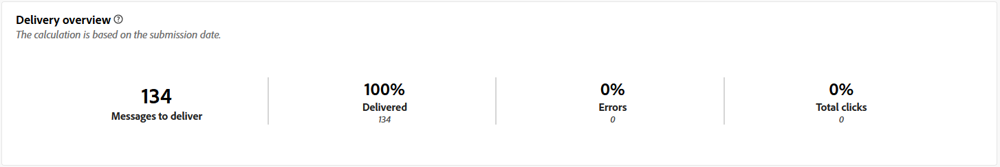
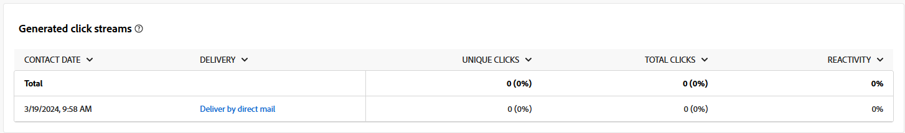

# Kampanjrapporter för Direct-postkanalen {#campaign-reports-direct-mail}

Varje kampanjrapport är uppdelad i olika widgetar som detaljerar kampanjens framgångar och fel. Rapporter och mätvärden för direktreklamkanalen finns nedan. Lär dig hur du får tillgång till dina kampanjrapporter i [den här sidan](campaign-reports.md).

## Leveranssammanfattning {#delivery-summary-direct}

### Leveransöversikt {#delivery-overview-direct}

>[!CONTEXTUALHELP]
>id="acw_campaign_reporting_delivery_overview_direct_mail"
>title="Leveransöversikt"
>abstract="The **Leveransöversikt** presenterar nyckeltal (KPI:er) som ger djupgående insikter i hur besökarna interagerar med varje direktutskick. Mätvärdena beskrivs nedan."

The **[!UICONTROL Delivery Overview]** presenterar nyckeltal (KPI:er) som ger djupgående insikter i hur besökarna interagerar med varje direktutskick. Mätvärdena beskrivs nedan.

{zoomable=&quot;yes&quot;}{align="center"}

+++Läs mer om leveransöversiktssiffror.

* **[!UICONTROL Messages to deliver]**: Totalt antal meddelanden som bearbetats under leveransförberedelsen.

* **[!UICONTROL Delivered]**: Antal meddelanden som har skickats, i relation till det totala antalet skickade meddelanden.

* **[!UICONTROL Errors]**: Totalt antal fel som har ackumulerats under leverans och automatisk returbehandling i relation till totalt antal skickade meddelanden.

* **[!UICONTROL Total clicks]**: Totalt antal distinkta mottagare som klickat på en leverans minst en gång.

+++

### Inledande målgruppsstatistik {#delivery-summary-direct-initial-target}

>[!CONTEXTUALHELP]
>id="acw_campaign_reporting_target_audience_direct_mail"
>title="Inledande målgruppsstatistik"
>abstract="Mottagardata och meddelandeinformation visas i **Inledande målgruppsstatistik** tabell, som avspeglar leveransanalysen."

The **[!UICONTROL Initial target audience statistics]** tabellen visar data som är relativa till mottagarna. Mätvärden beräknas under färdigställandet av leveransen och visar: den initiala målgruppen, antalet meddelanden som ska skickas, antalet exkluderade mottagare.

{zoomable=&quot;yes&quot;}

+++Läs mer om statistik om inledande målgrupper.

* **[!UICONTROL Initial audience]**: Totalt antal målmottagare.

* **[!UICONTROL Message to deliver]**: Totalt antal meddelanden som ska levereras efter leveransförberedelse.

* **[!UICONTROL Rejected by rules]**: Totalt antal adresser som ignoreras under analysen när regler tillämpas: adress som saknas, är i karantän, på blockeringslista osv.

+++

### Körningsstatistik {#delivery-summary-direct-exec-stats}

>[!CONTEXTUALHELP]
>id="acw_campaign_reporting_execution_statistics_direct_mail"
>title="Leveransstatistik"
>abstract="The **Körningsstatistik** tabellen innehåller information om hur din direktutskick lyckades och om fel som uppstått."

The **[!UICONTROL Execution statistics]** tabellen innehåller en beskrivning av hur väl varje direktmejlleverans lyckats, med detaljerade mätvärden som anges nedan.

+++Läs mer om leveransstatistik.

* **[!UICONTROL Message to deliver]**: Totalt antal meddelanden som ska levereras efter leveransförberedelse.

* **[!UICONTROL Success]**: Antal meddelanden som har bearbetats i relation till antalet meddelanden som ska levereras.

* **[!UICONTROL Errors]**: Totalt antal fel som har ackumulerats under leveranser och automatisk återinläsning i relation till antalet meddelanden som ska levereras.

* **[!UICONTROL New quarantines]**: Totalt antal adresser i karantän efter misslyckad leverans (okänd användare, ogiltig domän) i relation till antalet meddelanden som ska levereras.

+++

### Genererade klickströmmar {#click-streams}

>[!CONTEXTUALHELP]
>id="acw_campaign_reporting_clicks_direct_mail"
>title="Genererade klickströmmar"
>abstract="The **Genererade klickströmmar** tabellen visar tillgängliga data i relation till hur mottagarna interagerade med leveransen."

{zoomable=&quot;yes&quot;}{align="center"}

The **Genererade klickströmmar** tabellen visar orsakerna till att användarprofiler, som inte ingår i målprofilerna, inte kunde ta emot meddelandet.

+++Läs mer om Generated click streams metrics.

* **[!UICONTROL Unique clicks]**: Totalt antal distinkta mottagare som klickat på en leverans minst en gång.

* **[!UICONTROL Total clicks]**: Totalt antal klick på länkar i leveranser.

* **[!UICONTROL Reactivity]**: Förhållandet mellan antalet målmottagare som klickat i en leverans, i förhållande till det uppskattade antalet målmottagare som öppnat en leverans.

+++
