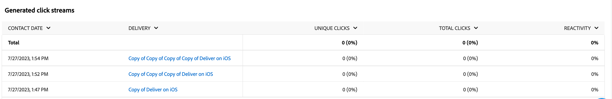

# Kampanjrapporter för push-kanalen {#campaign-reports-push-channel}

Varje kampanjrapport är uppdelad i olika widgetar som detaljerar kampanjens framgångar och fel. Rapporterna och mätvärdena för push-kanalen beskrivs nedan. Lär dig hur du får tillgång till dina kampanjrapporter på [den här sidan](campaign-reports.md).

## Leveranssammanfattning {#delivery-summary-push}

>[!CONTEXTUALHELP]
>id="acw_campaign_reporting_push_deliveries_overview"
>title="Leveransöversikt"
>abstract="Rapporten **Leveransöversikt** innehåller nyckeltal (KPI:er) som ger detaljerad information om hur besökarna interagerar med leveransen av push-meddelanden."

Rapporten **[!UICONTROL Delivery Overview]** innehåller nyckeltal (KPI:er) som ger detaljerad information om hur besökarna interagerar med leveransen av push-meddelanden. Mätvärdena anges nedan.

{zoomable="yes"}

+++Läs mer om mätvärden för push-kampanjrapporter.

* **[!UICONTROL Messages to deliver]**: Totalt antal meddelanden som bearbetats under leveransförberedelsen.

* **[!UICONTROL Delivered]**: Antal meddelanden som har skickats, i relation till det totala antalet skickade meddelanden.

* **[!UICONTROL Errors]**: Totalt antal fel som ackumulerats under leverans och automatisk returbearbetning, i relation till totalt antal skickade meddelanden.

* **[!UICONTROL Total clicks]**: Totalt antal distinkta mottagare som klickat på en leverans minst en gång.

+++

### Inledande målgruppsstatistik {#delivery-summary-push-initial-target}

>[!CONTEXTUALHELP]
>id="acw_campaign_reporting_push_target"
>title="Inledande målgruppsstatistik"
>abstract="Tabellen **Inledande målgruppsstatistik** visar data i förhållande till dina mottagare."

Tabellen **[!UICONTROL Initial target audience statistics]** visar data i förhållande till dina mottagare. Mätvärdena anges nedan.

{zoomable="yes"}

+++Läs mer om mätvärden för push-kampanjrapporter.

* **[!UICONTROL Initial audience]**: Totalt antal målmottagare.

* **[!UICONTROL Message to deliver]**: Totalt antal meddelanden som ska levereras efter leveransförberedelse.

* **[!UICONTROL Rejected by rules]**: Totalt antal adresser som ignoreras under analysen när regler tillämpas, t.ex. adress som saknas, är i karantän eller på blockeringslista.

+++

### Körningsstatistik {#delivery-summary-push-exec-stats}

>[!CONTEXTUALHELP]
>id="acw_campaign_reporting_push_exec_stats"
>title="Körningsstatistik"
>abstract="Tabellen **Körningsstatistik** visar hur din leverans lyckades: meddelanden som ska levereras, slutföras, fel och nya karantän."

Tabellen **[!UICONTROL Execution statistics]** innehåller information om leveransframgången. Mätvärdena anges nedan.

{zoomable="yes"}

+++Läs mer om mätvärden för push-kampanjrapporter.

* **[!UICONTROL Message to deliver]**: Totalt antal meddelanden som ska levereras efter leveransförberedelse.

* **[!UICONTROL Success]**: Antal meddelanden som har bearbetats, i relation till antalet meddelanden som ska levereras.

* **[!UICONTROL Errors]**: Totalt antal fel som ackumulerats under leveranser och automatisk återinläsning, i relation till antalet meddelanden som ska levereras.

* **[!UICONTROL New quarantines]**: Totalt antal adresser i karantän efter misslyckad leverans (t.ex. ogiltig registrering, avvisning av meddelanden eller nyttolast) i relation till antalet meddelanden som ska levereras.

  Feltyper för push-meddelanden visas i [Adobe Campaign v8-dokumentationen (klientkonsolen)](https://experienceleague.adobe.com/docs/campaign/campaign-v8/send/failures/delivery-failures.html#push-error-types){target="_blank"}.

+++

### Genererade klickströmmar {#delivery-summary-push-click-streams}

>[!CONTEXTUALHELP]
>id="acw_campaign_reporting_push_click_streams"
>title="Genererade klickströmmar"
>abstract="Tabellen **Genererade klickströmmar** visar tillgängliga data i relation till hur mottagarna interagerade med leveransen."

Tabellen **[!UICONTROL Generated click streams]** visar data i relation till hur mottagarna interagerade med leveransen. Mätvärdena anges nedan.

{zoomable="yes"}

+++Läs mer om mätvärden för push-kampanjrapporter.

* **[!UICONTROL Unique clicks]**: Totalt antal distinkta mottagare som klickat på en leverans minst en gång.

* **[!UICONTROL Total clicks]**: Totalt antal klick på länkar i leveranser.

* **[!UICONTROL Reactivity]**: Förhållandet mellan antalet målmottagare som klickade i en leverans, i förhållande till det beräknade antalet målmottagare som öppnade en leverans.

+++