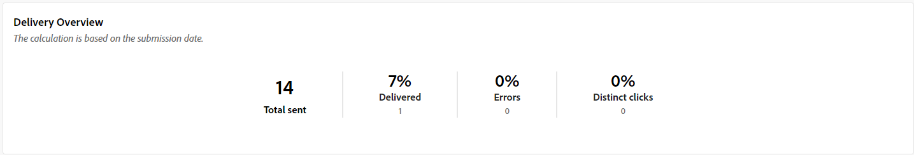

# Kampanjrapporter för SMS-kanalen {#campaign-reports-sms-channel}

## Leveranssammanfattning {#delivery-summary-sms}

The **[!UICONTROL Delivery Overview]** rapporten innehåller nyckeltal för nyckeltal (KPI) som ger detaljerad information om hur besökarna interagerar med SMS-leveransen. Mätvärdena anges nedan.

+++Läs mer om mätvärden för SMS-kampanjrapporter.

* **[!UICONTROL Total sent]**: Totalt antal meddelanden som bearbetats under leveransförberedelsen.

* **[!UICONTROL Delivered]**: Antal meddelanden som har skickats, i relation till det totala antalet skickade meddelanden.

* **[!UICONTROL Errors]**: Totalt antal fel som har ackumulerats under leverans och automatisk returbehandling i relation till totalt antal skickade meddelanden.

* **[!UICONTROL Distinct clicks]**: Totalt antal distinkta mottagare som klickat på en leverans minst en gång.

+++

### Inledande målgruppsstatistik {#delivery-summary-sms-initial-target}

The **[!UICONTROL Initial target audience statistics]** tabellen visar data som är relativa till mottagarna. Mätvärdena anges nedan.

+++Läs mer om mätvärden för SMS-kampanjrapporter.

* **[!UICONTROL Initial audience]**: Totalt antal målmottagare.

* **[!UICONTROL Message to deliver]**: Totalt antal meddelanden som ska levereras efter leveransförberedelse.

* **[!UICONTROL Rejected by rules]**: Totalt antal adresser som ignoreras under analysen när regler tillämpas: adress som saknas, är i karantän, på blockeringslista osv.

+++

### Körningsstatistik {#delivery-summary-sms-exec-stats}

The **[!UICONTROL Execution statistics]** tabellen visar hur bra leveransen är. Mätvärdena anges nedan.

+++Läs mer om mätvärden för SMS-kampanjrapporter.

* **[!UICONTROL Message to deliver]**: Totalt antal meddelanden som ska levereras efter leveransförberedelse.

* **[!UICONTROL Success]**: Antal meddelanden som har bearbetats i relation till antalet meddelanden som ska levereras.

* **[!UICONTROL Errors]**: Totalt antal fel som har ackumulerats under leveranser och automatisk återinläsning i relation till antalet meddelanden som ska levereras.

* **[!UICONTROL New quarantines]**: Totalt antal adresser i karantän efter misslyckad leverans (okänd användare, ogiltig domän) i relation till antalet meddelanden som ska levereras.

+++

### Genererade klickströmmar {#delivery-summary-sms-click-streams}

The **[!UICONTROL Generated click streams]** tabellen visar data som är relativa till hur mottagarna interagerade med leveransen. Mätvärdena anges nedan.

+++Läs mer om mätvärden för SMS-kampanjrapporter.

* **[!UICONTROL Distinct clicks]**: Totalt antal distinkta mottagare som klickat på en leverans minst en gång.

* **[!UICONTROL Clicks]**: Totalt antal klick på länkar i leveranser.

* **[!UICONTROL Reactivity]**: Förhållandet mellan antalet målmottagare som klickat i en leverans, i förhållande till det uppskattade antalet målmottagare som öppnat en leverans.

+++

## Push-kanal {#push-channel}

### Leveranssammanfattning {#delivery-summary-push}

* **[!UICONTROL Delivery Overview]** innehåller nyckeltal för nyckeltal (KPI) som ger detaljerad information om hur besökarna interagerar med leverans av push-meddelanden.

  +++Läs mer om mätvärden för push-kampanjrapporter.

   * **[!UICONTROL Total sent]**: Totalt antal meddelanden som bearbetats under leveransförberedelsen.

   * **[!UICONTROL Delivered]**: Antal meddelanden som har skickats, i relation till det totala antalet skickade meddelanden.

   * **[!UICONTROL Errors]**: Totalt antal fel som har ackumulerats under leverans och automatisk returbehandling i relation till totalt antal skickade meddelanden.

   * **[!UICONTROL Distinct clicks]**: Totalt antal distinkta mottagare som klickat på en leverans minst en gång.

+++

* **[!UICONTROL Initial target audience statistics]** tabellen visar data som är relativa till dina mottagare:

  +++Läs mer om mätvärden för push-kampanjrapporter.

   * **[!UICONTROL Initial audience]**: Totalt antal målmottagare.

   * **[!UICONTROL Message to deliver]**: Totalt antal meddelanden som ska levereras efter leveransförberedelse.

   * **[!UICONTROL Rejected by rules]**: Totalt antal adresser som ignoreras under analysen när regler tillämpas: adress som saknas, är i karantän, på blockeringslista osv.

+++

* **[!UICONTROL Execution statistics]** tabellen visar hur framgångsrik leveransen är:

  +++Läs mer om mätvärden för push-kampanjrapporter.

   * **[!UICONTROL Message to deliver]**: Totalt antal meddelanden som ska levereras efter leveransförberedelse.

   * **[!UICONTROL Success]**: Antal meddelanden som har bearbetats i relation till antalet meddelanden som ska levereras.

   * **[!UICONTROL Errors]**: Totalt antal fel som har ackumulerats under leveranser och automatisk återinläsning i relation till antalet meddelanden som ska levereras.

   * **[!UICONTROL New quarantines]**: Totalt antal adresser i karantän efter misslyckad leverans (okänd användare, ogiltig domän) i relation till antalet meddelanden som ska levereras.

+++

* **[!UICONTROL Generated click streams]** tabellen visar data som är relativa till hur mottagarna interagerade med leveransen:

  +++Läs mer om mätvärden för push-kampanjrapporter.

   * **[!UICONTROL Distinct clicks]**: Totalt antal distinkta mottagare som klickat på en leverans minst en gång.

   * **[!UICONTROL Clicks]**: Totalt antal klick på länkar i leveranser.

   * **[!UICONTROL Reactivity]**: Förhållandet mellan antalet målmottagare som klickat i en leverans, i förhållande till det uppskattade antalet målmottagare som öppnat en leverans.

+++
