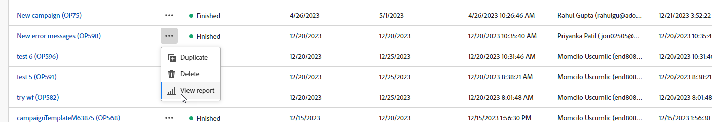

# Kom igång med kampanjrapporter {#campaign-reports}

**Kampanjrapporterna** innehåller en omfattande översikt över din **kampanj**, som innehåller all relevant information om de olika leveranser som ingår. Dessa rapporter innehåller en detaljerad analys av varje produkts prestanda per kanal, inklusive antal lyckade inköp, målgruppsengagemang och andra viktiga mätvärden. De hjälper er att utvärdera den övergripande effektiviteten och effekten av er kampanj.

En fullständig lista över rapporter och tillhörande mått för varje kanal finns på följande sidor:

* [Kampanjkanal för e-post](campaign-reports-email.md)
* [SMS-kampanjkanal](campaign-reports-sms.md)
* [Kampanjkanal](campaign-reports-push.md)
* [Kampanjkanal för direktreklam](campaign-reports-direct-mail.md)

## Hantera rapportinstrumentpanelen {#manage-reports}

Följ de här stegen för att få tillgång till och hantera kampanjrapporter:

1. Navigera till menyn **[!UICONTROL Campaigns]** och klicka på knappen **Rapporter** på instrumentpanelen för din kampanj.

   {zoomable="yes"}

   Du kan också använda knappen **Fler åtgärder** bredvid kampanjnamnet i kampanjlistan och välja **[!UICONTROL View report]**.

   {zoomable="yes"}

1. Välj en rapport i listan på den vänstra menyn och navigera bland flikarna för att visa data från varje kanal.

   {zoomable="yes"}

1. Klicka på **[!UICONTROL Select deliveries]** på instrumentpanelen för att ange en specifik leverans som ingår i kampanjen som mål.

1. Välj en **Start** och **[!UICONTROL End time]** på menyn **[!UICONTROL Delivery throughput]** om du vill fokusera på specifika data.

   {zoomable="yes"}

1. I fältet **[!UICONTROL Pick folder]** väljer du om leveranser eller kampanjer från en viss mapp ska målställas.

   Du kan också välja **[!UICONTROL Add rules]** om du vill skapa frågor för bättre filtrering av rapportdata. [Lär dig använda frågemodelleraren](../query/query-modeler-overview.md)

   {zoomable="yes"}

1. I **[!UICONTROL URLs and click streams]** väljer du **[!UICONTROL Top visited Links]** eller **[!UICONTROL Time period]**.

   Alternativen i **[!UICONTROL View by]** tillåter filtrering efter URL-adresser, etiketter eller kategorier.