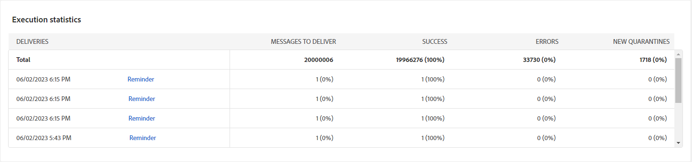

# Kampanjrapporter {#campaign-reports}

>[!CONTEXTUALHELP]
>id="acw_campaign_reporting_sending"
>title="Rapportering skickas"
>abstract="Fliken Skicka i din rapport ger djupgående insikter om besökarnas interaktion med leveranser och eventuella fel som de har upptäckt."

>[!CONTEXTUALHELP]
>id="acw_campaign_reporting_tracking"
>title="Rapporteringsspårning"
>abstract="Fliken Spärra/knip i rapporten innehåller värdefulla data, inklusive mottagarnas beteende per länk, hur öppningar och klickningar visas samt detaljerad information om de URL:er som du klickade mest på under en leverans."

>[!CONTEXTUALHELP]
>id="acw_campaign_reporting_deliveries_overview"
>title="Leveransöversikt"
>abstract="I leveransöversikten finns viktiga nyckeltal (KPI:er) som ger detaljerad information om hur besökarna interagerar med e-postleveransen."

>[!CONTEXTUALHELP]
>id="acw_campaign_reporting_deliveries_target"
>title="Inledande målgruppsstatistik"
>abstract="Den första målgruppsstatistiktabellen visar data relativt dina mottagare"

Campaign-rapporten är uppdelad i olika widgetar som detaljerar kampanjens framgångar och fel.

Kampanjrapportsidan visas med följande flikar:

* [E-postkanal](#email-channel)
* [SMS-kanal](#sms-channel)
* [Push-kanal](#push-channel)

Klicka på Rapporter från kampanjens kontrollpanel för att få tillgång till din Campaign-rapport.

## E-postkanal {#email-channel}

### Leveranssammanfattning {#delivery-summary-email}

* **[!UICONTROL Delivery Overview]** innehåller nyckeltal för nyckeltal (KPI) som ger detaljerad information om hur besökarna interagerar med e-postleveransen.

  

  +++Läs mer om rapportstatistik för e-postkampanjer.

   * **[!UICONTROL Total sent]**: Totalt antal meddelanden som bearbetats under leveransförberedelsen.

   * **[!UICONTROL Delivered]**: Antal meddelanden som har skickats, i relation till det totala antalet skickade meddelanden.

   * **[!UICONTROL Bounces]**: Totalt antal fel som har ackumulerats under leverans och automatisk returbehandling i relation till totalt antal skickade meddelanden.

   * **[!UICONTROL Distinct opens]**: Totalt antal målmottagare som öppnat ett meddelande minst en gång.

   * **[!UICONTROL Distinct clicks]**: Totalt antal distinkta mottagare som klickat på en leverans minst en gång.

+++

* **[!UICONTROL Initial target audience statistics]** tabellen visar data som är relativa till dina mottagare:

  

  +++Läs mer om rapportstatistik för e-postkampanjer.

   * **[!UICONTROL Initial audience]**: Totalt antal målmottagare.

   * **[!UICONTROL Message to deliver]**: Totalt antal meddelanden som ska levereras efter leveransförberedelse.

   * **[!UICONTROL Rejected by rules]**: Totalt antal adresser som ignoreras under analysen när regler tillämpas: adress som saknas, är i karantän, på blockeringslista osv.

+++

* **[!UICONTROL Execution statistics]** tabellen visar hur bra leveransen är.

  

  +++Läs mer om rapportstatistik för e-postkampanjer.

   * **[!UICONTROL Message to deliver]**: Totalt antal meddelanden som ska levereras efter leveransförberedelse.

   * **[!UICONTROL Success]**: Antal meddelanden som har bearbetats i relation till antalet meddelanden som ska levereras.

   * **[!UICONTROL Errors]**: Totalt antal fel som har ackumulerats under leveranser och automatisk återinläsning i relation till antalet meddelanden som ska levereras.

   * **[!UICONTROL New quarantines]**: Totalt antal adresser i karantän efter misslyckad leverans (okänd användare, ogiltig domän) i relation till antalet meddelanden som ska levereras.

+++

* **[!UICONTROL Reaction statistics]** tabellen innehåller tillgängliga data för mottagaraktivitet för leveransen.

  

  +++Läs mer om rapportstatistik för e-postkampanjer.

   * **[!UICONTROL Distinct opens]**: Totalt antal målmottagare som öppnat ett meddelande minst en gång.

   * **[!UICONTROL Opens]**: Antal distinkta målmottagare för den här domänen som har öppnat ett meddelande minst en gång.

   * **[!UICONTROL Unsubscriptions]**: Antal mottagare som klickat på att avbryta prenumerationen för den aktuella perioden.

   * **[!UICONTROL Mirror page]**: Antal mottagare som klickade på länken för spegelsidan.

   * **[!UICONTROL Forwards]**: Antal mottagare som klickade och som vidarebefordrat e-postmeddelandet.
+++

* **[!UICONTROL Generated click streams]** tabellen visar data som är relativa till hur mottagarna interagerade med leveransen.

  

  +++Läs mer om rapportstatistik för e-postkampanjer.

   * **[!UICONTROL Distinct clicks]**: Totalt antal distinkta mottagare som klickat på en leverans minst en gång.

   * **[!UICONTROL Clicks]**: Totalt antal klick på länkar i leveranser.

   * **[!UICONTROL Reactivity]**: Förhållandet mellan antalet målmottagare som klickat i en leverans, i förhållande till det uppskattade antalet målmottagare som öppnat en leverans.

+++

### Ej levererbara {#non-deliverables-email}

* **[!UICONTROL Breakdown of errors per type]** och **[!UICONTROL Breakdown of errors per domain]** tabeller och diagram innehåller tillgängliga data för eventuella fel som påträffas i varje domän.

  Felen som visas i den här rapporten utlöser karantänprocessen. Mer information om karantänhantering finns i [Kampanjdokumentation v8 (klientkonsol)](https://experienceleague.adobe.com/docs/campaign/campaign-v8/campaigns/send/failures/delivery-failures.html){target="_blank"}.

  

  +++Läs mer om rapportstatistik för e-postkampanjer.

   * **[!UICONTROL User unknown]**: Feltyp som genererades under leveransen för att ange att e-postadressen är ogiltig.

   * **[!UICONTROL Invalid domain]**: Feltyp som genereras när en leverans skickas för att ange att domänen för e-postadressen är fel eller inte finns.

   * **[!UICONTROL Mailbox full]**: Feltyp som genererats efter fem leveransförsök för att ange att mottagarens inkorg innehåller för många meddelanden.

   * **[!UICONTROL Account disabled]**: Feltyp som genereras när en leverans skickas för att ange att adressen inte längre finns.

   * **[!UICONTROL Refused]**: Feltyp som genereras när en adress nekas av IAP (Internet Access Provider), till exempel efter att en säkerhetsregel (antispam-program) har tillämpats.

   * **[!UICONTROL Unreachable]**: Feltyp som inträffar i meddelandedistributionssträngen: incident i SMTP-reläet, domän som inte går att nå temporärt, osv.

   * **[!UICONTROL Not connected]**: Feltyp som anger att mottagarens mobiltelefon är avstängd eller frånkopplad från nätverket vid tidpunkten för sändningen.

+++

### Spårningsindikatorer {#tracking-indicators-email}

* **[!UICONTROL Delivery statistics]** innehåller nyckeltal för nyckeltal (KPI) som ger detaljerad information om data som är tillgängliga för skickade e-postmeddelanden.

  

  +++Läs mer om rapportstatistik för e-postkampanjer.

   * **[!UICONTROL Success]**: Antal meddelanden som har bearbetats i relation till antalet meddelanden som ska levereras.

   * **[!UICONTROL Distinct opens]**: Totalt antal målmottagare som öppnat ett meddelande minst en gång.

   * **[!UICONTROL Opens]**: Antal distinkta målmottagare för den här domänen som har öppnat ett meddelande minst en gång.

   * **[!UICONTROL Clicks on the opt-out link]**: Antal klick på länken för att avbryta prenumerationen.

   * **[!UICONTROL Clicks on the mirror link]**: Antal klick på länken till spegelsidan.

   * **[!UICONTROL Estimation of forwards]**: Uppskattning av antalet e-postmeddelanden som vidarebefordras av målmottagarna.
+++

* **[!UICONTROL Initial target audience statistics]** tabellen visar data som är relativa till mottagarna.

  

  +++Läs mer om rapportstatistik för e-postkampanjer.

   * **[!UICONTROL Sent]**: Totalt antal skickade meddelanden.

   * **[!UICONTROL Complaints]**: Antal meddelanden för den här domänen som har rapporterats som oönskade av mottagaren.

   * **[!UICONTROL Opens]**: Antal distinkta målmottagare för den här domänen som har öppnat ett meddelande minst en gång.

   * **[!UICONTROL Clicks]**: Antal distinkta mottagare som klickat på samma leverans minst en gång.

   * **[!UICONTROL Raw reactivity]**: Procentandel av antalet mottagare som klickade på en leverans minst en gång jämfört med antalet mottagare som öppnade en leverans minst en gång.
+++

### URL:er och klickströmmar {#url-email}

* **[!UICONTROL URLs and click streams]** innehåller nyckeltal (KPI:er) som ger detaljerad information om de URL:er som du klickade mest på under en leverans.

  

  +++Läs mer om rapportstatistik för e-postkampanjer.

   * **[!UICONTROL Reactivity]**: Förhållandet mellan antalet målmottagare som klickat i en leverans, i förhållande till det uppskattade antalet målmottagare som öppnat en leverans.

   * **[!UICONTROL Distinct clicks]**: Totalt antal distinkta mottagare som klickat på en leverans minst en gång.

   * **[!UICONTROL Clicks]**: Totalt antal klick på länkar i leveranser.

   * **[!UICONTROL Platform average]** : Detta medelvärde, som visas för varje frekvens (reaktivitet, distinkta klick och kumulerade klick), beräknas för leveranser som skickats under de senaste sex månaderna. Endast leveranser med samma typologi och i samma kanal beaktas. Korrektur ingår inte.
+++

* **[!UICONTROL Top 10 most visited links]** diagram och tabell innehåller tillgängliga data för mottagarnas beteende per länk.

  

  +++Läs mer om rapportstatistik för e-postkampanjer.

   * **[!UICONTROL Clicks]**: Totalt antal klick på länkar i leveranser.

   * **[!UICONTROL Percentage]**: Procentandel användare som interagerade med leveransen.

+++

* **[!UICONTROL Breakdown of clicks over time]** diagrammet innehåller tillgängliga data för mottagarnas beteende per länk.

  

### Användaraktiviteter {#user-activities-email}

* **[!UICONTROL User activities]** visar hur öppningar och klickningar delas upp i ett diagram.

  

  +++Läs mer om rapportstatistik för e-postkampanjer.

   * **[!UICONTROL Clicks]**: Totalt antal klick på länkar i leveranser.

   * **[!UICONTROL Opens]**: Antal distinkta målmottagare för den här domänen som har öppnat ett meddelande minst en gång.

+++

## SMS-kanal {#sms-channel}

### Leveranssammanfattning {#delivery-summary-sms}

* **[!UICONTROL Delivery Overview]** innehåller nyckeltal för nyckeltal (KPI) som ger detaljerad information om hur besökarna interagerar med SMS-leveransen.

  

  +++Läs mer om mätvärden för SMS-kampanjrapporter.

   * **[!UICONTROL Total sent]**: Totalt antal meddelanden som bearbetats under leveransförberedelsen.

   * **[!UICONTROL Delivered]**: Antal meddelanden som har skickats, i relation till det totala antalet skickade meddelanden.

   * **[!UICONTROL Errors]**: Totalt antal fel som har ackumulerats under leverans och automatisk returbehandling i relation till totalt antal skickade meddelanden.

   * **[!UICONTROL Distinct clicks]**: Totalt antal distinkta mottagare som klickat på en leverans minst en gång.

+++

* **[!UICONTROL Initial target audience statistics]** tabellen visar data som är relativa till dina mottagare:

  

  +++Läs mer om mätvärden för SMS-kampanjrapporter.

   * **[!UICONTROL Initial audience]**: Totalt antal målmottagare.

   * **[!UICONTROL Message to deliver]**: Totalt antal meddelanden som ska levereras efter leveransförberedelse.

   * **[!UICONTROL Rejected by rules]**: Totalt antal adresser som ignoreras under analysen när regler tillämpas: adress som saknas, är i karantän, på blockeringslista osv.

+++

* **[!UICONTROL Execution statistics]** tabellen visar hur framgångsrik leveransen är:

  

  +++Läs mer om mätvärden för SMS-kampanjrapporter.

   * **[!UICONTROL Message to deliver]**: Totalt antal meddelanden som ska levereras efter leveransförberedelse.

   * **[!UICONTROL Success]**: Antal meddelanden som har bearbetats i relation till antalet meddelanden som ska levereras.

   * **[!UICONTROL Errors]**: Totalt antal fel som har ackumulerats under leveranser och automatisk återinläsning i relation till antalet meddelanden som ska levereras.

   * **[!UICONTROL New quarantines]**: Totalt antal adresser i karantän efter misslyckad leverans (okänd användare, ogiltig domän) i relation till antalet meddelanden som ska levereras.

+++

* **[!UICONTROL Generated click streams]** tabellen visar data som är relativa till hur mottagarna interagerade med leveransen:

  

  +++Läs mer om mätvärden för SMS-kampanjrapporter.

   * **[!UICONTROL Distinct clicks]**: Totalt antal distinkta mottagare som klickat på en leverans minst en gång.

   * **[!UICONTROL Clicks]**: Totalt antal klick på länkar i leveranser.

   * **[!UICONTROL Reactivity]**: Förhållandet mellan antalet målmottagare som klickat i en leverans, i förhållande till det uppskattade antalet målmottagare som öppnat en leverans.

+++

## Push-kanal {#push-channel}

### Leveranssammanfattning {#delivery-summary-push}

* **[!UICONTROL Delivery Overview]** innehåller nyckeltal för nyckeltal (KPI) som ger detaljerad information om hur besökarna interagerar med leverans av push-meddelanden.

  +++Läs mer om mätvärden för push-kampanjrapporter.

   * **[!UICONTROL Total sent]**: Totalt antal meddelanden som bearbetats under leveransförberedelsen.

   * **[!UICONTROL Delivered]**: Antal meddelanden som har skickats, i relation till det totala antalet skickade meddelanden.

   * **[!UICONTROL Errors]**: Totalt antal fel som har ackumulerats under leverans och automatisk returbehandling i relation till totalt antal skickade meddelanden.

   * **[!UICONTROL Distinct clicks]**: Totalt antal distinkta mottagare som klickat på en leverans minst en gång.

+++

* **[!UICONTROL Initial target audience statistics]** tabellen visar data som är relativa till dina mottagare:

  +++Läs mer om mätvärden för push-kampanjrapporter.

   * **[!UICONTROL Initial audience]**: Totalt antal målmottagare.

   * **[!UICONTROL Message to deliver]**: Totalt antal meddelanden som ska levereras efter leveransförberedelse.

   * **[!UICONTROL Rejected by rules]**: Totalt antal adresser som ignoreras under analysen när regler tillämpas: adress som saknas, är i karantän, på blockeringslista osv.

+++

* **[!UICONTROL Execution statistics]** tabellen visar hur framgångsrik leveransen är:

  +++Läs mer om mätvärden för push-kampanjrapporter.

   * **[!UICONTROL Message to deliver]**: Totalt antal meddelanden som ska levereras efter leveransförberedelse.

   * **[!UICONTROL Success]**: Antal meddelanden som har bearbetats i relation till antalet meddelanden som ska levereras.

   * **[!UICONTROL Errors]**: Totalt antal fel som har ackumulerats under leveranser och automatisk återinläsning i relation till antalet meddelanden som ska levereras.

   * **[!UICONTROL New quarantines]**: Totalt antal adresser i karantän efter misslyckad leverans (okänd användare, ogiltig domän) i relation till antalet meddelanden som ska levereras.

+++

* **[!UICONTROL Generated click streams]** tabellen visar data som är relativa till hur mottagarna interagerade med leveransen:

  +++Läs mer om mätvärden för push-kampanjrapporter.

   * **[!UICONTROL Distinct clicks]**: Totalt antal distinkta mottagare som klickat på en leverans minst en gång.

   * **[!UICONTROL Clicks]**: Totalt antal klick på länkar i leveranser.

   * **[!UICONTROL Reactivity]**: Förhållandet mellan antalet målmottagare som klickat i en leverans, i förhållande till det uppskattade antalet målmottagare som öppnat en leverans.

+++
