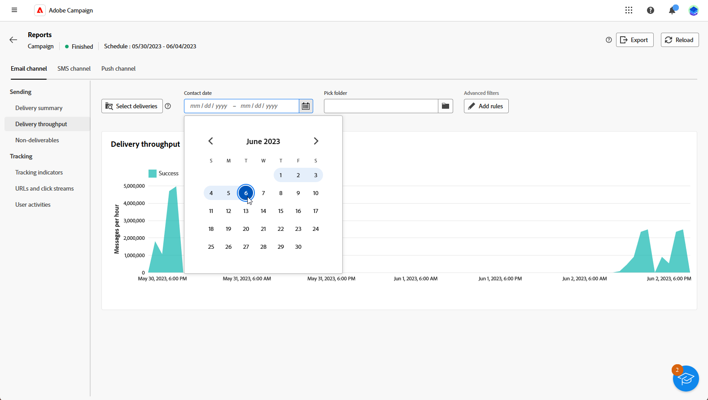

# Kom igång med kampanjrapporter {#campaign-reports}

**Kampanjrapporterna** innehåller en omfattande översikt över din **kampanj**, som innehåller all relevant information om de olika leveranserna som ingår. Dessa rapporter innehåller en grundlig analys av resultatet, per kanal: antal lyckade inköp, målgruppsengagemang och andra viktiga mätvärden. De gör att ni kan utvärdera kampanjens övergripande effektivitet och effekt.

En fullständig lista över rapporter och tillhörande mått för varje kanal finns på följande sidor:

* [Kampanjkanal för e-post](campaign-reports-email.md)
* [SMS-kampanjkanal](campaign-reports-sms.md)
* [Kampanjkanal](campaign-reports-push.md)
* [Kampanjkanal för direktreklam](campaign-reports-direct-mail.md)

## Hantera rapportinstrumentpanelen {#manage-reports}

Följ de här stegen för att få tillgång till och hantera kampanjrapporter:

1. Navigera till menyn **[!UICONTROL Campaigns]**. Klicka på knappen **Rapporter** på instrumentpanelen för din kampanj.

   {zoomable="yes"}

   Du kan också använda knappen **Fler åtgärder** bredvid kampanjnamnet i kampanjlistan och välja **[!UICONTROL View report]**.

   {zoomable="yes"}

1. Välj en rapport i listan på den vänstra menyn och navigera på fliken för att visa data från varje kanal.

   {zoomable="yes"}

1. Klicka på **[!UICONTROL Select deliveries]** på instrumentpanelen om du vill ange en specifik leverans som ingår i kampanjen som mål.

1. På menyn **[!UICONTROL Delivery throughput]** väljer du **Start** och **[!UICONTROL End time]** för att ange specifika data som mål.

   {zoomable="yes"}

1. Välj om du vill rikta leveranser eller kampanjer från en viss mapp i fältet **[!UICONTROL Pick folder]**.

   Du kan också välja **[!UICONTROL Add rules]** om du vill börja skapa frågor för att bättre filtrera rapporteringsdata. [Lär dig använda frågemodelleraren](../query/query-modeler-overview.md)

   {zoomable="yes"}

1. Från **[!UICONTROL URLs and click streams]** kan du även välja **[!UICONTROL Top visited Links]** eller **[!UICONTROL Time period]**.

   Med alternativen för **[!UICONTROL View by]** kan du filtrera URL-adresser, etiketter eller kategorier.
