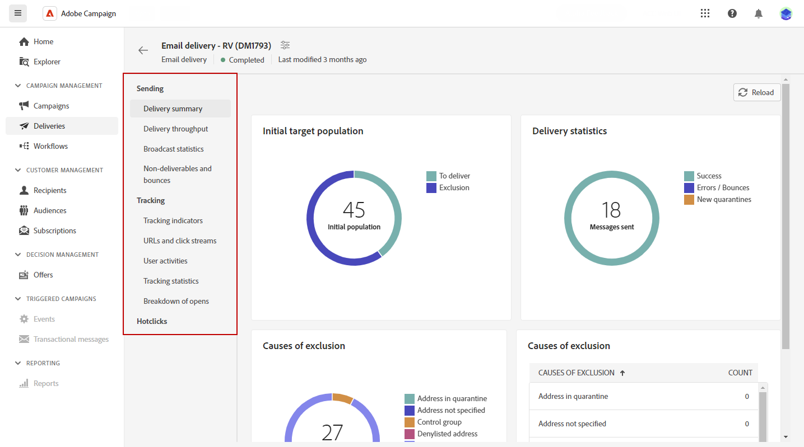

# Access Delivery reports {#reports}

>[!CONTEXTUALHELP]
>id="acw_campaign_reporting_deliveries_selection"
>title="Aggregerad rapportering för leveranser"
>abstract="Välj minst två leveranser för att visa en sammanställd datarapport."

Adobe Campaign erbjuder flera typer av rapporter som är tillgängliga för varje leverans. Med hjälp av de här rapporterna kan du mäta och visualisera effekten och prestandan av dina meddelanden på en inbyggd kontrollpanel.

Så här visar du rapporter:

1. Om du vill generera en rapport för en viss leverans går du till **[!UICONTROL Deliveries]** och väljer den leverans du vill rapportera på.

1. Från **[!UICONTROL Delivery]** kontrollpanel, klicka **[!UICONTROL Reports]**.

   

1. Välj en rapport från listan på den vänstra menyn.

   

1. Om leveransen är återkommande kan du välja en viss leverans att rapportera om genom att klicka på **[!UICONTROL Select deliveries]**.

   Du kan också använda en tidsperiod för rapporten genom att välja **[!UICONTROL Contact date]**.

   
