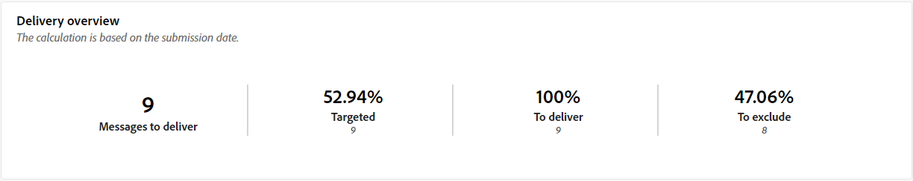
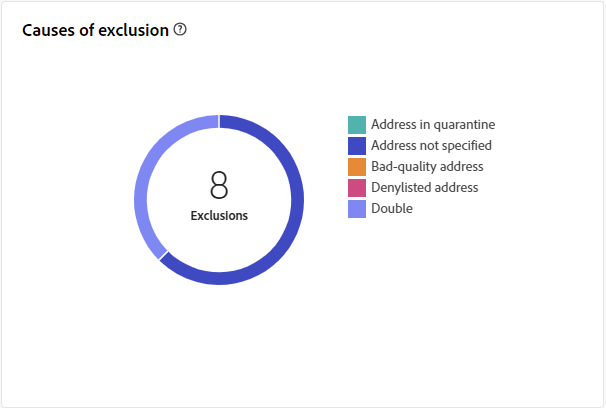

# Rapport om direktleverans av e-post {#direct-mail-report}

Rapporten **Direktleverans av e-post** innehåller omfattande insikter och data som är specifika för din direktleverans av e-post. Den ger detaljerad information om prestanda, effektivitet och resultat för era individuella leveranser och ger er en heltäckande översikt.

## Leveranssammanfattning {#delivery-summary-direct-mail}

### Leveransöversikt {#delivery-overview-direct-mail}

>[!CONTEXTUALHELP]
>id="acw_delivery_reporting_delivery_overview_direct_mail"
>title="Leveransöversikt"
>abstract="I **leveransöversikten** presenteras nyckeltal (KPI:er) som ger djupgående insikter i besökarnas interaktion med varje direktutskick. Mätvärdena beskrivs nedan."

**[!UICONTROL Delivery Overview]** ger detaljerade insikter om hur besökarna interagerar med varje direktsändning via e-post och visar viktiga nyckeltal (KPI).  Mätvärdena beskrivs nedan.

{zoomable="yes"}{align="center"}

+++Läs mer om leveransöversiktssiffror.

* **[!UICONTROL Messages to deliver]**: Totalt antal meddelanden som bearbetats under leveransförberedelsen.

* **[!UICONTROL Targeted]**: Antal användarprofiler som kvalificerar som målprofiler för dina direktutskick.

* **[!UICONTROL To exclude]**: Antal användarprofiler, exkluderade från målprofilerna, som inte tar emot dina direktutskick.
+++

### Inledande målpopulation {#direct-mail-delivery-targeted-population}

>[!CONTEXTUALHELP]
>id="acw_delivery_reporting_initial_target_direct_mail"
>title="Inledande målpopulation"
>abstract="Diagrammet **Inledande målpopulation** visar data i förhållande till dina mottagare och meddelanden baserat på resultatet av leveransförberedelsen."

Diagrammet **[!UICONTROL Initial target population]** visar data i förhållande till dina mottagare. Mätvärden beräknas under färdigställandet av leveransen och visar: den initiala målgruppen, antalet meddelanden som ska skickas, antalet exkluderade mottagare.

{zoomable="yes"}

För musen över en del av diagrammet för att visa det exakta talet.

{zoomable="yes"}

+++Läs mer om rapportvärden för direktutskick.

* **[!UICONTROL Initial audience]**: Totalt antal målmottagare.

* **[!UICONTROL To deliver]**: Totalt antal meddelanden som ska levereras efter leveransförberedelse.

* **[!UICONTROL Exclusion]**: Totalt antal mottagare exkluderade från målpopulationen.
+++

### Leveransstatistik {#direct-mail-delivery-stats}

>[!CONTEXTUALHELP]
>id="acw_delivery_reporting_delivery_statistics_summary_direct_mail"
>title="Leveransstatistik"
>abstract="Diagrammet **Leveransstatistik** visar hur din direktleverans lyckades och vilka fel som uppstod."

Diagrammet **[!UICONTROL Delivery statistics]** ger en omfattande översikt över din leveransförmåga och innehåller detaljerade mätvärden för att mäta framgång och effektivitet.

{zoomable="yes"}

+++Läs mer om rapportvärden för kampanjer i direktreklam.

* **[!UICONTROL Message sent]**: Totalt antal meddelanden som ska levereras efter leveransförberedelse.

* **[!UICONTROL Success]**: Antal meddelanden som har bearbetats i relation till antalet meddelanden som ska levereras.

* **[!UICONTROL Errors]**: Totalt antal fel som har ackumulerats under leveranser och automatisk återinläsning i relation till antalet meddelanden som ska levereras.

* **[!UICONTROL New quarantines]**: Totalt antal adresser i karantän efter en misslyckad leverans (okänd användare, ogiltig domän) i relation till antalet meddelanden som ska levereras.

+++

### Orsaker till uteslutning {#direct-mail-delivery-exclusions}

>[!CONTEXTUALHELP]
>id="acw_delivery_reporting_causes_exclusion_direct_mail"
>title="Leveransorsaker"
>abstract="Diagrammet **Orsaker till uteslutning** illustrerar distributionen av avvisade meddelanden under förberedelsen för leverans, kategoriserat av varje regel."

Diagrammet **[!UICONTROL Causes of exclusion]** innehåller en detaljerad beskrivning av orsakerna till att meddelanden nekas under processen för leveransförberedelse. Uppdelningen är uppdelad enligt olika regler och ger en heltäckande bild av de faktorer som bidrar till att utesluta meddelanden. Uteslutningsreglerna finns i dokumentationen för [Campaign v8 (konsol)](https://experienceleague.adobe.com/docs/campaign/campaign-v8/send/failures/delivery-failures.html#email-error-types){_blank}.

{zoomable="yes"}{align="center" zoomable="yes"}

+++Läs mer om orsaker till uteslutning.

* **[!UICONTROL Address in quarantine]**: Feltypen genererades när adressen placerades i karantän.

* **[!UICONTROL Address not specified]**: Feltypen som genererades när en leverans skickades för att ange att adressen inte finns.

* **[!UICONTROL Bad quality address]**: Feltypen som genereras när kvalitetsklassen för postadresser är för låg.

* **[!UICONTROL Denylisted address]**: Feltypen som genererades när mottagaren blocklist när leveransen utfördes.

* **[!UICONTROL Double]**: Feltypen som genererades när mottagaren exkluderades eftersom dess nyckelvärden inte var unika.

* **[!UICONTROL Control group]**: Mottagarens adress är en del av kontrollgruppen.

* **[!UICONTROL Target limited in size]**: Den maximala leveransstorleken har uppnåtts för mottagaren.

+++

### Undantag {#direct-mail-exclusions}

>[!CONTEXTUALHELP]
>id="acw_delivery_reporting_exclusions_direct_mail"
>title="Undantag"
>abstract="Tabellen **[!UICONTROL Exclusions]** visar en detaljerad beskrivning, per regel, av meddelanden som avvisats under leveransförberedelseprocessen."

Tabellen **[!UICONTROL Exclusions]** innehåller en detaljerad beskrivning, indelad med specifika regler, av meddelanden som avvisats under leveransfasen. Denna omfattande uppdelning ger en tydlig förståelse för orsakerna till att dessa meddelanden utesluts från leveransprocessen.

{zoomable="yes"}{align="center" zoomable="yes"}

Tillgängliga mått är samma som för [Orsaker till uteslutning](#direct-mail-delivery-exclusions) som beskrivs ovan.
