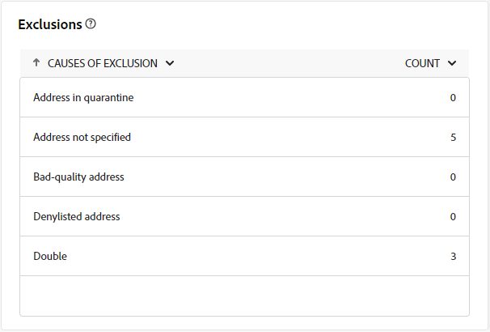

# Extern leveransrapport {#direct-mail-report}

Den **externa leveransrapporten** innehåller omfattande insikter och data som är specifika för din externa leverans. Den innehåller detaljerad information om prestanda, effektivitet och resultat för enskilda leveranser och ger en fullständig översikt.

Följande rapport beskrivs i samband med direktreklam. Den är även tillgänglig för callcenter och anpassade externa kanaler.

## Leveranssammanfattning {#delivery-summary-direct-mail}

### Leveransöversikt {#delivery-overview-direct-mail}

>[!CONTEXTUALHELP]
>id="acw_delivery_reporting_delivery_overview_direct_mail"
>title="Leveransöversikt"
>abstract="I **leveransöversikten** presenteras nyckeltal (KPI:er) som ger djupgående insikter i besökarnas interaktion med varje direktutskick. Mätvärdena beskrivs nedan."

**[!UICONTROL Delivery Overview]** ger detaljerade insikter om besökarinteraktion med varje direktsändning via e-post och visar viktiga nyckeltal (KPI). Mätvärdena beskrivs nedan.

{zoomable="yes"}{align="center"}

+++Läs mer om leveransöversiktssiffror.

* **[!UICONTROL Messages to deliver]**: Totalt antal meddelanden som bearbetats under leveransförberedelsen.
* **[!UICONTROL Targeted]**: Antal användarprofiler som kvalificerar som målprofiler för direktmeddelanden.
* **[!UICONTROL To exclude]**: Antal användarprofiler som exkluderats från målprofilerna och som inte tar emot direktreklam.
+++

### Inledande målpopulation {#direct-mail-delivery-targeted-population}

>[!CONTEXTUALHELP]
>id="acw_delivery_reporting_initial_target_direct_mail"
>title="Inledande målpopulation"
>abstract="Diagrammet **Inledande målpopulation** visar data i förhållande till dina mottagare och meddelanden baserat på resultatet av leveransförberedelsen."

Diagrammet **[!UICONTROL Initial target population]** visar data relaterade till mottagare. Mätvärden beräknas under färdigställandet av leveransen och omfattar den initiala målgruppen, antalet meddelanden som ska skickas och antalet mottagare som ska uteslutas.

{zoomable="yes"}

För musen över en del av diagrammet för att visa det exakta talet.

{zoomable="yes"}

+++Läs mer om rapportvärden för direktutskick.

* **[!UICONTROL Initial audience]**: Totalt antal målmottagare.
* **[!UICONTROL To deliver]**: Totalt antal meddelanden som ska levereras efter leveransförberedelse.
* **[!UICONTROL Exclusion]**: Totalt antal mottagare exkluderade från målpopulationen.
+++

### Leveransstatistik {#direct-mail-delivery-stats}

>[!CONTEXTUALHELP]
>id="acw_delivery_reporting_delivery_statistics_summary_direct_mail"
>title="Leveransstatistik"
>abstract="Diagrammet **Leveransstatistik** visar hur din direktleverans lyckades och vilka fel som uppstod."

Diagrammet **[!UICONTROL Delivery statistics]** ger en översikt över leveransresultaten och innehåller detaljerade mått för att mäta om det lyckades eller var det fungerade.

{zoomable="yes"}

+++Läs mer om rapportvärden för kampanjer i direktreklam.

* **[!UICONTROL Message sent]**: Totalt antal meddelanden som ska levereras efter leveransförberedelse.
* **[!UICONTROL Success]**: Antal meddelanden som har bearbetats jämfört med antalet meddelanden som ska levereras.
* **[!UICONTROL Errors]**: Totalt antal fel som ackumulerats under leveranser och automatisk ombunden bearbetning jämfört med antalet meddelanden som ska levereras.
* **[!UICONTROL New quarantines]**: Totalt antal adresser i karantän efter misslyckad leverans (t.ex. okänd användare, ogiltig domän) jämfört med antalet meddelanden som ska levereras.
+++

### Orsaker till uteslutning {#direct-mail-delivery-exclusions}

>[!CONTEXTUALHELP]
>id="acw_delivery_reporting_causes_exclusion_direct_mail"
>title="Leveransorsaker"
>abstract="Diagrammet **Orsaker till uteslutning** illustrerar distributionen av avvisade meddelanden under förberedelsen för leverans, kategoriserat av varje regel."

Diagrammet **[!UICONTROL Causes of exclusion]** innehåller en beskrivning av orsaker till att meddelandet avvisades under förberedelsen av leveransen. Denna uppdelning är uppdelad enligt olika regler och ger en detaljerad bild av de faktorer som bidrar till att utesluta meddelanden. Uteslutningsreglerna finns i dokumentationen för [Campaign v8 (konsolen)](https://experienceleague.adobe.com/docs/campaign/campaign-v8/send/failures/delivery-failures.html#email-error-types){_blank}.

{zoomable="yes"}{align="center" zoomable="yes"}

+++Läs mer om orsaker till undantag.

* **[!UICONTROL Address in quarantine]**: Feltypen som genereras när en adress placeras i karantän.
* **[!UICONTROL Address not specified]**: Feltypen genererades när en adress inte finns.
* **[!UICONTROL Bad quality address]**: Feltypen som genereras när kvalitetsklassen för postadresser är för låg.
* **[!UICONTROL Denylisted address]**: Feltypen som genererades när mottagaren blocklist under leveransen.
* **[!UICONTROL Double]**: Feltypen som genererades när mottagaren exkluderades på grund av icke-unika nyckelvärden.
* **[!UICONTROL Control group]**: Mottagarens adress är en del av kontrollgruppen.
* **[!UICONTROL Target limited in size]**: Den maximala leveransstorleken har uppnåtts för mottagaren.
+++

### Undantag {#direct-mail-exclusions}

>[!CONTEXTUALHELP]
>id="acw_delivery_reporting_exclusions_direct_mail"
>title="Undantag"
>abstract="Tabellen **[!UICONTROL Exclusions]** visar en detaljerad beskrivning, per regel, av meddelanden som avvisats under leveransförberedelseprocessen."

Tabellen **[!UICONTROL Exclusions]** innehåller en detaljerad beskrivning, indelad efter specifika regler, av meddelanden som avvisats under leveransförberedelsen. Den här uppdelningen ger en tydlig förståelse för orsakerna till att meddelanden utesluts.

{zoomable="yes"}{align="center" zoomable="yes"}

Tillgängliga mått är samma som för [Orsaker till uteslutning](#direct-mail-delivery-exclusions) som beskrivs ovan.