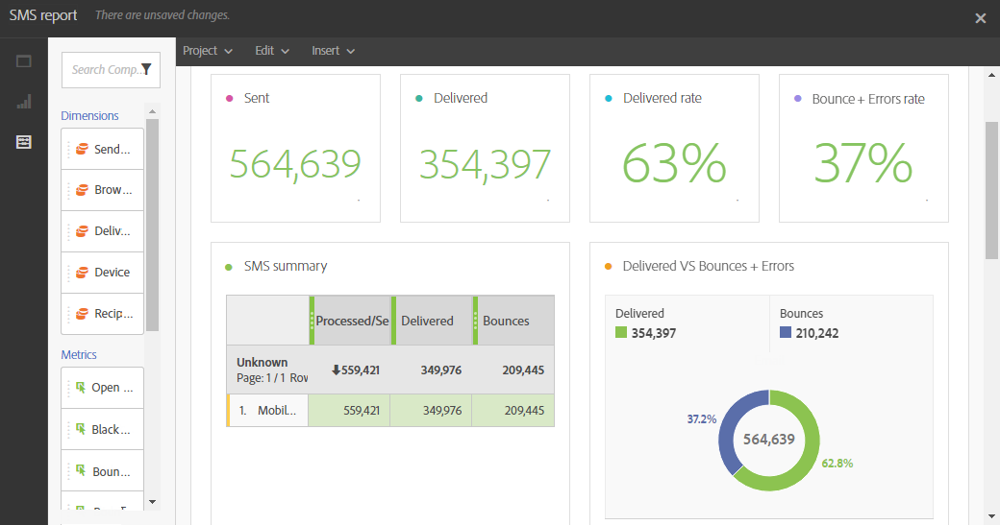

# SMS-rapport{#sms-report}

Rapporten **SMS** innehåller information om SMS-leveranser, till exempel levererade och studsfrekvenser.

Tabellen **SMS-sammanfattning**, diagram och sammanfattningsnummer innehåller tillgängliga data för SMS-leveranser som har skickats.

* **Behandlad/skickad**: Antalet SMS som skickades.
* **Levererat**: Antalet SMS som levererats.
* **studsar + fel**: Antalet meddelanden som inte kunde levereras.
