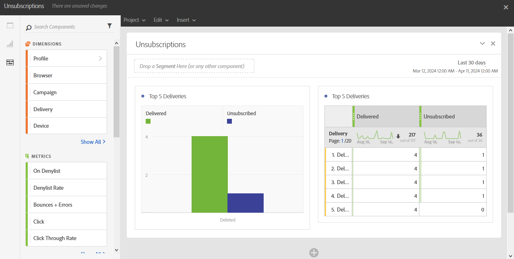

# Avprenumerationer{#unsubscriptions}

Rapporten **[!UICONTROL Unsubscriptions]** identifierar de leveranser som har flest avanmälningar.

Tabellen och diagrammet **[!UICONTROL TOP 5 deliveries]** visar de fem främsta leveranserna med det högsta antalet levererade meddelanden och antalet mottagare som har avbeställt prenumerationen. De data som visas här baseras på antalet klick på meddelandets länk för att avbryta prenumerationen.
