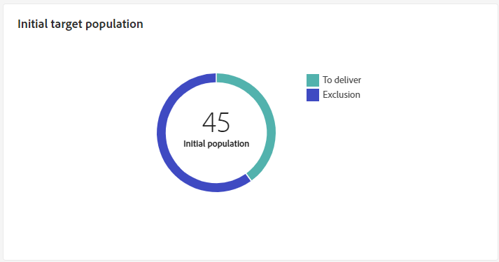
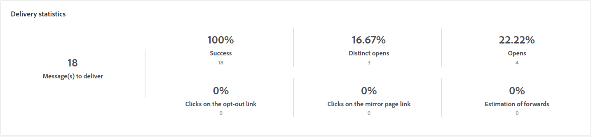
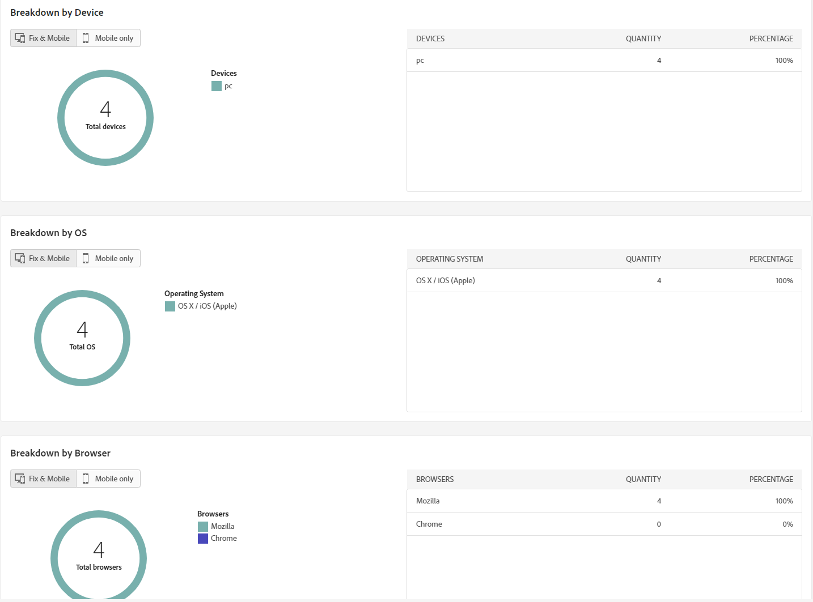

# Rapport om e-postleverans {#email-report}

The **Rapport om e-postleverans** erbjuder omfattande insikter och data som är specifika för e-postkanalen. Den ger detaljerad information om prestanda, effektivitet och resultat för era individuella leveranser och ger er en heltäckande översikt.

## Leveranssammanfattning {#delivery-summary-email}

* **[!UICONTROL Initial target audience statistics]** tabellen visar data som är relativa till dina mottagare:

  {align="left" zoomable="yes"}

  +++Läs mer om mätvärden för e-postleveransrapporter.

   * **[!UICONTROL Initial audience]**: Totalt antal målmottagare.

   * **[!UICONTROL To deliver]**: Totalt antal meddelanden som ska levereras efter leveransanalys.

   * **[!UICONTROL Exclusion]**: Totalt antal meddelanden som utelämnats från det skickade målet.
+++

* **[!UICONTROL Delivery statistics]** tabellen visar hur bra leveransen är.

  {align="left"}

  +++Läs mer om rapportstatistik för e-postkampanjer.

   * **[!UICONTROL Message sent]**: Totalt antal meddelanden som ska levereras efter leveransanalys.

   * **[!UICONTROL Success]**: Antal meddelanden som har bearbetats i relation till antalet meddelanden som ska levereras.

   * **[!UICONTROL Errors]**: Totalt antal fel som har ackumulerats under leveranser och automatisk återinläsning i relation till antalet meddelanden som ska levereras.

   * **[!UICONTROL New quarantines]**: Totalt antal adresser i karantän efter misslyckad leverans (okänd användare, ogiltig domän) i relation till antalet meddelanden som ska levereras.

+++

* **[!UICONTROL Causes of exclusion]** Diagram och tabell visar uppdelningen per regel för meddelanden som avvisats under analysen.

  {align="center"}

  +++Läs mer om mätvärden för e-postleveransrapporter.

   * **[!UICONTROL User unknown]**: Feltypen som genererades under leveransen för att ange att e-postadressen är ogiltig.

   * **[!UICONTROL Invalid domain]**: Feltypen som genererades när en leverans skickades för att ange att domänen för e-postadressen är fel eller inte finns.

   * **[!UICONTROL Mailbox full]**: Feltyp som genererats efter fem leveransförsök för att ange att mottagarens inkorg innehåller för många meddelanden.

   * **[!UICONTROL Account disabled]**: Feltyp som genereras när en leverans skickas för att ange att adressen inte längre finns.

   * **[!UICONTROL Refused]**: Feltyp som genereras när en adress nekas av IAP (Internet Access Provider), till exempel efter att en säkerhetsregel (antispam-program) har tillämpats.

   * **[!UICONTROL Unreachable]**: Feltyp som inträffar i meddelandedistributionssträngen: incident på SMTP-reläet, domän som tillfälligt inte kan nås osv.

   * **[!UICONTROL Not connected]**: Feltyp som anger att mottagarens mobiltelefon är avstängd eller frånkopplad från nätverket vid tidpunkten för sändningen.

+++

## Leveranskapacitet {#delivery-throughtput}

Den här rapporten innehåller detaljerad information om hela plattformens leveransflöde inom en angiven tidsram. Det primära måttet som används för att mäta hastigheten för meddelandeleverans är antalet meddelanden som skickas per timme.

## Sändningsstatistik {#broadcast-statistics}

* **[!UICONTROL Broadcast statistics]** tabellen innehåller tillgängliga data för eventuella fel som påträffats i varje domän.

  {align="center"}

  +++Läs mer om mätvärden för e-postleveransrapporter.

   * **[!UICONTROL Processed emails]**: Totalt antal meddelanden som har bearbetats av leveransservern.

   * **[!UICONTROL Delivered]**: Procentandel av antalet meddelanden som har bearbetats jämfört med det totala antalet meddelanden som har bearbetats.

   * **[!UICONTROL Hard bounces]**: Procentandel av antalet&quot;hårda&quot; studsar, permanenta fel, t.ex. fel e-postadress, jämfört med det totala antalet bearbetade meddelanden.

   * **[!UICONTROL Soft bounces]**: Procentandel av antalet&quot;mjuka&quot; studsar, tillfälliga fel som en fullständig inkorg, jämfört med det totala antalet bearbetade meddelanden

   * **[!UICONTROL Opens]**: Procentandel av antalet målmottagare som öppnade ett meddelande minst en gång jämfört med antalet meddelanden som bearbetades.

   * **[!UICONTROL Clicks]**: Procentandel av antalet personer som klickade i en leverans minst en gång jämfört med antalet meddelanden som bearbetades.

   * **[!UICONTROL Unsubscriptions]**: Procentandel av antalet klick på en länk för att avbryta prenumerationen jämfört med antalet meddelanden som har bearbetats.
+++

## Ej levererbara och studsningar {#non-deliverables-email}

* **[!UICONTROL Breakdown of errors per type]** och **[!UICONTROL Breakdown of errors per domain]** tabeller och diagram innehåller tillgängliga data för eventuella fel som påträffas i varje domän.

  Felen som visas i den här rapporten utlöser karantänprocessen. Mer information om karantänhantering finns i [Kampanjdokumentation v8 (konsol)](https://experienceleague.adobe.com/docs/campaign/campaign-v8/campaigns/send/failures/delivery-failures.html){target="_blank"}.

  

  +++Läs mer om mätvärden för e-postleveransrapporter.

   * **[!UICONTROL User unknown]**: Feltypen som genererades under leveransen för att ange att e-postadressen är ogiltig.

   * **[!UICONTROL Invalid domain]**: Feltypen som genererades när en leverans skickades för att ange att domänen för e-postadressen är fel eller inte finns.

   * **[!UICONTROL Mailbox full]**: Feltyp som genererats efter fem leveransförsök för att ange att mottagarens inkorg innehåller för många meddelanden.

   * **[!UICONTROL Account disabled]**: Feltyp som genereras när en leverans skickas för att ange att adressen inte längre finns.

   * **[!UICONTROL Refused]**: Feltyp som genereras när en adress nekas av IAP (Internet Access Provider), till exempel efter att en säkerhetsregel (antispam-program) har tillämpats.

   * **[!UICONTROL Unreachable]**: Feltyp som inträffar i meddelandedistributionssträngen: incident på SMTP-reläet, domän som tillfälligt inte kan nås osv.

   * **[!UICONTROL Not connected]**: Feltyp som anger att mottagarens mobiltelefon är avstängd eller frånkopplad från nätverket vid tidpunkten för sändningen.

+++

## Spårningsindikatorer {#tracking-indicators-email}

* **[!UICONTROL Delivery statistics]** innehåller nyckeltal för nyckeltal (KPI) som ger detaljerad information om data som är tillgängliga för skickade e-postmeddelanden.

  {align="center"}

  +++Läs mer om mätvärden för e-postleveransrapporter.

   * **[!UICONTROL Success]**: Antal meddelanden som har bearbetats i relation till antalet meddelanden som ska levereras.

   * **[!UICONTROL Distinct opens]**: Totalt antal målmottagare som öppnat ett meddelande minst en gång.

   * **[!UICONTROL Opens]**: Antal distinkta målmottagare för den här domänen som har öppnat ett meddelande minst en gång.

   * **[!UICONTROL Clicks on the opt-out link]**: Antal klick på länken för att avbryta prenumerationen.

   * **[!UICONTROL Clicks on the mirror link]**: Antal klick på länken till spegelsidan.

   * **[!UICONTROL Estimation of forwards]**: Uppskattning av antalet e-postmeddelanden som vidarebefordrats av målmottagarna.
+++

* **[!UICONTROL Open and click-through rate]** tabellen visar data som är relativa till mottagarna.

  {align="center"}

  +++Läs mer om mätvärden för e-postleveransrapporter.

   * **[!UICONTROL Sent]**: Totalt antal skickade meddelanden.

   * **[!UICONTROL Complaints]**: Antal meddelanden för den här domänen som har rapporterats som oönskade av mottagaren.

   * **[!UICONTROL Opens]**: Antal distinkta målmottagare för den här domänen som har öppnat ett meddelande minst en gång.

   * **[!UICONTROL Clicks]**: Antal distinkta mottagare som klickat på samma leverans minst en gång.

   * **[!UICONTROL Raw reactivity]**: Procentandel av antalet mottagare som klickade på en leverans minst en gång jämfört med antalet mottagare som öppnade en leverans minst en gång.
+++

## URL:er och klickströmmar {#url-email}

* **[!UICONTROL URLs and click streams]** innehåller nyckeltal (KPI:er) som ger detaljerad information om de URL:er som du klickade mest på under en leverans.

  {align="center"}

  +++Läs mer om mätvärden för e-postleveransrapporter.

   * **[!UICONTROL Reactivity]**: Förhållandet mellan antalet målmottagare som klickat på en leverans, i förhållande till det uppskattade antalet målmottagare som öppnat en leverans.

   * **[!UICONTROL Distinct clicks]**: Totalt antal distinkta mottagare som klickat på en leverans minst en gång.

   * **[!UICONTROL Clicks]**: Totalt antal klick på länkar i leveranser.

   * **[!UICONTROL Platform average]** : Denna genomsnittliga hastighet, som visas för varje frekvens (reaktivitet, distinkta klick och kumulerade klick), beräknas för leveranser som skickats under de senaste sex månaderna. Endast leveranser med samma typologi och i samma kanal beaktas. Korrektur ingår inte.

+++

* **[!UICONTROL Top 10 most visited links]** diagram och tabell innehåller tillgängliga data för mottagarnas beteende per länk.

  {align="center"}

  +++Läs mer om mätvärden för e-postleveransrapporter.

   * **[!UICONTROL Clicks]**: Totalt antal klick på länkar i leveranser.

   * **[!UICONTROL Percentage]**: Procentandel användare som interagerade med leveransen.

+++

* **[!UICONTROL Breakdown of clicks over time]** diagrammet innehåller tillgängliga data för mottagarnas beteende per länk.

  {align="center"}

## Användaraktiviteter {#user-activities-email}

* **[!UICONTROL User activities]** visar hur öppningar och klickningar delas upp i ett diagram. Du kan välja tidsperioden för måldata: sista dagen eller timmen eller 30 minuter.

  {align="center"}

  +++Läs mer om mätvärden för e-postleveransrapporter.

   * **[!UICONTROL Clicks]**: Totalt antal klick på länkar i leveranser.

   * **[!UICONTROL Opens]**: Antal distinkta målmottagare för den här domänen som har öppnat ett meddelande minst en gång.

+++

## Spårningsstatistik {#tracking-statistics}

* **[!UICONTROL Tracking Statistics]** diagram visar statistik om öppningar och klickningar. Du kan välja en specifik tidsram för måldata.

  {align="center"}

  +++Läs mer om mätvärden för e-postleveransrapporter.

   * **[!UICONTROL Clicks]**: Totalt antal klick på länkar i leveranser.

   * **[!UICONTROL Opens]**: Antal distinkta målmottagare för den här domänen som har öppnat ett meddelande minst en gång.

+++

## Indelning av öppningar {#breakdown-opens}

Denna rapport visar hur öppningarna fördelats efter operativsystem, enhet och webbläsare under den aktuella perioden. För varje kategori används två diagram. Den första visar statistik om öppningar på datorer och mobila enheter. Den andra visar statistik som endast gäller öppningar på mobila enheter.
Du kan växla mellan **[!UICONTROL Fix & mobile]** att enbart rikta sig till **[!UICONTROL Mobile only]** för mer exakt målinriktning.

{align="center"}

## Klickningar {#hotclicks}

Den här rapporten visar meddelandeinnehållet (HTML och/eller text) med procentandelen klickningar på länkar för varje länk. Personalisering blockerar prenumerationslänkar, länkar till spegelsidor och erbjudandelänkar som tas med i beräkningen i det totala antalet klickningar, men visas inte i rapporten.

