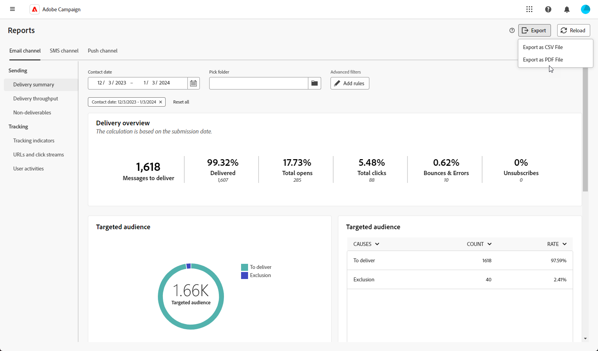

# Exportera rapporter {#export-reports}

>[!CONTEXTUALHELP]
>id="acw_reporting_email_exportation"
>title="Exportera rapporter"
>abstract="Klicka på **Exportera** om du vill exportera dessa mätvärden till PDF eller CSV-format, vilket gör att du kan dela eller skriva ut dem."

Du kan enkelt exportera dina olika rapporter till PDF eller CSV-format så att du kan dela, ändra och skriva ut dem.

1. Klicka på **[!UICONTROL Export]** och markera **[!UICONTROL Export as PDF file]** eller **[!UICONTROL Export as CSV file]**.

   

1. Leta reda på mappen där du vill spara filen, byt namn på den om det behövs och klicka på **[!UICONTROL Save]**.

Din rapport är nu tillgänglig för visning eller delning i en PDF- eller CSV-fil.

