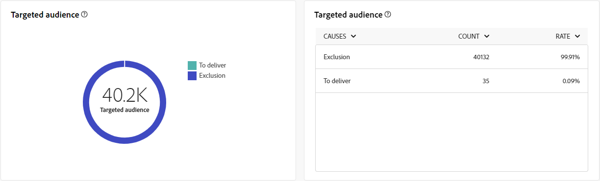

# Globala rapporter för direktreklamkanalen {#global-report-direct}

De globala rapporterna för direktreklam ger användarna en heltäckande översikt över trafik- och engagemangsmått på kanalnivå.

Navigera till **[!UICONTROL Reports]** menyn i **[!UICONTROL Reporting]** -avsnitt. Du kan filtrera dina data beroende på rapportdatumet, mappen eller reglerna. [Läs mer](global-reports.md)

## Leveranssammanfattning {#delivery-summary-direct}

### Leveransöversikt {#delivery-overview-direct}

>[!CONTEXTUALHELP]
>id="acw_global_reporting_delivery_overview_direct_mail"
>title="Leveransöversikt"
>abstract="The **Leveransöversikt** presenterar nyckeltal (KPI:er) som ger djupgående insikter i hur besökarna interagerar med varje direktutskick. Mätvärdena beskrivs nedan."

The **[!UICONTROL Delivery Overview]** presenterar nyckeltal (KPI:er) som ger djupgående insikter i hur besökarna interagerar med varje direktutskick. Mätvärdena beskrivs nedan.

{zoomable=&quot;yes&quot;}{align="center"}

+++Läs mer om leveransöversiktssiffror.

* **[!UICONTROL Messages to deliver]**: Totalt antal meddelanden som bearbetats under leveransförberedelsen.

* **[!UICONTROL Delivered]**: Antal meddelanden som har skickats, i relation till det totala antalet skickade meddelanden.

* **[!UICONTROL Errors]**: Totalt antal fel som har ackumulerats under leverans och automatisk returbehandling i relation till totalt antal skickade meddelanden.

* **[!UICONTROL Unsubscribes]**: Antal mottagare som klickat på Avbeställ.
+++

### Målgrupp {#delivery-summary-direct-initial-target}

>[!CONTEXTUALHELP]
>id="acw_global_reporting_target_audience_direct_mail_graph"
>title="Målgrupp"
>abstract="Mottagardata och meddelandeinformation visas i **Målgrupp** diagram som avspeglar leveransanalysen."

>[!CONTEXTUALHELP]
>id="acw_global_reporting_target_audience_direct_mail_table"
>title="Målgrupp"
>abstract="The **Målgrupp** tabellen innehåller en detaljerad beskrivning av dina mottagare och motsvarande meddelanden, baserat på resultatet av leveransförberedelseprocessen."

Tabell och diagram för **[!UICONTROL Targeted Audience]** visa data om era mottagare, med detaljerade mått som anges nedan.

{zoomable=&quot;yes&quot;}{align="center"}

+++Läs mer om målgruppsstatistik.

* **[!UICONTROL Targeted audience]**: Totalt antal målmottagare.

* **[!UICONTROL Message to deliver]**: Totalt antal meddelanden som ska levereras efter leveransförberedelse.

* **[!UICONTROL Exclusion]**: Totalt antal adresser som ignoreras under analysen när regler tillämpas: adress som saknas, är i karantän, på blockeringslista osv.

+++

### Leveransstatistik {#delivery-summary-direct-exec-stats}

>[!CONTEXTUALHELP]
>id="acw_global_reporting_delivery_statistics_summary_direct_mail_graph"
>title="Leveransstatistik"
>abstract="The **Leveransstatistik** diagram ger insikt i hur effektiva era direktutskick är, inklusive slutförda leveranser och eventuella fel som uppstått."

>[!CONTEXTUALHELP]
>id="acw_global_reporting_delivery_statistics_summary_direct_mail_table"
>title="Leveransstatistik"
>abstract="The **Leveransstatistik** tabellen innehåller information om hur din direktutskick lyckades och om fel som uppstått."

The **[!UICONTROL Delivery statistics]** diagram och tabeller ger en beskrivning av hur väl varje direktmejlleverans lyckats, med detaljerade mätvärden som anges nedan.

+++Läs mer om leveransstatistik.

* **[!UICONTROL Message to deliver]**: Totalt antal meddelanden som ska levereras efter leveransförberedelse.

* **[!UICONTROL Success]**: Antal meddelanden som har bearbetats i relation till antalet meddelanden som ska levereras.

* **[!UICONTROL Errors / Bounces]**: Totalt antal fel som har ackumulerats under leveranser och automatisk återinläsning i relation till antalet meddelanden som ska levereras.

* **[!UICONTROL New quarantines]**: Totalt antal adresser i karantän efter misslyckad leverans (okänd användare, ogiltig domän) i relation till antalet meddelanden som ska levereras.

+++

### Orsaker till uteslutning {#causes-exclusion}

>[!CONTEXTUALHELP]
>id="acw_global_reporting_exclusions_direct_mail_table"
>title="Undantag"
>abstract="The **Orsaker till uteslutning** tabellen visar en detaljerad beskrivning, per regel, av meddelanden som avvisats under leveransförberedelseprocessen."

>[!CONTEXTUALHELP]
>id="acw_global_reporting_causes_exclusion_direct_mail_graph"
>title="Orsaker till uteslutning"
>abstract="The **Orsaker till uteslutning** graf visar distributionen av avvisade meddelanden under färdigställandet av leveransen, indelat i kategorier."

{zoomable=&quot;yes&quot;}{align="center"}

Diagrammet och tabellen Uteslutningar visar orsakerna till att användarprofiler, som inte ingår i målprofilerna, inte kunde ta emot meddelandet.

+++Läs mer om orsaker till uteslutning.

* **[!UICONTROL Address in quarantine]**: Feltyp som genereras när adressen placeras i karantän.

* **[!UICONTROL Address not specified]**: Feltyp som genereras när en leverans skickas för att ange att adressen inte finns.

* **[!UICONTROL Bad quality address]**: Feltyp som genereras när kvalitetsklassen för postadresser är för låg.

* **[!UICONTROL Denylisted address]**: Feltyp som genererades när mottagaren blocklist när leveransen utfördes.

* **[!UICONTROL Double]**: Feltyp som genererades när mottagaren exkluderades eftersom dess nyckelvärden inte var unika.

* **[!UICONTROL Control group]**: Mottagarens adress ingår i kontrollgruppen.

* **[!UICONTROL Target limited in size]**: Den maximala leveransstorleken har uppnåtts för mottagaren.

+++
