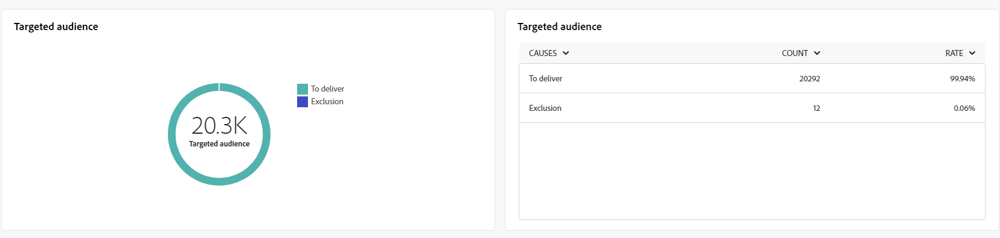

# Globala rapporter för e-postkanalen {#global-report-direct}

De globala rapporterna ger användarna en heltäckande översikt över trafik- och engagemangsmätningar på kanalnivå.

Navigera till menyn **[!UICONTROL Reports]** i avsnittet **[!UICONTROL Reporting]**. Du kan filtrera dina data beroende på rapportens datum, mapp eller regler. [Läs mer](global-reports.md)

## Leveranssammanfattning {#delivery-summary-email}

### Leveransöversikt {#delivery-overview-email}

>[!CONTEXTUALHELP]
>id="acw_global_reporting_deliveries_overview_email"
>title="Leveransöversikt"
>abstract="I **leveransöversikten** presenteras nyckeltal (KPI:er) som ger djupgående insikter om hur er målgrupp interagerar med de e-postleveranser och -kampanjer ni skickar."

**[!UICONTROL Delivery Overview]** presenterar nyckeltal (KPI:er) som ger djupgående insikter i besökarnas interaktion med varje e-postleverans. Mätvärdena beskrivs nedan.

{zoomable="yes"}{align="center"}

+++Läs mer om leveransöversiktssiffror.

* **[!UICONTROL Messages to deliver]**: Totalt antal meddelanden som bearbetats under leveransförberedelsen.

* **[!UICONTROL Delivered]**: Antal meddelanden som har skickats, i relation till det totala antalet skickade meddelanden.

* **[!UICONTROL Total opens]**: Totalt antal målmottagare som öppnat ett meddelande minst en gång.

* **[!UICONTROL Total clicks]**: Totalt antal mottagare som klickat i en leverans minst en gång.

* **[!UICONTROL Bounces & errors]**: Totalt antal fel som ackumulerats under leveransen och automatisk returbearbetning i relation till totalt antal skickade meddelanden.

* **[!UICONTROL Unsubscribes]**: Antal mottagare som klickat på att avbryta prenumerationer.
+++

### Målgrupp {#delivery-summary-email-initial-target}

>[!CONTEXTUALHELP]
>id="acw_global_reporting_target_audience_email"
>title="Inledande målgruppsstatistik"
>abstract="Tabellen och diagrammet **Målgrupp** innehåller insikter om mottagarnas engagemang, vilket hjälper dig att utvärdera hur effektiva era kampanjer och leveranser är."

Tabellen och diagrammet för **[!UICONTROL Targeted Audience]** visar data relaterade till dina mottagare, med detaljerade mått angivna nedan.

{zoomable="yes"}{align="center"}

+++Läs mer om målgruppsstatistik.

* **[!UICONTROL Targeted audience]**: Totalt antal målmottagare.

* **[!UICONTROL Message to deliver]**: Totalt antal meddelanden som ska levereras efter leveransförberedelse.

* **[!UICONTROL Exclusion]**: Totalt antal adresser som ignoreras under analysen när regler tillämpas, t.ex. adress som saknas, är i karantän eller på blockeringslista.

+++

### Leveransstatistik {#delivery-summary-email-delivery-stats}

>[!CONTEXTUALHELP]
>id="acw_global_reporting_email_delivery_stats"
>title="Leveransstatistik"
>abstract="Diagrammet **Leveransstatistik** och tabellen innehåller nyckeltal, inklusive slutförda leveranser, fel och nya karantän, som ger en kortfattad översikt för att utvärdera leveransresultatet."

Tabellen **[!UICONTROL Delivery statistics]** innehåller en beskrivning av framgången för varje e-postleverans, med detaljerade mått som beskrivs nedan.

{zoomable="yes"}{align="center"}

+++Läs mer om statistik för leveransstatistik.

* **[!UICONTROL Message to deliver]**: Totalt antal meddelanden som ska levereras efter leveransförberedelse.

* **[!UICONTROL Success]**: Antal meddelanden som har bearbetats i relation till antalet meddelanden som ska levereras.

* **[!UICONTROL Errors / Bounces]**: Totalt antal fel som ackumulerats under leveranser och automatisk ombunden bearbetning i relation till antalet meddelanden som ska levereras.

* **[!UICONTROL New quarantines]**: Totalt antal adresser i karantän efter en misslyckad leverans (okänd användare, ogiltig domän) i relation till antalet meddelanden som ska levereras.

+++

### Orsaker till uteslutning {#causes-exclusion}

>[!CONTEXTUALHELP]
>id="acw_global_reporting_exclusion_email"
>title="Orsaker till uteslutning"
>abstract="Diagrammet och tabellen **Orsaker till uteslutning** visar de specifika orsakerna till att meddelanden nekas under förberedelsen av leveransen, vilket ger en detaljerad beskrivning per regel."

{zoomable="yes"}{align="center"}

Exkluderingsdiagrammet och tabellen visar orsakerna till att användarprofiler, som inte ingår i målprofilerna, inte kunde ta emot meddelandet.

E-postfeltyperna listas i [Adobe Campaign v8-dokumentationen (klientkonsolen)](https://experienceleague.adobe.com/docs/campaign/campaign-v8/send/failures/delivery-failures.html?lang=sv-SE#email-error-types){target="_blank"}.

## Leveranskapacitet {#delivery-throughput}

>[!CONTEXTUALHELP]
>id="acw_global_reporting_throughput_email"
>title="Leveranskapacitet"
>abstract="Detta **leveransflöde** ger omfattande insikter om leveransflöde, vilket framhäver framgångs- och felfrekvenser inom en angiven tidsram."

{zoomable="yes"}{align="center"}

Rapporten Leveransflöde ger djupgående insikter om hur effektiv leveransprocessen är och ger en detaljerad översikt över lyckade resultat och felprocent inom en viss tidsram.

+++Läs mer om leveransdataflödesstatistik.

* **[!UICONTROL Success]**: Antal meddelanden som har bearbetats i relation till antalet meddelanden som ska levereras.

* **[!UICONTROL Errors]**: Totalt antal fel som ackumulerats under leveranser och automatisk ombunden bearbetning i relation till antalet meddelanden som ska levereras.

+++

## Ej levererbara {#non-deliverables-email}

### Uppdelning av fel per typ {#delivery-summary-email-breakdown-per-type}

>[!CONTEXTUALHELP]
>id="acw_global_reporting_error_type_email"
>title="Uppdelning av fel per typ"
>abstract="Tabellen och diagrammet som beskriver **uppdelningen av fel per typ** innehåller information om olika feltyper som påträffas under processen, bland annat okänd användare, postlåda full, ogiltig domän och andra."

{zoomable="yes"}{align="center"}

Tabellen och diagrammet **[!UICONTROL Breakdown of errors per type]** innehåller data som är relaterade till potentiella fel som uppstått i olika domäner, med specifika mått som anges nedan.

Felen som visas i den här rapporten utlöser karantänprocessen. Mer information om karantänhantering finns i [dokumentationen för Campaign v8 (klientkonsolen)](https://experienceleague.adobe.com/docs/campaign/campaign-v8/campaigns/send/failures/delivery-failures.html?lang=sv-SE){target="_blank"}.

+++Läs mer om indelning av fel per typ.

* **[!UICONTROL User unknown]**: Feltypen som genererades under leveransen indikerar att e-postadressen är ogiltig.

* **[!UICONTROL Invalid domain]**: Feltypen som genererades när en leverans skickades för att ange att domänen för e-postadressen är fel eller inte finns.

* **[!UICONTROL Mailbox full]**: Feltypen som genererades efter fem leveransförsök för att ange att mottagarens inkorg innehåller för många meddelanden.

* **[!UICONTROL Account disabled]**: Feltypen som genererades när en leverans skickades för att ange att adressen inte längre finns.

* **[!UICONTROL Refused]**: Feltypen som genereras när en adress nekas av Internet Access-providern, till exempel efter att en säkerhetsregel (antispam-programvara) har använts.

* **[!UICONTROL Unreachable]**: Feltyp som inträffar i meddelandedistributionssträngen, t.ex. en incident i SMTP-reläet eller domänen, är tillfälligt oåtkomlig.

* **[!UICONTROL Not connected]**: Feltyp som indikerar att mottagarens mobiltelefon är avstängd eller frånkopplad från nätverket när den skickas.

+++

### Uppdelning av fel per domän {#delivery-summary-email-breakdown-per-domain}

>[!CONTEXTUALHELP]
>id="acw_global_reporting_error_domain_email"
>title="Uppdelning av fel per domän"
>abstract="Tabellen och diagrammet som illustrerar **uppdelningen av fel per domän** visar data för varje feltyp som påträffas, kategoriserade efter specifika domäner."

{zoomable="yes"}{align="center"}

Tabellen och diagrammet **[!UICONTROL Breakdown of errors per domain]** visar data som är relaterade till potentiella fel inom varje domän. Mätvärdena är gemensamma för tabellen **[!UICONTROL Breakdown of errors per type]** och diagrammet som anges ovan.

## Spårningsindikatorer {#tracking-indicators-email}

### Leveransstatistik {#delivery-summary-email-statistics}

>[!CONTEXTUALHELP]
>id="acw_global_delivery_statistics_summary_email"
>title="Leveransstatistik"
>abstract="KPI:erna (Key Performance Indicators) för **leveransstatistik** ger en omfattande översikt över dina leveranser och kampanjprestanda, med information om både lyckade leveranser, påträffade fel och användarengagemang."

Måtten **[!UICONTROL Delivery statistics]** innehåller nyckeltal för prestanda (KPI:er) som ger detaljerad information om data som är associerade med varje e-postleverans. Mer information om dessa mått finns nedan.

{zoomable="yes"}{align="center"}

+++Läs mer om statistik för leveransstatistik.

* **[!UICONTROL Messages to deliver]**: Totalt antal meddelanden som bearbetats under leveransförberedelsen.

* **[!UICONTROL Success]**: Antal meddelanden som har bearbetats i relation till antalet meddelanden som ska levereras.

* **[!UICONTROL Unique opens]**: Totalt antal målmottagare som öppnat ett meddelande minst en gång.

* **[!UICONTROL Total Opens]**: Antal distinkta målmottagare för den här domänen som har öppnat ett meddelande minst en gång.

* **[!UICONTROL Clicks on the opt-out link]**: Antal klick på länken för att avbryta prenumerationen.

* **[!UICONTROL Clicks on the mirror link]**: Antal klick på länken till spegelsidan.

* **[!UICONTROL Estimation of forwards]**: Uppskattning av antalet e-postmeddelanden som vidarebefordrats av målmottagarna.
+++

### Öppnings- och klickfrekvens {#delivery-summary-open-rate}

>[!CONTEXTUALHELP]
>id="acw_global_reporting_open_clickthrough_email"
>title="Öppnings- och klickfrekvens"
>abstract="Tabellen för **öppnings- och klickfrekvenser** visar mottagarnas engagemang med din leverans, visar data om öppningsfrekvenser och klickfrekvens för en snabb och insiktsfull översikt."

Tabellen **[!UICONTROL Open and click-through rate]** visar data i förhållande till dina mottagare. Mätvärdena anges nedan.

{zoomable="yes"}{align="center"}

+++Läs mer om inledande och klickfrekvens.

* **[!UICONTROL Sent]**: Totalt antal skickade meddelanden.

* **[!UICONTROL Complaints]**: Antal och procentandel meddelanden för den här domänen som har rapporterats som oönskade av mottagaren.

* **[!UICONTROL Unique Opens]**: Antal och procentandel distinkta mottagare för den här domänen som har öppnat ett meddelande minst en gång.

* **[!UICONTROL Unique Clicks]**: Antal och procentandel distinkta målmottagare som klickade i samma leverans minst en gång.

* **[!UICONTROL Raw reactivity]**: Procentandel av antalet mottagare som klickade i en leverans minst en gång jämfört med antalet mottagare som öppnade en leverans minst en gång.
+++

## URL:er och klickströmmar {#url-email}

### URL:er och klicka på strömmar KPI:er {#url-email-kpis}

>[!CONTEXTUALHELP]
>id="acw_global_reporting_urls_clickstreams_email"
>title="URL:er och klickströmmar"
>abstract="**URL:erna och klickrapporten innehåller viktiga KPI:er (Key Performance Indicators) som ger detaljerad information om de mest klickade URL:erna under en leverans.**"

Rapporten **[!UICONTROL URLs and click streams]** innehåller nyckeltal (KPI:er) som ger detaljerade insikter om de URL:er som fick det högsta antalet klick under en leverans. Mätvärdena anges nedan.

{zoomable="yes"}{align="center"}

+++Läs mer om URL:er och klicka på strömningsstatistik.

* **[!UICONTROL Reactivity]**: Förhållandet mellan antalet målmottagare som har klickat i en leverans och det beräknade antalet målmottagare som har öppnat en leverans.

* **[!UICONTROL Unique clicks]**: Totalt antal distinkta mottagare som klickat på en leverans minst en gång.

* **[!UICONTROL Total Clicks]**: Totalt antal klick på länkar i leveranser.

* **[!UICONTROL Platform average]**: Den här genomsnittliga hastigheten, som visas under varje frekvens (reaktivitet, distinkta klick och kumulativa klick), beräknas för leveranser som skickats under de senaste sex månaderna. Endast leveranser med samma typologi och i samma kanal beaktas. Korrektur ingår inte.
+++

### De tio mest besökta länkarna {#top10-global-report-email}

>[!CONTEXTUALHELP]
>id="acw_global_reporting_top10_email"
>title="De tio mest besökta länkarna"
>abstract="Diagrammet och tabellen **Top 10 most visit links** visar omfattande data om mottagarnas interaktion med varje länk."

Diagrammet och tabellen **[!UICONTROL Top 10 most visited links]** innehåller tillgängliga data för mottagarnas beteende per länk. Mätvärdena anges nedan.

{zoomable="yes"}{align="center"}

+++Läs mer om de tio mest besökta länkarna.

* **[!UICONTROL Total Clicks]**: Totalt antal klick på länkar i leveranser.

* **[!UICONTROL Percentage]**: Procentandel användare som interagerade med leveransen.

+++

### Klicknedbrytning över tid {#global-report-email-breakdown-clicks}

>[!CONTEXTUALHELP]
>id="acw_global_reporting_urls_click_breakdown_email"
>title="Klicknedbrytning över tid"
>abstract="Diagrammet **Klicknedbrytning över tid** ger en heltäckande bild av hur mottagarna interagerar med länkar under den angivna tidsramen."

Diagrammet **[!UICONTROL Breakdown of clicks over time]** innehåller tillgängliga data för mottagarnas beteende per länk.

{zoomable="yes"}{align="center"}

## Användaraktiviteter {#user-activities-email}

>[!CONTEXTUALHELP]
>id="acw_global_reporting_user_activities_email"
>title="Användaraktiviteter"
>abstract="Den grafiska representationen av **användaraktiviteter** ger en detaljerad beskrivning av mottagarinteraktioner, öppningar för porträttning och klickningar i ett informativt diagramformat."

Rapporten **[!UICONTROL User activities]** visar uppdelningen av öppningar och klick i form av ett diagram. Mätvärden för den här rapporten finns nedan.

{zoomable="yes"}{align="center"}

+++Läs mer om mått för användaraktiviteter.

* **[!UICONTROL Total Clicks]**: Totalt antal klick på länkar i leveranser.

* **[!UICONTROL Total Opens]**: Totalt antal distinkta mottagare för den här domänen som har öppnat ett meddelande minst en gång.

+++
