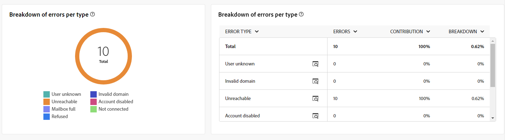
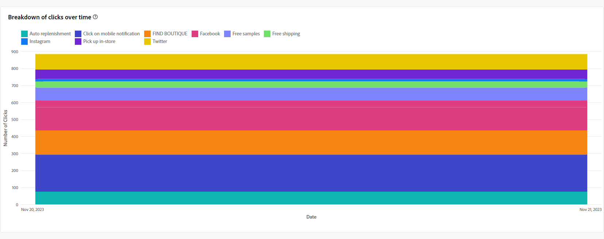
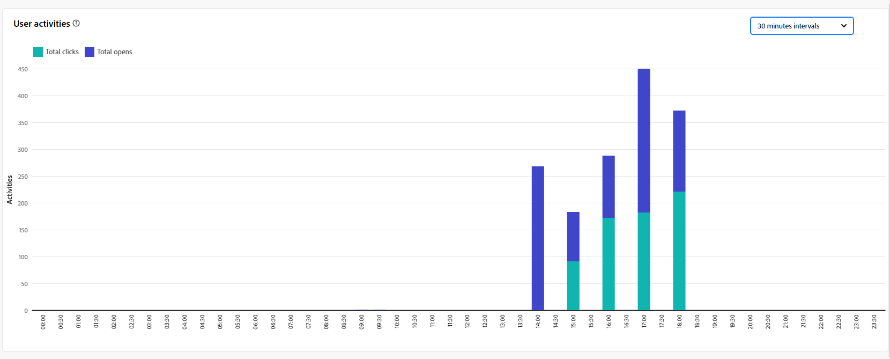

# Globala rapporter för e-postkanalen {#global-report-direct}

De globala rapporterna ger användarna en heltäckande översikt över trafik- och engagemangsmätningar på kanalnivå.

Navigera till **[!UICONTROL Reports]** menyn i **[!UICONTROL Reporting]** -avsnitt. Du kan filtrera dina data beroende på rapportdatumet, mappen eller reglerna. [Läs mer](global-reports.md)

## Leveranssammanfattning {#delivery-summary-email}

### Leveransöversikt {#delivery-overview-email}

The **[!UICONTROL Delivery Overview]** presenterar nyckeltal (KPI:er) som ger djupgående insikter om hur besökarna interagerar med varje e-postleverans. Mätvärdena beskrivs nedan.

{align="center"}

+++Läs mer om leveransöversiktssiffror.

* **[!UICONTROL Messages to deliver]**: Totalt antal meddelanden som bearbetats under leveransförberedelsen.

* **[!UICONTROL Delivered]**: Antal meddelanden som har skickats, i relation till det totala antalet skickade meddelanden.

* **[!UICONTROL Total opens]**: Totalt antal målmottagare som öppnat ett meddelande minst en gång.

* **[!UICONTROL Total clicks]**: Totalt antal mottagare som klickat på en leverans minst en gång.

* **[!UICONTROL Bounces & errors]**: Totalt antal fel som har ackumulerats under leverans och automatisk returbehandling i relation till totalt antal skickade meddelanden.

* **[!UICONTROL Unsubscribes]**: Antal mottagare som klickat på Avbeställ.
+++

### Målgrupp {#delivery-summary-email-initial-target}

Tabell och diagram för **[!UICONTROL Targeted Audience]** visa data om era mottagare, med detaljerade mått som anges nedan.

{align="center"}

+++Läs mer om målgruppsstatistik.

* **[!UICONTROL Targeted audience]**: Totalt antal målmottagare.

* **[!UICONTROL Message to deliver]**: Totalt antal meddelanden som ska levereras efter leveransförberedelse.

* **[!UICONTROL Exclusion]**: Totalt antal adresser som ignoreras under analysen när regler tillämpas: adress som saknas, är i karantän, på blockeringslista osv.

+++

### Leveransstatistik {#delivery-summary-email-exec-stats}

The **[!UICONTROL Delivery statistics]** tabellen innehåller en beskrivning av hur väl varje e-postleverans lyckats, med detaljerade mått som beskrivs nedan.

{align="center"}

+++Läs mer om leveransstatistik.

* **[!UICONTROL Message to deliver]**: Totalt antal meddelanden som ska levereras efter leveransförberedelse.

* **[!UICONTROL Success]**: Antal meddelanden som har bearbetats i relation till antalet meddelanden som ska levereras.

* **[!UICONTROL Errors / Bounces]**: Totalt antal fel som har ackumulerats under leveranser och automatisk återinläsning i relation till antalet meddelanden som ska levereras.

* **[!UICONTROL New quarantines]**: Totalt antal adresser i karantän efter misslyckad leverans (okänd användare, ogiltig domän) i relation till antalet meddelanden som ska levereras.

+++

### Orsaker till uteslutning {#causes-exclusion}

{align="center"}

Diagrammet och tabellen Uteslutningar visar orsakerna till att användarprofiler, som inte ingår i målprofilerna, inte kunde ta emot meddelandet.

E-postfeltyperna listas i [Adobe Campaign v8-dokumentation (klientkonsol)](https://experienceleague.adobe.com/docs/campaign/campaign-v8/send/failures/delivery-failures.html#email-error-types){target="_blank"}.

## Leveranskapacitet {#delivery-throughput}

{align="center"}

Den här rapporten innehåller omfattande information om leveransflödet inom en angiven tidsram.

## Ej levererbara {#non-deliverables-email}

### Uppdelning av fel per typ {#delivery-summary-email-breakdown-per-type}

{align="center"}

The **[!UICONTROL Breakdown of errors per type]** tabellen och diagrammet innehåller data om potentiella fel som uppstått i olika domäner, med specifika mått som anges nedan.

Felen som visas i den här rapporten utlöser karantänprocessen. Mer information om karantänhantering finns i [Kampanjdokumentation v8 (klientkonsol)](https://experienceleague.adobe.com/docs/campaign/campaign-v8/campaigns/send/failures/delivery-failures.html){target="_blank"}.

+++Läs mer om indelning av fel per typmått.

* **[!UICONTROL User unknown]**: Feltyp som genererades under leveransen för att ange att e-postadressen är ogiltig.

* **[!UICONTROL Invalid domain]**: Feltyp som genereras när en leverans skickas för att ange att domänen för e-postadressen är fel eller inte finns.

* **[!UICONTROL Mailbox full]**: Feltyp som genererats efter fem leveransförsök för att ange att mottagarens inkorg innehåller för många meddelanden.

* **[!UICONTROL Account disabled]**: Feltyp som genereras när en leverans skickas för att ange att adressen inte längre finns.

* **[!UICONTROL Refused]**: Feltyp som genereras när en adress nekas av IAP (Internet Access Provider), till exempel efter att en säkerhetsregel (antispam-program) har tillämpats.

* **[!UICONTROL Unreachable]**: Feltyp som inträffar i meddelandedistributionssträngen: incident i SMTP-reläet, domän som inte går att nå temporärt, osv.

* **[!UICONTROL Not connected]**: Feltyp som anger att mottagarens mobiltelefon är avstängd eller frånkopplad från nätverket vid tidpunkten för sändningen.

+++

### Uppdelning av fel per domän {#delivery-summary-email-breakdown-per-domain}

{align="center"}

The **[!UICONTROL Breakdown of errors per domain]** tabellen och diagrammet visar data relaterade till potentiella fel inom varje domän. Mätvärdena är gemensamma med **[!UICONTROL Breakdown of errors per type]** tabellen och diagrammet som anges ovan.

## Spårningsindikatorer {#tracking-indicators-email}

### Leveransstatistik {#delivery-summary-email-statistics}

The **[!UICONTROL Delivery statistics]** Mätvärden innehåller nyckeltal (KPI) som ger detaljerad information om data som är kopplade till varje e-postleverans. Mer information om dessa mått finns nedan.

{align="center"}

+++Läs mer om leveransstatistik.

* **[!UICONTROL Messages to deliver]**: Totalt antal meddelanden som bearbetats under leveransförberedelsen.

* **[!UICONTROL Success]**: Antal meddelanden som har bearbetats i relation till antalet meddelanden som ska levereras.

* **[!UICONTROL Unique opens]**: Totalt antal målmottagare som öppnat ett meddelande minst en gång.

* **[!UICONTROL Total Opens]**: Antal distinkta målmottagare för den här domänen som har öppnat ett meddelande minst en gång.

* **[!UICONTROL Clicks on the opt-out link]**: Antal klick på länken för att avbryta prenumerationen.

* **[!UICONTROL Clicks on the mirror link]**: Antal klick på länken till spegelsidan.

* **[!UICONTROL Estimation of forwards]**: Uppskattning av antalet e-postmeddelanden som vidarebefordras av målmottagarna.
+++

### Öppen och klickbar frekvens {#delivery-summary-open-rate}

The **[!UICONTROL Open and click-trough rate]** tabellen visar data som är relativa till mottagarna. Mätvärdena anges nedan.

{align="center"}

+++Läs mer om Open och click-trough rate metrics.

* **[!UICONTROL Sent]**: Totalt antal skickade meddelanden.

* **[!UICONTROL Complaints]**: Antal och procentandel meddelanden för den här domänen som har rapporterats som oönskade av mottagaren.

* **[!UICONTROL Unique Opens]**: Antal och procentandel distinkta målmottagare för den här domänen som har öppnat ett meddelande minst en gång.

* **[!UICONTROL Unique Clicks]**: Antal och procentandel av distinkta målmottagare som klickade på samma leverans minst en gång.

* **[!UICONTROL Raw reactivity]**: Procentandel av antalet mottagare som klickade på en leverans minst en gång jämfört med antalet mottagare som öppnade en leverans minst en gång.
+++

## URL:er och klickströmmar {#url-email}

### URL:er och klicka på strömmar KPI:er {#url-email-kpis}

The **[!UICONTROL URLs and click streams]** rapporten innehåller nyckeltal (KPI:er) som ger detaljerade insikter om de URL:er som fick det högsta antalet klick under en leverans. Mätvärdena anges nedan.

{align="center"}

+++Läs mer om URL:er och klicka på strömma mätvärden.

* **[!UICONTROL Reactivity]**: Förhållandet mellan antalet målmottagare som klickat i en leverans, i förhållande till det uppskattade antalet målmottagare som öppnat en leverans.

* **[!UICONTROL Unique clicks]**: Totalt antal distinkta mottagare som klickat på en leverans minst en gång.

* **[!UICONTROL Total Clicks]**: Totalt antal klick på länkar i leveranser.

* **[!UICONTROL Platform average]** : Detta medelvärde, som visas för varje frekvens (reaktivitet, distinkta klick och kumulerade klick), beräknas för leveranser som skickats under de senaste sex månaderna. Endast leveranser med samma typologi och i samma kanal beaktas. Korrektur ingår inte.
+++

### De tio mest besökta länkarna {#top10-campaign-report-email}

The **[!UICONTROL Top 10 most visited links]** diagram och tabell innehåller tillgängliga data för mottagarnas beteende per länk. Mätvärdena anges nedan.

{align="center"}

+++Läs mer om de 10 mest besökta länkarna.

* **[!UICONTROL Total Clicks]**: Totalt antal klick på länkar i leveranser.

* **[!UICONTROL Percentage]**: Procentandel användare som interagerade med leveransen.

+++

### Klicknedbrytning över tid {#campaign-report-email-breakdown-clicks}

The **[!UICONTROL Breakdown of clicks over time]** diagrammet innehåller tillgängliga data för mottagarnas beteende per länk.

{align="center"}

## Användaraktiviteter {#user-activities-email}

The **[!UICONTROL User activities]** rapporten visar hur öppningar och klickningar i form av ett diagram är uppdelade. Mätvärden för den här rapporten finns nedan.

{align="center"}

+++Läs mer om mått för användaraktiviteter.

* **[!UICONTROL Total Clicks]**: Totalt antal klick på länkar i leveranser.

* **[!UICONTROL Total Opens]**: Totalt antal distinkta målmottagare för den här domänen som har öppnat ett meddelande minst en gång.

+++
