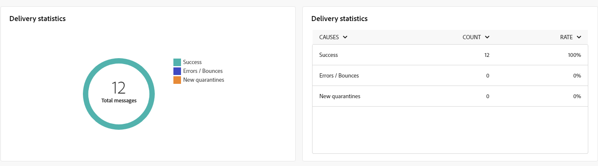

# Globala rapporter för push-kanalen {#campaign-reports-push}

De globala rapporterna ger användarna en heltäckande översikt över trafik- och engagemangsmätningar på kanalnivå.

Navigera till menyn **[!UICONTROL Reports]** i avsnittet **[!UICONTROL Reporting]**. Du kan filtrera dina data beroende på rapportens datum, mapp eller regler. [Läs mer](global-reports.md)

## Leveranssammanfattning {#delivery-summary-push}

### Leveransöversikt {#delivery-overview-push}

>[!CONTEXTUALHELP]
>id="acw_push_global_report_overview"
>title="Översikt över push-leverans"
>abstract="KPI:er för push-leverans **&#x200B;**&#x200B;ger en grundlig granskning av dina push-leveranser och ger detaljerade insikter och specifika data. Den innehåller omfattande information om leveransens prestanda, effektivitet och resultat."

Rapporten **[!UICONTROL Delivery Overview]** innehåller nyckeltal (KPI:er) som ger detaljerad information om hur besökarna interagerar med varje push-meddelandeleverans. Mätvärdena anges nedan.

{zoomable="yes"}

+++Läs mer om leveransöversiktssiffror.

* **[!UICONTROL Messages to deliver]**: Totalt antal meddelanden som bearbetats under leveransförberedelsen.

* **[!UICONTROL Delivered]**: Antal meddelanden som har skickats, i relation till det totala antalet skickade meddelanden.

* **[!UICONTROL Total clicks]**: Totalt antal distinkta mottagare som klickat på en leverans minst en gång.

* **[!UICONTROL Errors]**: Totalt antal fel som ackumulerats under leveransen och automatisk returbearbetning i relation till totalt antal skickade meddelanden.

+++

### Målgrupp {#delivery-summary-push-initial-target}

>[!CONTEXTUALHELP]
>id="acw_global_reporting_push_targeted_audience"
>title="Skjut målpopulationen"
>abstract="Diagrammet och tabellen **Målinriktad population** visar data relaterade till målgruppen för push-meddelanden, med information om meddelanden som ska levereras och undantag."

Tabellen och diagrammet **[!UICONTROL Targeted audience]** innehåller data som är relaterade till dina mottagare för varje skickad push-meddelandeleverans. Mätvärdena anges nedan.

{zoomable="yes"}

+++Läs mer om målgruppsstatistik.

* **[!UICONTROL Targeted audience]**: Totalt antal målmottagare.

* **[!UICONTROL Message to deliver]**: Totalt antal meddelanden som ska levereras efter leveransförberedelse.

* **[!UICONTROL Exclusion]**: Totalt antal adresser som ignoreras under analysen när regler tillämpas: adress saknas, sätts i karantän, på blockeringslista och liknande orsaker.

+++

### Leveransstatistik {#delivery-summary-push-exec-stats}

>[!CONTEXTUALHELP]
>id="acw_global_reporting_push_delivery_stats"
>title="Statistik för push-leverans"
>abstract="Rapporten **Total statistik** innehåller information om skickade push-meddelanden, inklusive antal lyckade händelser, fel och karantän."

Tabellen **[!UICONTROL Delivery statistics]** innehåller information om resultatet av varje push-meddelandeleverans. Mätvärdena anges nedan.

{zoomable="yes"}

+++Läs mer om leveransstatistik.

* **[!UICONTROL Total messages]**: Totalt antal meddelanden som ska levereras efter leveransförberedelse.

* **[!UICONTROL Success]**: Antal meddelanden som har bearbetats i relation till antalet meddelanden som ska levereras.

* **[!UICONTROL Errors / Bounces]**: Totalt antal fel som ackumulerats under leveranser och automatisk ombunden bearbetning i relation till antalet meddelanden som ska levereras.

* **[!UICONTROL New quarantines]**: Totalt antal adresser i karantän efter en misslyckad leverans (ogiltig registrering, avvisning av meddelande, nyttolastfel och liknande orsaker) i relation till antalet meddelanden som ska levereras.

  Feltyper för push-meddelanden visas i [Adobe Campaign v8-dokumentationen (klientkonsolen)](https://experienceleague.adobe.com/docs/campaign/campaign-v8/send/failures/delivery-failures.html#push-error-types){target="_blank"}.

+++

### Orsaker till uteslutning {#causes-exclusion}

>[!CONTEXTUALHELP]
>id="acw_global_reporting_push_exclusion"
>title="Uteslutningsorsaker"
>abstract="Diagrammet och tabellen **Orsaker till undantag** visar de olika anledningarna till att användarprofiler inte kunde ta emot push-meddelanden."

Diagrammet och tabellen **[!UICONTROL Causes of exclusion]** visar orsaker som hindrade användarprofiler, som uteslöts från målprofilerna, från att ta emot meddelandet.

Feltyper för push-meddelanden visas i [Adobe Campaign v8-dokumentationen (klientkonsolen)](https://experienceleague.adobe.com/docs/campaign/campaign-v8/send/failures/delivery-failures.html#push-error-types){target="_blank"}.

## Leveranskapacitet {#delivery-throughput-sms}

>[!CONTEXTUALHELP]
>id="acw_global_reporting_throughput_push"
>title="Rapport om leveransdataflöde"
>abstract="Rapporten **Leveransflöde** innehåller detaljerad information om hela plattformens leveransflöde för push-meddelanden inom en angiven tidsram."

{zoomable="yes"}

Rapporten **[!UICONTROL Delivery Throughput]** innehåller omfattande insikter om hur effektivt leveranssystemet för push-meddelanden är. Den innehåller en detaljerad sammanfattning av lyckade åtgärder och felprocent under en angiven period.