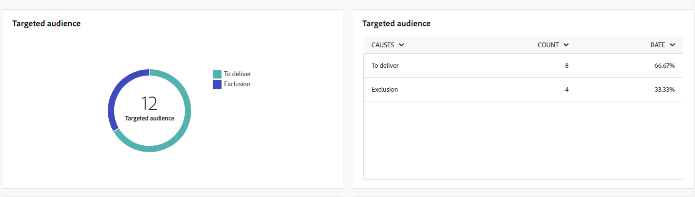

# Globala rapporter för SMS-kanalen {#campaign-reports-sms}

De globala rapporterna ger användarna en heltäckande översikt över trafik- och engagemangsmätningar på kanalnivå.

Navigera till menyn **[!UICONTROL Reports]** i avsnittet **[!UICONTROL Reporting]**. Du kan filtrera dina data beroende på rapportdatumet, mappen eller reglerna. [Läs mer](global-reports.md)

## Leveranssammanfattning {#delivery-summary-sms}

### Leveransöversikt {#delivery-overview-sms}

>[!CONTEXTUALHELP]
>id="acw_sms_global_report_overview"
>title="Översikt över SMS-leverans"
>abstract="KPI:erna för **SMS-leverans** ger en detaljerad sammanfattning av SMS-leveransen med detaljerade insikter och specifika data. Den ger omfattande information om prestanda, effektivitet och resultat av er leverans."

Rapporten **[!UICONTROL Delivery Overview]** innehåller omfattande nyckeltal (KPI) som ger djupgående insikter i besökarnas interaktionsmönster för varje SMS-leverans. Följande mätvärden beskrivs nedan.

{zoomable="yes"}

+++Läs mer om leveransöversiktssiffror.

* **[!UICONTROL Messages to deliver]**: Totalt antal meddelanden som bearbetats under leveransförberedelsen.

* **[!UICONTROL Delivered]**: Procentandel meddelanden som har skickats, i relation till det totala antalet skickade meddelanden.

* **[!UICONTROL Click-through rate]**: Procentandel distinkta mottagare som klickade i en leverans minst en gång.

* **[!UICONTROL Errors]**: Procentandel fel som kumulerats under leverans och automatisk returbearbetning i förhållande till det totala antalet skickade meddelanden.

+++

### Målgrupp {#delivery-summary-sms-initial-target}

>[!CONTEXTUALHELP]
>id="acw_global_reporting_sms_targeted_audience"
>title="Målgrupp för SMS"
>abstract="Diagrammet och tabellen för **Målobulationen** innehåller data som är relaterade till din SMS-målgrupp, inklusive information om meddelanden som ska levereras och undantag."

Tabellen och diagrammet **[!UICONTROL Targeted audience]** innehåller data som är relaterade till dina mottagare för varje skickad SMS-leverans. Mätvärdena anges nedan.

{zoomable="yes"}

+++Läs mer om målgruppsstatistik.

* **[!UICONTROL Targeted audience]**: Totalt antal målmottagare.

* **[!UICONTROL Message to deliver]**: Totalt antal meddelanden som ska levereras efter leveransförberedelse.

* **[!UICONTROL Exclusion]**: Totalt antal adresser som ignoreras under analysen när regler tillämpas: adress som saknas, är i karantän, på blockeringslista, osv.

+++

### Leveransstatistik {#delivery-summary-sms-exec-stats}

>[!CONTEXTUALHELP]
>id="acw_global_reporting_sms_delivery_stats"
>title="Statistik för SMS-leverans"
>abstract="Rapporten **Leveransstatistik** innehåller omfattande insikter om det skickade SMS:et, med en beskrivning av olika mätvärden, till exempel antal lyckade händelser, fel och målgrupp som placerats i karantän. Denna detaljerade presentation gör det möjligt att grundligt granska det övergripande resultatet av SMS-leveransprocessen."

Tabellen **[!UICONTROL Delivery statistics]** innehåller information om framgången för din SMS-leverans. Mätvärdena anges nedan.

{zoomable="yes"}

+++Läs mer om leveransstatistik.

* **[!UICONTROL Total messages]**: Totalt antal meddelanden som ska levereras efter leveransförberedelse.

* **[!UICONTROL Success]**: Antal meddelanden som har bearbetats i relation till antalet meddelanden som ska levereras.

* **[!UICONTROL Errors / Bounces]**: Totalt antal fel som har ackumulerats under leveranser och automatisk återinläsning i relation till antalet meddelanden som ska levereras.

* **[!UICONTROL New quarantines]**: Totalt antal adresser i karantän efter en misslyckad leverans (okänd användare, ogiltig domän) i relation till antalet meddelanden som ska levereras.

  SMS-feltyper visas i [Adobe Campaign v8-dokumentationen (klientkonsolen)](https://experienceleague.adobe.com/docs/campaign/campaign-v8/send/failures/delivery-failures.html#sms-quarantines){target="_blank"}.

+++

### Orsaker till uteslutning {#causes-exclusion}

>[!CONTEXTUALHELP]
>id="acw_global_reporting_sms_exclusions"
>title="SMS Orsaker till uteslutning"
>abstract="Diagrammet och tabellen **Orsaker till uteslutning** visar de olika anledningarna till att det inte gick att ta emot SMS-meddelanden med användarprofiler."

Diagrammet och tabellen **[!UICONTROL Causes of exclusion]** visar orsaker som hindrade användarprofiler, som exkluderades från målprofilerna, från att ta emot SMS-leveranser.

Feltyperna listas i [Adobe Campaign v8-dokumentationen (klientkonsolen)](https://experienceleague.adobe.com/docs/campaign/campaign-v8/send/failures/delivery-failures.html#email-error-types){target="_blank"}.

{zoomable="yes"}

## Leveranskapacitet {#delivery-throughput-sms}

>[!CONTEXTUALHELP]
>id="acw_global_reporting_throughput_sms"
>title="SMS-leverans"
>abstract="Rapporten **Leveransflöde** ger omfattande insikter om effektiviteten i SMS-meddelandeleveranssystemet och ger en detaljerad översikt över lyckade åtgärder och felfrekvens inom en angiven tidsram."

{zoomable="yes"}

Rapporten **[!UICONTROL Delivery Throughput]** innehåller omfattande insikter om effektiviteten hos SMS-meddelandeleverans, med en detaljerad sammanfattning av lyckade och felfrekvenser under en angiven period.
