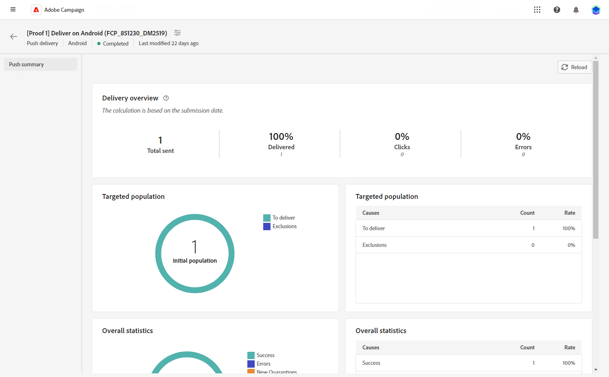

# Rapport om push-leverans {#push-report}

>[!CONTEXTUALHELP]
>id="acw_push_report_overview"
>title="Sammanfattning av push-rapport"
>abstract="Upptäck rapporteringsstatistik för push-leverans."

## Push-sammanfattning {#push-summary}

* **[!UICONTROL Delivery overview]** innehåller nyckeltal (KPI) som ger detaljerad information om hur besökarna interagerar med push-meddelanden. Dessa nyckeltal omfattar:

   * **[!UICONTROL Total sent]**: Totalt antal meddelanden som bearbetats under leveransanalysen.

   * **[!UICONTROL Delivered]**: Antal meddelanden som har skickats, i relation till det totala antalet skickade meddelanden.

   * **[!UICONTROL Clicks]**: Totalt antal mottagare som interagerat med push-meddelandet.

   * **[!UICONTROL Errors]**: Totalt antal fel som uppstod under en leverans och som förhindrar att den skickas till profiler.

* **Målgrupp** diagram- och tabellvisningsdata i relation till målgruppen:

   * **[!UICONTROL To deliver]**: Totalt antal meddelanden som bearbetats under leveransanalysen.

   * **[!UICONTROL Exclusions]**: Antal profiler som har uteslutits från analysen.

* **Övergripande statistik** visar data för skickade push-meddelanden, inklusive:

   * **[!UICONTROL Success]**: Antal meddelanden som har bearbetats.

   * **[!UICONTROL Errors]**: Totalt antal fel som uppstod under leveransen, vilket förhindrar att meddelanden skickas till vissa profiler.

   * **[!UICONTROL New quarantine]**: Antal profiler som har uteslutits och lagts till i karantänen.

* **[!UICONTROL Exclusions]** I diagram och tabeller visas de olika orsaker som gjorde att användarprofiler som inte ingick i målprofilerna inte kunde ta emot meddelandet.