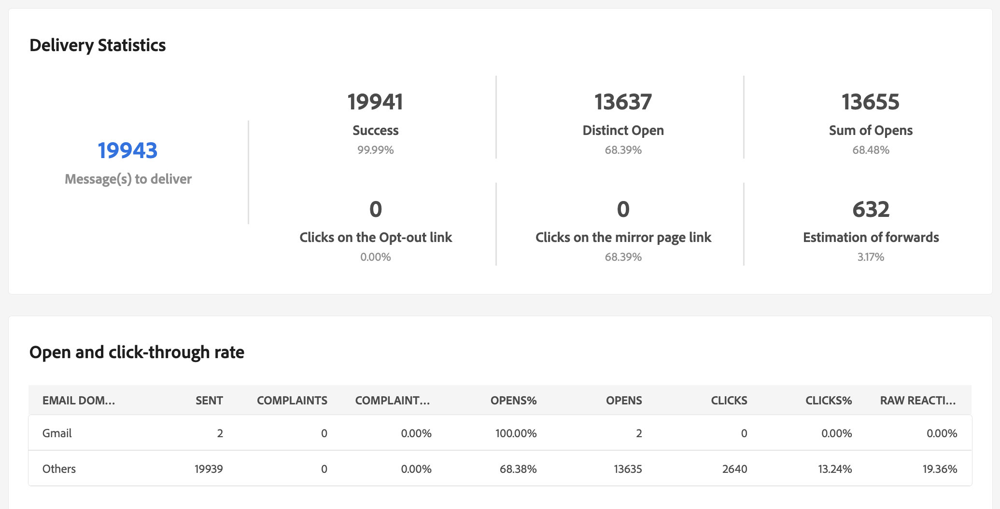

# Leveransrapporter {#reports}

<!--
detail delivery reports and how to access them

same content as in v7 (excepted for the navigation that is similar to AJO
-->

Adobe Campaign erbjuder flera typer av rapporter som är tillgängliga för varje leverans. Med hjälp av de här rapporterna kan du mäta och visualisera effekten och prestandan av dina meddelanden på en inbyggd kontrollpanel.

Så här visar du rapporter:

1. Få tillgång till din e-postleverans och klicka på **Rapport** -knappen.

   

1. Välj en rapport från listan på den vänstra menyn.

   {width="70%" align="left"}

## Skickar

* **Sammanfattning av leverans**: Den här rapporten innehåller all huvudinformation om leveransen. Målgrupp, orsaker till uteslutning, leveransstatistik.

   

* **Leveransflöde**: Den här rapporten innehåller information om leveransflöde för en viss period. För att mäta den hastighet med vilken meddelandena levereras är kriterierna antalet meddelanden som skickas per timme och meddelandets storlek (i bitar per sekund). I exemplet nedan visar det första diagrammet de lyckade leveranserna i blått och antalet felaktiga leveranser i orange.

   

* **Sändningsstatistik**: Den här rapporten visar hur alla meddelanden som bearbetas och skickas har delats upp per Internetdomän, både när det gäller hårda och mjuka studsar, öppningar, klick och prenumerationer.

   

* **Ej levererbara produkter och studsar**: I den här rapporten visas uppdelningen av icke-levererbara produkter samt en uppdelning av studenterna per Internetdomän.

   

## Spåra

* **Spårningsindikatorer**: I den här rapporten kombineras de viktigaste indikatorerna för att spåra mottagarnas beteende när de tar emot leveransen. Den ger tillgång till leverans- och mottagningsstatistik, öppnings- och klickfrekvens, genererade klickströmmar, webbspårning samt delar aktiviteter till sociala nätverk.

   

* **URL:er och klickbara strömmar**: Den här rapporten innehåller en lista över besökta sidor efter en leverans.

   

* **Användaraktiviteter**: Den här rapporten visar hur öppningar och klickningar per halvtimme, timme eller dag delas upp i ett diagram.

   

* **Spårningsstatistik**: Den här rapporten innehåller statistik om öppningar och klick.

   

* **Indelning av öppningar**: Denna rapport visar hur öppningarna fördelats efter operativsystem, enhet och webbläsare under den aktuella perioden. För varje kategori används två diagram. Den första visar statistik om öppningar på datorer och mobila enheter. Den andra visar statistik som endast gäller öppningar på mobila enheter.

   

## Klickningar

Den här rapporten visar meddelandeinnehållet (HTML och/eller text) med procentandelen klickningar på länkar för varje länk. Personalisering blockerar prenumerationslänkar, länkar till spegelsidor och erbjudandelänkar som tas med i beräkningen i det totala antalet klickningar, men visas inte i rapporten.

