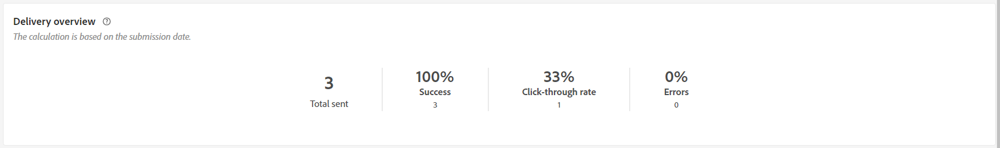
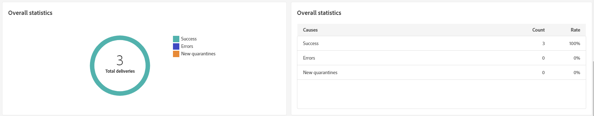

# SMS-leveransrapport {#report}

>[!CONTEXTUALHELP]
>id="acw_sms_report_overview"
>title="Sammanfattning av SMS-rapport"
>abstract="Upptäck rapporteringsstatistik för SMS-leverans."

## Leveranssammanfattning {#delivery-summary}

* **[!UICONTROL Delivery overview]** innehåller nyckeltal för nyckeltal (KPI) som ger detaljerad information om hur besökarna interagerar med dina SMS-meddelanden.

  +++Läs mer om mätvärden för SMS-leveransrapporter.

   * **[!UICONTROL Total sent]**: Totalt antal meddelanden som bearbetats under leveransanalysen.

   * **[!UICONTROL Success]**: Antal meddelanden som har skickats, i relation till det totala antalet skickade meddelanden.

   * **[!UICONTROL Click-through rate]**: Procentandel användare som interagerade med länkar som ingår i SMS-leveransen.

   * **[!UICONTROL Errors]**: Totalt antal fel som uppstod under en leverans och som förhindrar att den skickas till profiler.
+++

  

* **Målgrupp** diagram och tabeller visar data i relation till målgruppen.

  +++Läs mer om mätvärden för SMS-leveransrapporter.

   * **[!UICONTROL To deliver]**: Totalt antal meddelanden som bearbetats under leveransanalysen.

   * **[!UICONTROL Exclusions]**: Antal profiler som har uteslutits från analysen.
+++

  

* **Övergripande statistik** presenterar data för skickade SMS-meddelanden, inklusive:

  +++Läs mer om mätvärden för SMS-leveransrapporter.

   * **[!UICONTROL Success]**: Antal meddelanden som har bearbetats.

   * **[!UICONTROL Errors]**: Totalt antal fel som uppstod under leveransen, vilket förhindrar att meddelanden skickas till vissa profiler.

   * **[!UICONTROL New quarantine]**: Antal profiler som har uteslutits och lagts till i karantänen.
+++

  

* **[!UICONTROL Exclusions]** I diagram och tabeller visas de olika orsaker som gjorde att användarprofiler som inte ingick i målprofilerna inte kunde ta emot meddelandet.

## Leveranskapacitet {#delivery-throughput}

Den här rapporten innehåller detaljerad information om hela plattformens leveransflöde inom en angiven tidsram. Det primära måttet som används för att mäta hastigheten för meddelandeleverans är antalet meddelanden som skickas per timme.

