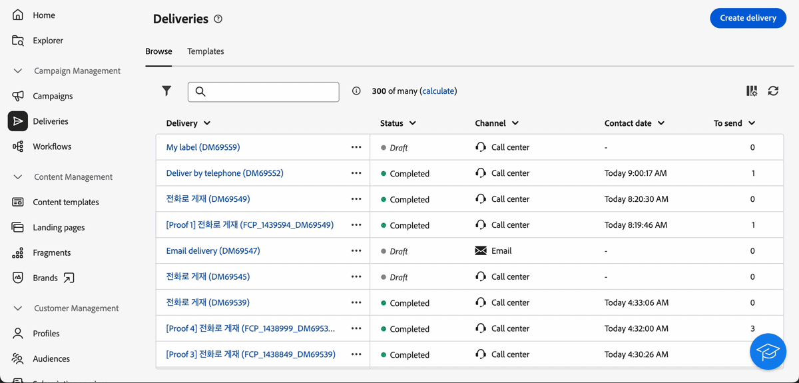

# Versionsinformation 2025 {#2025-release}

På den här sidan visas alla ändringar och förbättringar som är tillgängliga i **2025-utgåvor**. De senaste versionskommentarerna är tillgängliga på [den här sidan](release-notes.md).

## 25 juni {#25-6-release}

### Förbättringar {#25-6-improvements}

* Rapporten Delivery Summary finns nu tillgänglig för både Call Center och Custom channel. [Läs mer](../reporting/direct-mail.md)

* När du konfigurerar en SMS-leverans har du nu tillgång till de specifika SMS-parametrarna. Det här är samma parametrar som finns i klientkonsolen. [Läs mer](../advanced-settings/delivery-settings.md#sms-tab)

* Dina favoritmappar visas nu högst upp i den vänstra panelen på Utforskarsidan, vilket gör dem enklare att komma åt. [Läs mer](../get-started/work-with-folders.md#favorite-folders)

* Regelbyggaren har nu stöd för dra och släpp, vilket gör att du kan ordna om komponenterna i frågan mer effektivt. [Läs mer](../query/build-query.md#drag-and-drop)

* Det&quot;mänskliga villkoret&quot; i regelbyggaren har förbättrats. Det här är den skrivna, oformaterade versionen av reglerna som visas längst ned på skärmen:

   * Attribut markeras nu och det associerade schemat visas.
   * Du kan klicka på de här elementen om du vill visa mer detaljerad information.
   * Nu kan du kopiera det mänskliga villkoret med motsvarande knapp.

* Åtkomsten till mapparna&quot;Tekniska arbetsflöden&quot; och&quot;Objekt skapade automatiskt&quot; är nu begränsad för att förhindra att de visas. [Läs mer](../get-started/work-with-folders.md#about-folders)

## Version 25 maj {#25-5-release}

Följande funktioner är tillgängliga för alla användare från och med majversionen.

<table>
<thead>
<tr>
<th><strong>Poäng för varumärkesjustering (Beta)</strong> </th>
</tr>
</thead>
<tbody>
<tr>
<td>

Poängen för varumärkesjustering ger tydlig feedback direkt i e-postdesignern, som hjälper dig att se om innehållet överensstämmer med varumärkets ton, stil och riktlinjer. Den här funktionen är tillgänglig i Beta.

Mer information finns i den <a href="../content/brands-score.md">detaljerade dokumentationen</a>.

</td>
</tr>
</tbody>
</table>

<table>
<thead>
<tr>
<th><strong>Anpassad kanal för externa leveranser</strong> </th>
</tr>
</thead>
<tbody>
<tr>
<td>

Du kan nu, direkt från Adobe Campaign Web UI, samordna och köra leveranser baserat på anpassade externa kanaler. Dessa leveranser kan vara fristående eller ingå i ett arbetsflöde. Den anpassade externa kanalen som är integrerad med en tredje part skapas i konsolen.

Obs! Rapportering är inte tillgängligt i webbgränssnittet för den anpassade kanalen. Du måste bläddra till klientkonsolen för att komma åt rapporter.

Mer information finns i den <a href="../call-center/gs-custom-channel.md">detaljerade dokumentationen</a>.

</td>
</tr>
</tbody>
</table>

### Förbättringar {#25-5-improvements}

Skärmen för att skapa typologiregler har uppdaterats för att underlätta valet av regeltyp.

## 25 april {#25-4-release}

**Releasedatum**: 29 april 2025

### Nya funktioner {#25-4-features}

Följande funktioner är tillgängliga för alla användare från och med aprilversionen.

<table>
<thead>
<tr>
<th><strong>Kanal för kundtjänst</strong> </th>
</tr>
</thead>
<tbody>
<tr>
<td>

Kundtjänstkanalen är nu tillgänglig i Campaign Web User-gränssnittet. Den här kanalen avser en kommunikationsmetod som används för att hantera och spåra kommunikation eller interaktioner som hanteras via ett callcenter - vanligtvis telefonsamtal som görs av agenter till kunder eller potentiella kunder.

Obs! Rapportering är inte tillgängligt i webbgränssnittet för callcenter-kanalen. Du måste bläddra till klientkonsolen för att komma åt rapporter.

Mer information finns i den <a href="../call-center/gs-call-center.md">detaljerade dokumentationen</a>.

</td>
</tr>
</tbody>
</table>

<table>
<thead>
<tr>
<th><strong>Nytt regelverktyg</strong> </th>
</tr>
</thead>
<tbody>
<tr>
<td>

Det finns nu en ny regelbyggare som hjälper dig att definiera komplexa villkor i ett förbättrat användargränssnitt. Du kan vid behov växla från det gamla till det nya regelverktyget.

Mer information finns i den <a href="../query/query-modeler-overview.md">detaljerade dokumentationen</a>.

</td>
</tr>
</tbody>
</table>

<table>
<thead>
<tr>
<th><strong>Skapa externa konton</strong> </th>
</tr>
</thead>
<tbody>
<tr>
<td>

Som Campaign-administratör kan du nu skapa nya anslutningar med externa system från användargränssnittet i Campaign Web.
Du kan också visa, uppdatera och hantera befintliga externa konton.

Mer information finns i den <a href="../administration/external-account.md">detaljerade dokumentationen</a>.

</td>
</tr>
</tbody>
</table>

### Förbättringar {#25-4-improvements}

**Förbättrat allmänt gränssnitt**

* Fältbeskrivningen, Lägg till i favoriter och Distribution av värdealternativ för schemaattribut är nu mer synlig i användargränssnittet. Mer information finns i den [detaljerade dokumentationen](../get-started/attributes.md).
* I gränssnittet visas nu datum och tid enligt det primära språk som angetts i inställningarna för Experience League. Den här förbättringen är bara tillgänglig för flera språk. En fullständig lista över vilka språk som stöds finns i [den detaljerade dokumentationen](https://experienceleague.adobe.com/sv/docs/core-services/interface/features/browser-language){target=_blank}.

<!--
ko * Built-in options are now only visible in the list of options if the **Show advanced options** toggle is activated.
ko * The typology rules creation screen has been updated to facilitate the selection of the type of rule.
-->

**E-postredigerare**: För att förbättra tillgängligheten i webbgränssnittet för Campaign finns nu två nya fält i e-post-Designer: de motsvarar elementet `title` och språkattributet i elementet `html` i ditt e-postinnehåll. Du kan definiera de här inställningarna förutom fältet Förrubrik i delen Brödtext för e-post. Mer information finns i den [detaljerade dokumentationen](../email/metadata.md).

<!--
**Workflow**: You can now select an existing Javascript code in workflow properties or in a Javascript activity.    
-->

**Scheman**

* Du kan nu redigera det tillfälliga schemat för en lista från webbgränssnittet i Campaign. Mer information finns i den [detaljerade dokumentationen](../audience/manage-audience.md).
* Du kan nu förhandsgranska anpassade fält i ett schema på en exempelskärm. Mer information finns i den [detaljerade dokumentationen](../administration/custom-fields.md#add).
* Nu kan du flytta anpassade fält i listan genom att dra och släppa. Mer information finns i den [detaljerade dokumentationen](../administration/custom-fields.md#add).

### Nya funktioner i begränsad tillgänglighet {#25-4-features-la}

>[!AVAILABILITY]
>
>Följande funktioner är i Begränsad tillgänglighet (LA). De är begränsade till kunder som migrerar **från Adobe Campaign Standard till Adobe Campaign v8** och kan inte distribueras i någon annan miljö. De kräver en uppgradering av Campaign-servern till v8.7.4.
>
>Se följande dokumentationssidor: [Campaign Standard övergång till Campaign v8](../rn/acs-migration.md) och [Funktioner för Campaign Standard-användare](https://experienceleague.adobe.com/docs/experience-cloud/campaign/campaign-standard-migration-home.html?lang=sv-SE).

* **Skapa flerspråkig leverans** - Nu kan du skicka flera e-postleveranser på olika språk i Adobe Campaign webbanvändargränssnitt. Med funktionen för flerspråkig leverans kan du välja standardspråk för leveransen samt de olika språk som leveransen kan skickas till. Du kan även förhandsgranska leveransen på de språk du har valt. Mer information finns i den [detaljerade dokumentationen](../email/edit-content.md).

* **Dynamisk rapportering för flerspråkiga** - Dynamisk rapportering är nu tillgänglig för flerspråkiga e-postleveranser. Mer information finns i den [detaljerade dokumentationen](../reporting/global-reports.md).

* **Stöd för SMS REST API (LA)** - Transactional Messaging REST API är nu tillgängligt för SMS-kanalen. När både e-post och mobilePhone finns i nyttolasten kan du använda fältet&quot;önskekanal&quot; för att ange kanalen. Om det inte anges används e-post som standard, såvida inte önskadChannel uttryckligen begär SMS. Mer information finns i den [detaljerade dokumentationen](https://experienceleague.adobe.com/docs/campaign/campaign-v8/developer/apis/get-started-apis.html){target=_blank}.

## 25 februari {#25-2-release}

**Releasedatum**: 18 feb 2025

Följande funktioner och förbättringar är tillgängliga från och med februari.

### Funktioner {#25-2-features}

<table>
<thead>
<tr>
<th><strong>Skapa affärsregler (typologiregler)</strong> </th>
</tr>
</thead>
<tbody>
<tr>
<td>

Nu kan du skapa typologier och typologiregler i Adobe Campaign webbgränssnitt. Med typologier kan ni styra, filtrera och prioritera utskick av leveranser. Typologier används för att validera att leveranser alltid innehåller obligatoriska komponenter (t.ex. en länk för att avbryta prenumerationen eller en ämnesrad) eller filtreringsregler som utesluter grupper från målgruppen (t.ex. prenumeranter, konkurrenter eller icke-lojalitetskunder).

Mer information finns i den <a href="../administration/typologies.md">detaljerade dokumentationen</a>.

</td>
</tr>
</tbody>
</table>

<table>
<thead>
<tr>
<th><strong>Målmappningar</strong> </th>
</tr>
</thead>
<tbody>
<tr>
<td>

Nu kan du skapa målmappningar i Campaign Web User Interface. Målmappningar definierar hur olika leveranskanaler (e-post, SMS, push-meddelanden) länkar till datafälten i ett schema. Med målmappningen kan du definiera målgruppen: profiler, kontraktsanställda, operatorer, prenumeranter, potentiella kunder osv.

Mer information finns i den <a href="../administration/target-mappings.md">detaljerade dokumentationen</a>.

</td>
</tr>
</tbody>
</table>

<table>
<thead>
<tr>
<th><strong>Schemainformation</strong> </th>
</tr>
</thead>
<tbody>
<tr>
<td>

Nu kan du komma åt information om ett schema genom att markera dess namn i listan. Utgåvan av anpassade fält är nu tillgänglig från knappen <b>Redigera anpassade fält</b> som finns i schemainformationen.

Mer information finns i den <a href="../administration/schemas.md">detaljerade dokumentationen</a>.

</td>
</tr>
</tbody>
</table>

## 25 januari {#25-1-release}

**Releasedatum**: 5 feb 2025

Följande funktioner och förbättringar är tillgängliga från och med januari.

### Funktioner {#25-1-features}

<table>
<thead>
<tr>
<th><strong>Skapa och använda visuella fragment</strong> </th>
</tr>
</thead>
<tbody>
<tr>
<td>

Visuella fragment är fördefinierade visuella block som du kan återanvända i flera e-postleveranser eller i innehållsmallar. Den här funktionen är nu tillgänglig för alla kunder som kör serverbygget 8.6.4 och senare.

Mer information finns i den <a href="../content/use-visual-fragments.md">detaljerade dokumentationen</a>.

</td>
</tr>
</tbody>
</table>

<table>
<thead>
<tr>
<th><strong>Använd ett tredjepartssystem för att skicka leveranser</strong> </th>
</tr>
</thead>
<tbody>
<tr>
<td>

Nu kan du definiera externa leveranser och externa leveransmallar i webbgränssnittet för Campaign. I det här läget kompileras meddelanden till en utdatafil som kan delas med din externa leverantör. Som standard används det externa leveransläget för direktmeddelandekanalen.

Mer information finns i den <a href="../msg/send-external-deliveries.md">detaljerade dokumentationen</a>.

</td>
</tr>
</tbody>
</table>

<table>
<thead>
<tr>
<th><strong>Hantera dina uppräkningar</strong> </th>
</tr>
</thead>
<tbody>
<tr>
<td>

Nu kan du skapa uppräkningar direkt via Adobe Campaign webbanvändargränssnitt. En uppräkning är en lista med värden som föreslås av systemet för att fylla i fält. Använd uppräkningar för att standardisera värdena för dessa fält, hjälp med inmatning av data eller användning inom frågor.

Mer information finns i den <a href="../administration/enumerations.md">detaljerade dokumentationen</a>.

</td>
</tr>
</tbody>
</table>

<table>
<thead>
<tr>
<th><strong>Skapa anpassade alternativ</strong> </th>
</tr>
</thead>
<tbody>
<tr>
<td>

Nu kan du använda de tekniska funktionerna i Adobe Campaign webbgränssnitt och skapa egna anpassade alternativ som passar dina behov. Detta är särskilt användbart när du arbetar med arbetsflödesaktiviteter i JavaScript för att lagra mellanliggande data.

Mer information finns i den <a href="../administration/options.md">detaljerade dokumentationen</a>.

</td>
</tr>
</tbody>
</table>

<table>
<thead>
<tr>
<th><strong>Definiera och anropa Javascript-koder</strong> </th>
</tr>
</thead>
<tbody>
<tr>
<td>

Nu kan du skapa JavaScript-koder i Adobe Campaign webbanvändargränssnitt. På så sätt kan du skapa återanvändbara funktioner som kan användas i olika arbetsflöden, ungefär som i ett bibliotek.

Mer information finns i den <a href="../administration/javascript-codes.md">detaljerade dokumentationen</a>.

</td>
</tr>
</tbody>
</table>

<table>
<thead>
<tr>
<th><strong>Skapa landningssidor med AI Assistant</strong> </th>
</tr>
</thead>
<tbody>
<tr>
<td>

AI Assistant finns nu för leverans av landningssidor, vilket gör att du kan generera text, bilder eller hela sidlayouter.

Mer information om AI Assistant finns i <a href="../email/generative-lp.md">detaljerad dokumentation</a>.

</td>
</tr>
</tbody>
</table>

### Förbättringar {#25-1-improvements}

* Anpassa visningen av anpassade fält i gränssnittet:

   * Nu kan du välja ytterligare anpassade fält som ska visas i gränssnittet
   * Du kan nu ange regler för hur anpassade fält av länktyp ska visas, t.ex. att begränsa listvärden baserat på indata från ett annat fält
   * Nu kan du ordna fälten i gränssnittet på ett flexiblare sätt: fälten kan spänna över en enda kolumn eller grupperas i underavsnitt för bättre sortering
   * Du kan nu ange specifika fält som skrivskyddade

* Senaste filter och favoritfilter: Om du snabbt vill återanvända attribut som används ofta kan du nu lägga till dem i favoriter. Detta gör att de är lättillgängliga för framtida uppgifter. Förutom favoriter kan du även visa och använda de senast markerade attributen.

* Externa konton: Den nya typen **[!UICONTROL Routing]** är tillgänglig för val när du skapar ett nytt externt konto. Med det kan du konfigurera ett specifikt externt konto för användning i externa leveranser. [Läs mer](../administration/external-account.md#routing)
