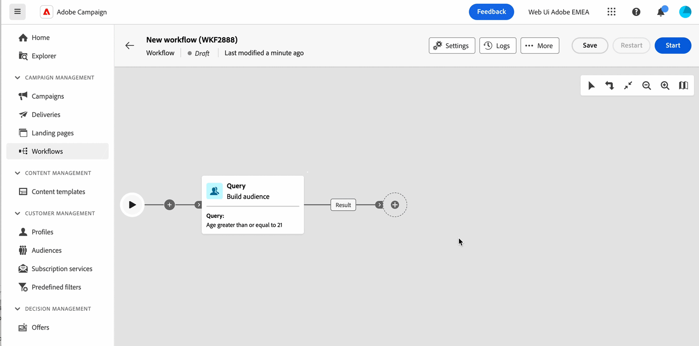

# Versionsinformation {#latest-release}

>[!CONTEXTUALHELP]
>id="acw_homepage_learning_card2"
>title="Nyheter"
>abstract="Adobe Campaign Web Interface används i en kontinuerlig leveransmodell som ger en mer skalbar, stegvis metod för driftsättning av funktioner. Versionsinformationen uppdateras flera gånger i månaden. **Marsversionen är nu aktiv**, inklusive Direct mail channel, den nya arbetsflödesaktiviteten Ändra datakälla och andra förbättringar."

<!--Last update: **March 19, 2024**-->

Adobe Campaign Web Interface används i en kontinuerlig leveransmodell som ger en mer skalbar, stegvis metod för driftsättning av funktioner. Därför uppdateras versionsinformationen flera gånger i månaden. Kontrollera dem regelbundet.

>[!AVAILABILITY]
>
>Den här versionen är tillgänglig för alla användare som startar [Campaign (konsol) version 8.6](https://experienceleague.adobe.com/docs/campaign/campaign-v8/releases/release-notes.html). Läs mer om Adobe Campaign kundkonsoluppdateringar och uppgraderingar i [Kampanjdokumentation v8 (konsol)](https://experienceleague.adobe.com/docs/campaign/campaign-v8/releases/upgrades.html){target="_blank"}.

## Versionsinformation om mars {#24-3-release}

>[!CONTEXTUALHELP]
>id="acw_homepage_welcome_rn1"
>title="Direktmeddelande"
>abstract="Direktpostkanalen kan nu användas i arbetsflöden och fristående leveranser. Använd Direct mail offline-kanalen för att skapa, anpassa och generera en extraheringsfil och dela den med direktreklamleverantörer för att skicka e-post till kunderna."
>additional-url="https://experienceleague.adobe.com/en/docs/campaign-web/v8/release-notes/release-notes" text="Se versionsinformation"

>[!CONTEXTUALHELP]
>id="acw_homepage_welcome_rn2"
>title="Ändra datakälla"
>abstract="Använd den nya målarbetsflödesaktiviteten Ändra datakälla för arbetsflöde om du vill ändra datakällan som används i arbetsflödets arbetsregister. Den här aktiviteten ger större flexibilitet genom att du kan hantera data i olika databaser och förbättra prestandan."
>additional-url="https://experienceleague.adobe.com/en/docs/campaign-web/v8/release-notes/release-notes" text="Se versionsinformation"

**Releasedatum**: 19-20 mars 2024

### Direktreklam, kanal {#24-3-dm}

**Direktreklam** kanalen kan nu användas i arbetsflöden och som fristående leveranser. Direktreklam är en offlinekanal som gör att du kan skapa, anpassa och generera extraheringsfiler och dela dem med direktreklamleverantörer för att skicka e-post till kunderna. [Läs mer](../direct-mail/gs-direct-mail.md)

### Ny arbetsflödesaktivitet för Ändra datakälla {#24-3-change-data-source}

The **Ändra datakälla** målaktiviteter gör att du kan ändra datakällan som används i arbetsflödets arbetsregister. Den här aktiviteten ger större flexibilitet genom att du kan hantera data i olika databaser och förbättra prestandan. [Läs mer](../workflows/activities/change-data-source.md)

### Förbättring av delad arbetsflödesaktivitet {#24-3-split}

Nu kan du använda **Generera alla delmängder i samma tabell** i **Dela** arbetsflödesaktivitet för att gruppera alla delmängder i en enda utdataövergång. [Läs mer](../workflows/activities/split.md)

### Frågemodelleraren {#24-3-query-modeler}

* Frågemodelleraren kan nu användas i e-postdesignern. Du kan skapa villkor när du skapar villkorsstyrt innehåll. [Läs mer](../personalization/conditions.md)
* Fördefinierade värden är nu tillgängliga för datumtypsattribut när du skapar ett anpassat villkor. [Läs mer](../query/build-query.md)
* Det går inte längre att lägga till operatorer för en ny övergång i diagrammet. De kan bara läggas till i en befintlig övergång innan komponenterna filtreras för att gruppera dem. [Läs mer](../query/build-query.md)
