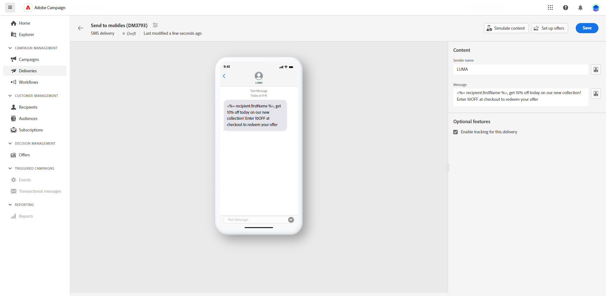

# Designa en SMS-leverans {#design-sms}

>[!CONTEXTUALHELP]
>id="acw_deliveries_sms_content"
>title="SMS-innehåll"
>abstract="Skapa innehållet i era SMS-leveranser och anpassa det med personaliseringsfält, innehållsblock och dynamiskt innehåll."

>[!CONTEXTUALHELP]
>id="acw_sms_preview_option_app_target"
>title="Appprenumeranter"
>abstract="Förhandsgranska och testa meddelandet genom att lägga till programprenumeranter i huvudmålet."

Så här utformar du innehållet i en SMS-leverans:

1. Klicka på **[!UICONTROL Edit content]** för att utforma ditt SMS-innehåll.

1. På **[!UICONTROL Edit content]** kan du anpassa avsändarens namn via **[!UICONTROL Sender field]** och ange önskat namn.

   Genom att klicka på **[!UICONTROL Open personalization dialog]** kan du inkludera anpassningsfält, innehållsblock och dynamiskt innehåll i meddelandet.

   

1. Skriv ditt textmeddelande i dialogrutan **[!UICONTROL Message]** eller klicka på **[!UICONTROL Open personalization dialog]** för att definiera innehåll och lägga till dynamiskt innehåll. [Läs mer](../personalization/gs-personalization.md)

   

1. Spårning är aktiverat som standard för leveranser. Du kan inaktivera det här alternativet på **[!UICONTROL Optional features section]**.

1. Öppna **[!UICONTROL Simulate content]** för att förhandsgranska ditt personaliserade innehåll. [Läs mer](send-sms.md#preview-sms)

1. Klicka **[!UICONTROL Save]** och kontrollera meddelandet i förhandsgranskningen.

Nu kan ni granska och skicka SMS-meddelanden till er målgrupp.
