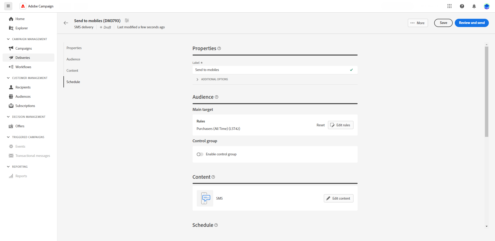
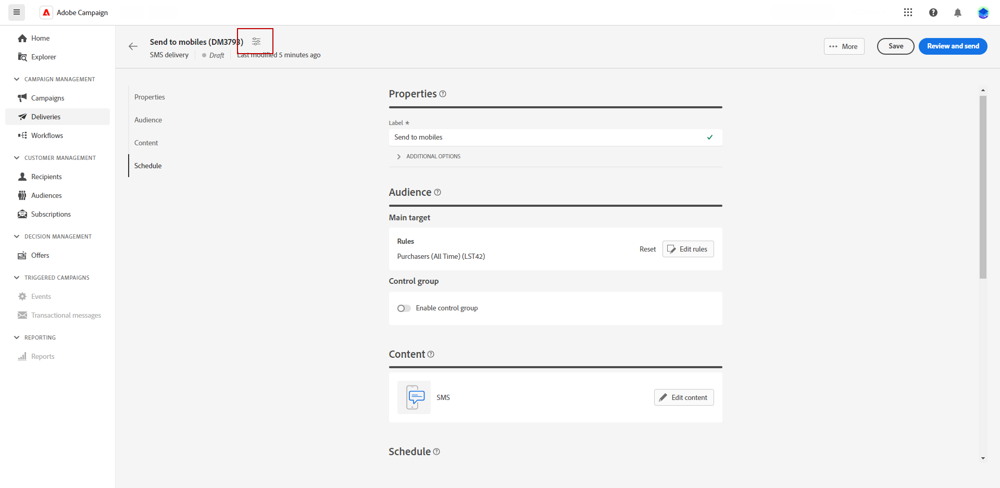

# Skapa en SMS-leverans {#create-sms}

>[!CONTEXTUALHELP]
>id="acw_deliveries_sms_properties"
>title="SMS-leveransegenskaper"
>abstract="Egenskaperna omfattar de vanligaste leveransparametrarna som hjälper dig att både namnge och klassificera leveransen. Om leveransen baseras på ett utökat schema är specifika fält för anpassade alternativ tillgängliga."

>[!CONTEXTUALHELP]
>id="acw_deliveries_sms_audience"
>title="Definiera SMS-målgruppen"
>abstract="Välj den bästa målgruppen för SMS-meddelandet."

>[!CONTEXTUALHELP]
>id="acw_deliveries_sms_template_selection"
>title="Val av SMS-mall"
>abstract="Välj en fördefinierad mall för att starta SMS-leveransen."

Du kan skapa en fristående SMS-leverans eller skapa ett SMS i samband med ett kampanjarbetsflöde. Stegen nedan beskriver i detalj proceduren för en fristående (enshot) SMS-leverans. Om du arbetar i ett kampanjarbetsflöde beskrivs stegen för att skapa i [det här avsnittet](../workflows/activities/channels.md#create-a-delivery-in-a-campaign-workflow).

Så här skapar du en ny fristående SMS-leverans:

1. Gå till **[!UICONTROL Deliveries]** till vänster och klicka på  **[!UICONTROL Create delivery]** -knappen.

1. Under **[!UICONTROL Channel]** väljer du SMS som kanal och väljer en mall. [Läs mer om mallar](../msg/delivery-template.md)

1. Bekräfta genom att klicka på knappen **[!UICONTROL Create delivery]**.

   

1. Ange en **[!UICONTROL Label]** för leverans och åtkomst till **[!UICONTROL Additional options]** nedrullningsbar meny.

   +++Konfigurera följande inställningar baserat på dina behov.
   * **[!UICONTROL Internal name]**: Tilldela en unik identifierare till leveransen.
   * **[!UICONTROL Folder]**: Lagra leveransen i en viss mapp.
   * **[!UICONTROL Delivery code]**: Ordna leveranserna med din egen namnkonvention.
   * **[!UICONTROL Description]**: Ange en beskrivning för leveransen.
   * **[!UICONTROL Nature]**: Ange e-postens natur för klassificeringsändamål.
+++

1. Klicka på **[!UICONTROL Select audience]** för att rikta sig till en befintlig målgrupp eller skapa en egen. [Läs mer](../audience/about-audiences.md).

   

1. Aktivera **[!UICONTROL Enable control]** gruppalternativ för att ställa in en kontrollgrupp för att mäta effekten av leveransen, så att du kan jämföra beteendet hos den population som tog emot meddelandet med beteendet hos kontakter som inte gjorde det. [Läs mer](../audience/control-group.md)

1. Klicka **[!UICONTROL Edit content]** för att börja designa innehållet i SMS-meddelandet. [Läs mer](content-sms.md)

   

   Från den här skärmen kan du även [simulera ditt innehåll](../preview-test/preview-test.md) och [konfigurera erbjudanden](../content/offers.md).

1. Aktivera **[!UICONTROL Enable scheduling]** alternativ. När du har initierat leveransen skickas meddelandet automatiskt på exakt det datum och klockslag som du har angett för mottagaren. Läs mer om leveransplanering i [det här avsnittet](../msg/gs-messages.md#gs-schedule).

1. Klicka **[!UICONTROL Configure delivery settings]** för att få tillgång till avancerade alternativ för leveransmallen. [Läs mer](../advanced-settings/delivery-settings.md)

   
